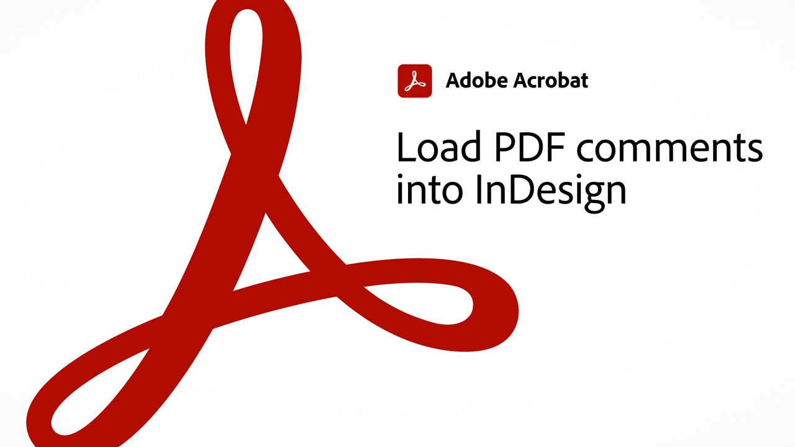

# 60초 Acrobat 개요

60초 Acrobat은 1분 이내에 Acrobat DC의 새로운 기법을 배울 수 있는 바이트 크기의 튜토리얼을 제공합니다. 이러한 작업 기반의 팁을 통해 Acrobat의 숨겨진 보석 중 일부를 잠금 해제하여 PDF 파일 작업에 대한 새로운 스킬을 습득할 수 있습니다. 답변을 빠르게 얻을 수 있는 영상 1편과 문서 생산성을 높이기 위한 영상 5편을 볼 수 있으며, 휴식 시간을 가질 수 있습니다.

## 60초 Acrobat 튜토리얼

<table style="table-layout:fixed">
<tr>
  <td>
    
    

    <a href="combine-to-one-pdf.md"><strong>여러 파일을 하나의 PDF으로 결합</strong></a>
    

    <em>여러 유형의 파일을 단일 PDF으로 결합하여 새 문서를 빠르게 만듭니다.</em>
     
  </td>
  <td>
    
    

    <a href="edit.md"><strong>Acrobat Web으로 PDF 편집</strong></a>
    

    <em>PDF을 다운로드하지 않고도 텍스트와 이미지를 간편하게 편집할 수 있습니다</em>
     
  </td>
  <td>
    
    

     <a href="search.md"><strong>한 번에 여러 PDF 파일 검색</strong></a>
    

    <em>PDF 파일에서 검색을 시작한 다음 고급 검색을 열고 PDF 파일의 전체 폴더를 검색합니다</em>
     
  </td>
</tr>
<tr>
  <td>
    
    

    <a href="photo.md"><strong>한 번에 사진 PDF 만들기</strong></a>
    

    <em>여러 JPG을 Acrobat 아이콘에 드래그하여 놓아 PDF을 만드는 방법을 살펴보세요</em>
     
  </td>
  <td>
    
    

    <a href="phone.md"><strong>스마트폰에서 PPT 파일을 PDF으로 변환</strong></a>
    

    <em>휴대폰에서 전자 메일 PowerPoint 첨부 파일을 PDF으로 변환하는 방법 알아보기</em>
     
  </td>  
  <td>
    
    

    <a href="sign.md"><strong>종이 문서에 전자 서명</strong></a>
    

    <em>Adobe Scan을 사용하여 인쇄된 양식에 서명하는 방법 알아보기</em>
     
  </td>  
</tr>
<tr>
  <td>
    
    

    <a href="indesign.md"><strong>PDF 주석을 InDesign에 로드</strong></a>
    

    <em>Acrobat 공유 검토 후 PDF 주석을 다시 InDesign으로 로드하는 방법에 대해 알아봅니다</em>
     
  </td>
   <td>
    
    

    <a href="editphoto.md"><strong>PDF에서 사진 편집</strong></a>
    

    <em>Photoshop을 사용하여 PDF에서 사진을 고급 편집하는 방법 알아보기</em>
     
  </td>
  <td>
    
    

    <a href="editgraphic.md"><strong>PDF에서 그래픽 편집</strong></a>
    

    <em>Illustrator을 사용하여 PDF에서 그래픽의 고급 편집을 수행하는 방법을 살펴봅니다</em>
     
  </td> 
</tr>
<tr>
  <td>
    
    

    <a href="organize.md"><strong>신속한 페이지 구성</strong></a>
    

    <em>PDF 구성 툴을 사용하여 페이지를 한눈에 보는 방법을 살펴봅니다</em>
     
  </td>
  <td>
   
    

     
  </td>
  <td>
   
    

     
  </td>  
</tr>
</table>