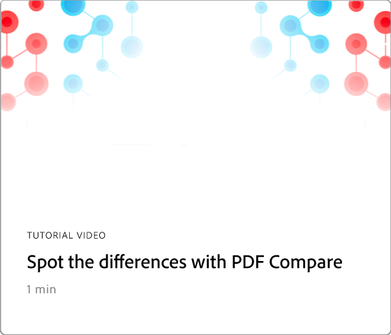

# 60초 Acrobat 개요

60초 Acrobat은 Acrobat의 새로운 기술을 1분 이내에 학습할 수 있는 바이트 크기의 튜토리얼을 제공합니다. 이러한 작업 기반 팁을 통해 Acrobat의 숨겨진 보석 일부를 잠금 해제하여 PDF 파일 작업에 대한 새로운 기술을 선택할 수 있습니다. 간단한 답변을 얻기 위해 하나를 보고, 문서 생산성을 높이기 위해 5개를 보고, 커피 마시는 시간을 즐길 수 있습니다.

## 60초 Acrobat 튜토리얼

## 편집

<table style="table-layout:fixed">
<tr>
   <td>
    
    

    <a href="edit.md"><strong>Acrobat 웹으로 PDF 편집</strong></a>
    

    Acrobat 웹에서 편집하는 방법 알아보기
     
  </td>
  <td>
    
    

    <a href="textrecognition.md"><strong>스캔한 PDF 파일에서 텍스트 인식</strong></a>
    

    스캔한 이미지에서 텍스트를 인식하는 방법 알아보기
     
  </td>
  <td>
    
    

    <a href="combine-to-one-pdf.md"><strong>파일을 하나의 PDF으로 결합</strong></a>
    

    파일을 단일 PDF으로 빠르게 결합하는 방법 알아보기
     
  </td>
   <td>
    
    

    <a href="organize.md"><strong>스냅에서 페이지 구성</strong></a>
    

    PDF에서 페이지를 빠르게 구성하는 방법 알아보기
     
  </td>
</tr>
<tr>
  <td>
    
    

    <a href="editphoto.md"><strong>PDF에서 사진 편집</strong></a>
    

    PDF에서 사진을 편집하는 방법 알아보기
  </td>
  <td>
    
    

    <a href="editgraphic.md"><strong>PDF에서 그래픽 편집</strong></a>
    

    PDF에서 그래픽을 편집하는 방법 알아보기
  </td>
  <td>
      
        

         
  </td>
  <td>
      
        

         
  </td>
</tr>
</table>

## 변환

<table style="table-layout:fixed">
<tr>
  <td>
    
    

    <a href="convert-pdf-word.md"><strong>PDF을 Word로 변환</strong></a>
    

    PDF을 Word 형식으로 변환하는 방법에 대해 알아보십시오.
  </td>
 <td>
    
    

    <a href="convert-pdf-excel.md"><strong>PDF을 Excel로 변환</strong></a>
    

    PDF을 Excel 형식으로 변환하는 방법에 대해 알아보십시오.
  </td>
  <td>
    
    

    <a href="convert-pdf-powerpoint.md"><strong>PDF을 PowerPoint로 변환</strong></a>
    

    PDF을 PowerPoint 형식으로 변환하는 방법에 대해 알아봅니다
  </td>
  <td>
    
    

    <a href="exportwordphone.md"><strong>휴대폰에서 Word로 Export PDF</strong></a>
    

    휴대폰에서 PDF을 Word로 내보내는 방법 알아보기
  </td>
</tr>
</table>

## 만들기

<table style="table-layout:fixed">
<tr>
  <td>
    
    

    <a href="word-to-pdf.md"><strong>Microsoft Word에서 PDF 만들기</strong></a>
    

    Word에서 직접 PDF을 만드는 방법 알아보기
  </td>
  <td>
    
    

    <a href="create-from-acrobat.md"><strong>Acrobat에서 PDF 만들기</strong></a>
    

    Acrobat 내에서 PDF을 만드는 방법 알아보기
  <td>
    
    

    <a href="wordform.md"><strong>양식 필드를 포함하여 Word를 PDF으로 변환</strong></a>
    

    Word 파일을 PDF으로 변환하고 양식 필드를 자동으로 생성
  </td>
  <td>
    
    

    <a href="photo.md"><strong>사진의 PDF을 즉시 만들기</strong></a>
    

    여러 사진의 PDF 만들기
  </td>
</tr>
<tr>
  <td>
    
    

    <a href="phone.md"><strong>휴대폰에서 PPT 파일을 PDF으로 변환</strong></a>
    

    휴대폰에서 PowerPoint 파일을 PDF으로 변환
  </td>
  <td>
    
    

    <a href="optimize.md"><strong>스냅에서 보다 효율적인 PDF 파일 만들기</strong></a>
    

    PDF 파일을 빠르게 최적화
  </td>
  <td>
      
        

         
  </td>
  <td>
      
        

         
  </td>
</tr>
</table>

## 서명

<table style="table-layout:fixed">
<tr>
  <td>
    
    

    <a href="sign.md"><strong>종이 문서에 전자 서명</strong></a>
    

    종이 문서에 전자 서명하는 방법 알아보기
  </td>
  <td>
      
        

         
  </td>
  <td>
      
        

         
  </td>
  <td>
      
        

         
  </td>
</tr>
</table>

## 보호

<table style="table-layout:fixed">
<tr>
  <td>
    
    

    <a href="protect.md"><strong>암호로 PDF 파일 Protect</strong></a>
    

    암호로 PDF을 보호하는 방법 알아보기
  </td>
  <td>
    
    

    <a href="redaction.md"><strong>교정: 올바른 방법</strong></a>
    

    PDF의 민감한 정보를 올바른 방법으로 교정하는 방법 알아보기
  </td>
  <td>
      
        

         
  </td>
  <td>
      
        

         
  </td>
</tr>
</table>

## 공유 및 검토

<table style="table-layout:fixed">
<tr>
  <td>
    
    

    <a href="share-comment.md"><strong>주석 달기를 위해 PDF 공유</strong></a>
    

    다른 사람이 댓글을 달 수 있도록 PDF을 공유하는 방법 알아보기
  </td>
  <td>
    
    

    <a href="share-comment-teams.md"><strong>Teams의 PDF 파일에 공유 및 주석 달기</strong></a>
    

    Microsoft Teams의 PDF 파일에 공유 및 주석 달기
  </td>
  <td>
    
    

    <a href="summarize-comments.md"><strong>요약과 PDF 댓글 다툼</strong></a>
    

    모든 주석을 단일 PDF으로 요약
  </td>
   <td>
    
    

    <a href="indesign.md"><strong>PDF 주석을 InDesign에 로드</strong></a>
    

    모든 PDF 주석을 InDesign 상태로 만드는 방법을 알아봅니다.
  </td>
</tr>
</table>

## 준비

<table style="table-layout:fixed">
<tr>
  <td>
    
    

    <a href="accessible.md"><strong>액세스 가능한 PDF을 만드는 데 Acrobat이 도움이 되도록 합니다</strong></a>
    

    PDF에 대한 접근성을 전반적으로 높이는 방법 알아보기
  </td>
 <td>
    
    

    <a href="conform.md"><strong>표준 형식으로 PDF 맞추기</strong></a>
    

    특정 표준을 PDF에 맞추는 방법 알아보기
  </td>
  <td>
      
        

         
  </td>
  <td>
      
        

         
  </td>
</tr>
</table>

## 추가 항목

<table style="table-layout:fixed">
<tr>
  <td>
    
    

    <a href="compare.md"><strong>PDF 비교와 차이점 찾기</strong></a>
    

    두 PDF 간의 차이를 빠르게 비교하는 방법을 알아봅니다.
  </td>
 <td>
    
    

    <a href="search.md"><strong>한 번에 여러 PDF 파일 검색</strong></a>
    

    여러 PDF 파일에서 검색하는 방법 알아보기
  </td>
  <td>
      
        

         
  </td>
  <td>
      
        

         
  </td>
</tr>
</table>