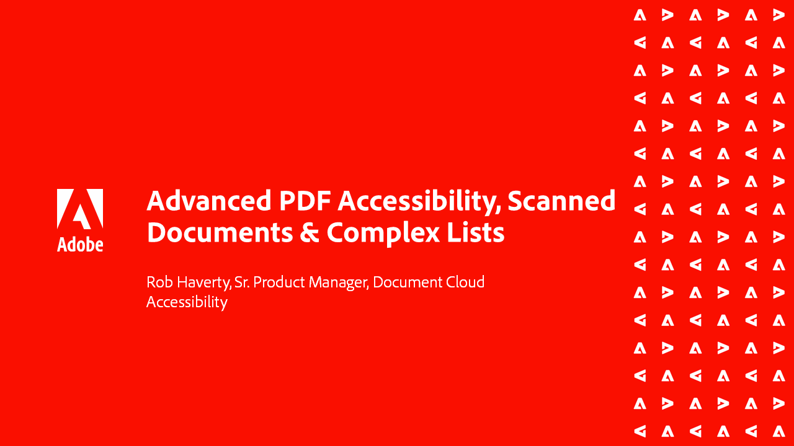

# Acrobat 액세스 가능성 시리즈

이 6부로 구성된 주문형 웹 세미나 시리즈에서는 [내게 필요한 옵션]의 기본 사항에서 PDF 파일에 태깅을 수행하는 심층적인 방법에 이르기까지 각 세션에는 따라야 할 연습 파일이 포함됩니다.

<table style="table-layout:fixed">
<tr>
  <td>
    
    

    <a href="accessibilitysession1.md"><strong>PDF 액세서빌러티 소개</strong></a>
    

    <em>이 on-demand 세션에서는 PDF에 액세스할 수 있도록 하는 것이 무엇을 의미하는지, Acrobat Pro DC가 액세서빌러티 기능을 위해 PDF에서 작동하도록 설정하는 방법, 소스 문서에서 PDF로 변환하는 프로세스를 알아봅니다.</em>
     
  </td>
  <td>
    
    

    <a href="accessibilitysession2.md"><strong>액세스할 수 없는 PDF 수정</strong></a>
    

    <em>이 on-demand 세션에서는 소개 웹 세미나에 표시된 Acrobat Pro DC 도구를 사용하여 Word 문서를 변환하고 일부 기본 태그 문제를 해결하는 워크플로를 배웁니다</em>
     
  </td>  
  <td>
    
    

    <a href="accessibilitysession3.md"><strong>복합 테이블</strong></a>
    

    <em>이 on-demand 세션은 PDF의 액세스 가능성을 개선하는 데 있어 가장 일반적이고 어려운 문제 중 하나(복잡한 테이블)를 해결합니다.</em>
     
  </td>
</tr>
<tr>
  <td>
    
    

    <a href="accessibilitysession4.md"><strong>스캔한 문서 및 복잡한 목록</strong></a>
    

    <em>이 on-demand 세션은 스캔한 문서 및 복잡한 목록 등 자주 발생하는 복잡한 문제를 해결합니다.</em>
     
  </td>
  <td>
    
    

    <a href="accessibilitysession5.md"><strong>태그 있는 PDF에 양식 필드 추가</strong></a>
    

    <em>이 주문형 세션은 이전에 태그가 지정된 PDF에 양식 필드를 추가하는 데 중점을 둡니다.</em>
     
  </td>  
  <td>
    
    

    <a href="accessibilitysession6.md"><strong>태그 없는 PDF에 양식 필드 추가</strong></a>
    

    <em>이 on-demand 세션에서는 수동 양식 필드 및 추가 양식 필드 속성을 만드는 데 더 깊이 들어갑니다.</em>
     
  </td> 
</tr>
</table>
