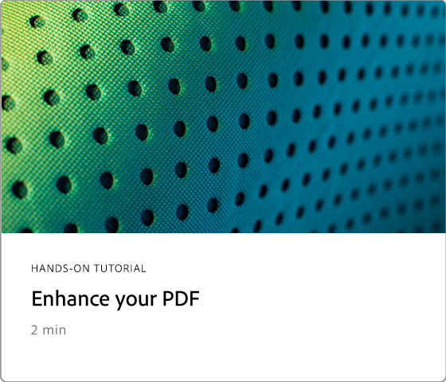

# 고급 작업 개요

Acrobat의 고급 도구를 사용하여 기본 사항 이상을 살펴보세요. 동작을 만들어 일상적인 작업을 반복하고, 민감한 정보를 제거하고, 대용량 파일을 감소 및 최적화하고, 양식 데이터를 빠르게 수집하고, 보편적으로 액세스 가능한 PDF 파일을 만드는 방법을 알아보십시오.

## 새로운 기능

>[!BEGINTABS]

>[!TAB 안내가 제공되는 동작]

[안내가 제공되는 동작](action.md)을 사용하여 효율성을 개선하는 방법을 알아봅니다.

>[!TAB SEO에 대한 Optimize PDF(검색 엔진 최적화)]

웹에서 검색 기능과 PDF 엔진 순위를 개선하기 위해 [검색을 최적화](optimizeseo.md)하는 방법을 알아보세요.

>[!ENDTABS]

## 고급 작업 튜토리얼

<table style="table-layout:fixed">
<tr>
  <td>
    
    

      <a href="bookmarks.md"><strong>책갈피 및 하이퍼링크 추가</strong></a>
      

      더 나은 탐색을 위해 책갈피 및 하이퍼링크 추가
  </td>
  <td>
    
    

      <a href="optimizescan.md"><strong>스캔한 문서 최적화</strong></a>
      

      스캔한 문서를 향상시키는 방법 알아보기
  </td>
  <td>
    
    

      <a href="custom.md"><strong>사용자 지정 명령 및 도구</strong></a>
      

      문서 워크플로우의 효율을 높이는 방법 알아보기
  </td>
  <td>
    
    

      <a href="advancedforms.md"><strong>고급 양식 필드</strong></a>
      

      고급 양식 필드를 빌드하는 방법에 대해 알아보십시오.
  </td>
</tr>
<tr>
 <td>
    
    

      <a href="optimizeseo.md"><strong>SEO용 Optimize PDF</strong></a>
      

      SEO에 대한 PDF 최적화(검색 엔진 최적화)
  </td>
  <td>
    
    

      <a href="workforms.md"><strong>양식 필드로 작업</strong></a>
      

      다양한 유형의 양식 필드 및 속성을 추가하는 방법에 대해 알아봅니다.
  </td>
  <td>
    
    

      <a href="enhance.md"><strong>PDF 향상</strong></a>
      

      PDF 변형 방법 알아보기
  </td>
 <td>
    
    

      <a href="compare.md"><strong>두 PDF 간의 차이점 검색</strong></a>
      

      두 PDF 파일 간의 차이점을 빠르게 감지
  </td>
</tr>
<tr>
  <td>
    
    

      <a href="action.md"><strong>안내가 제공되는 동작</strong></a>
      

      안내가 제공되는 동작을 사용하여 효율성을 개선하는 방법에 대해 알아봅니다.
  </td>
  <td>
    
    

      <a href="redact.md"><strong>교정 및 기밀 정보 가리기</strong></a>
      

      민감한 정보를 영구적으로 제거하는 방법 알아보기
  </td>
 <td>
    
    

      <a href="reduce.md"><strong>파일 크기 축소 및 최적화</strong></a>
      

      품질 저하 없이 대용량 파일 줄이기
  </td>
  <td>
    
    

      <a href="formdata.md"><strong>양식 데이터를 사용하여 작업</strong></a>
      

      양식 데이터를 컴파일하는 방법 알아보기
  </td>
</tr>
<tr>
 <td>
    
    

      <a href="accessibility.md"><strong>PDF 접근성 확인</strong></a>
      

      PDF에 일반적으로 액세스할 수 있는지 확인하는 방법 알아보기
  </td>
 <td>
    
    

      <a href="accessibility-series.md"><strong>Acrobat 접근성 시리즈</strong></a>
      

      6세션 온디맨드 PDF 접근성 시리즈
  </td>
  <td>
   
    

     
  </td> 
  <td>
   
    

     
  </td>  
</tr>
</table>
