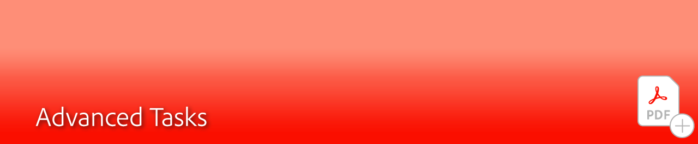
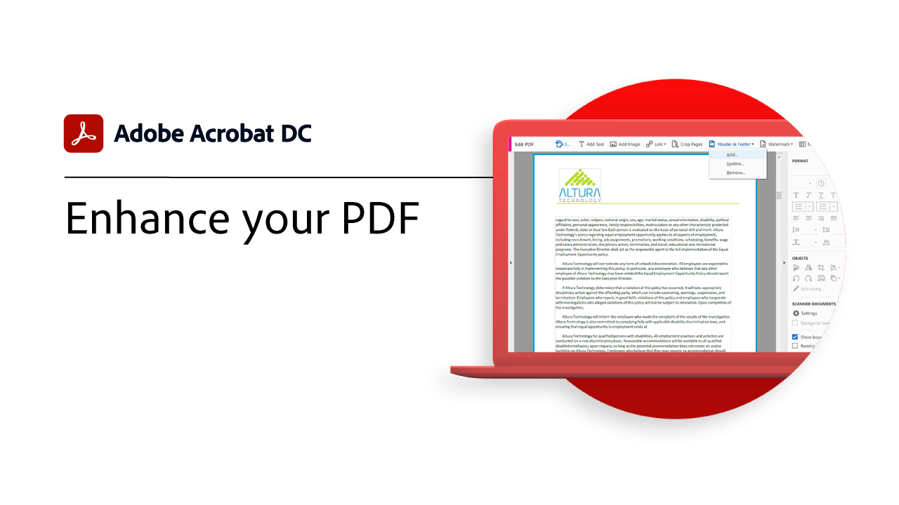

# 고급 작업 개요

Acrobat의 고급 툴로 기본 기능 강화 동작을 만들어 일상적인 작업을 반복하고, 민감한 정보를 제거하고, 대용량 파일을 축소 및 최적화하고, 양식 데이터를 빠르게 수집하고, 일반적으로 액세스할 수 있는 PDF 파일을 만드는 방법을 알아봅니다.

## Acrobat 튜토리얼

<table style="table-layout:fixed">
<tr>
  <td>
    
    

    <a href="custom.md"><strong>사용자 정의 명령 및 도구</strong></a>
    

    <em>사용자 정의 명령 및 도구를 사용하여 문서 작업 과정의 생산성 향상</em>
     
  </td>
  <td>
    
    

    <a href="advancedforms.md"><strong>고급 양식 필드</strong></a>
    

    <em>전문적인 PDF forms 구축을 위한 고급 기법 학습</em>
     
  </td>
  <td>
    
    

    <a href="optimizeseo.md"><strong>SEO(검색 엔진 최적화) Optimize PDF</strong></a>
    

    <em>검색 가능성 및 웹에서의 검색 엔진 순위 향상을 위해 PDF 최적화</em>
     
  </td>
</tr>
<tr>
  <td>
    
    

    <a href="workforms.md"><strong>양식 필드를 사용한 작업</strong></a>
    

    <em>다양한 유형의 양식 필드를 추가하고, 양식 필드 속성을 설정하고, 보안을 추가하여 고품질의 전문적인 양식을 만들 수 있습니다</em>
     
  </td>
  <td>
    
    

    <a href="enhance.md"><strong>PDF 향상</strong></a>
    

    <em>그래픽 개선 사항과 자동 번호 매기기를 추가하여 PDF 변형</em>
     
  </td>
  <td>
    
    

    <a href="compare.md"><strong>두 PDF 간의 차이 감지</strong></a>
    

    <em>두 PDF 파일 간의 차이점을 빠르고 정확하게 감지</em>
     
  </td>   
</tr>
<tr>
  <td>
    
    

    <a href="action.md"><strong>Action Wizard</strong></a>
    

    <em>액션을 사용하여 한 개 또는 여러 개의 파일에 일련의 명령을 자동으로 적용하여 키 입력과 시간 절약</em>
     
  </td>
  <td>
    
    

    <a href="redact.md"><strong>교정 및 기밀 정보 가리기</strong></a>
    

    <em>PDF에서 비공개 또는 민감한 정보 영구 제거</em>
     
  </td>
   <td>
    
    

    <a href="reduce.md"><strong>파일 크기 축소 및 최적화</strong></a>
    

    <em>공유, 게시 또는 아카이빙의 품질을 그대로 유지하면서 대용량 파일을 줄이고 PDF 최적화</em>
     
  </td>
</tr>
<tr>
  <td>
    
    

    <a href="formdata.md"><strong>양식 데이터를 사용한 작업</strong></a>
    

    <em>양식 데이터를 단일 스프레드시트로 컴파일</em>
     
  </td>
  <td>
    
    

    <a href="accessibility.md"><strong>PDF 액세스 가능성 확인</strong></a>
    

    <em>장애가 있는 사용자가 PDF에 일반적으로 액세스할 수 있는지 확인</em>
     
  </td>
  <td>
    
    

    <a href="accessibility-series.md"><strong>Acrobat 액세서빌러티 시리즈</strong></a>
    

    <em>6개의 부분으로 구성된 온디맨드 온라인 세미나 시리즈에서 접근성의 기본부터 PDF 파일에 태그를 지정하는 심층까지 살펴봅니다</em>
     
  </td>
</tr>
</table>
