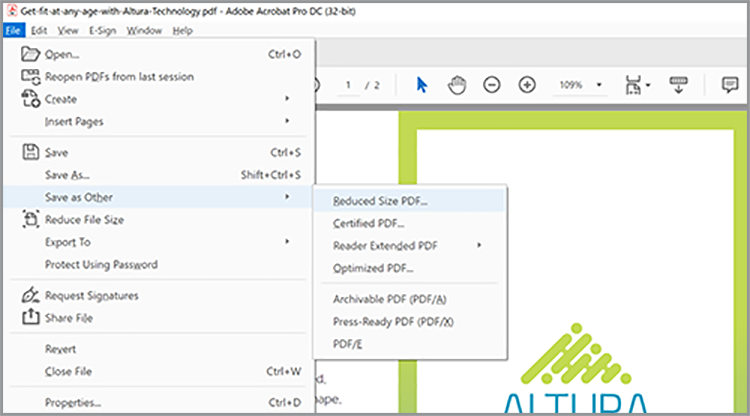

# Optimize PDFs for SEO (Search Engine Optimization)

Learn how to optimize a PDF for improved discoverability and search engine ranking on the web.

## Create unique content

Create PDF content that is different from the information your web pages. PDF content should be unique and structured as follows:

* Use a single main heading/title beginning with a keyword
* Use keyword subheadings organized in a hierarchical structure
* Use short paragraphs containing keywords and lists
* Add internal and external (content on your website or other websites) hyperlinks
* Add a hyperlinked table of contents for documents longer than 25 pages
* 
*  Include additional subheadings if necessary to improve navigation.

   

## Add Document Properties

PDF files have a title and meta description just like a web page. ****

1. ************
1. ****
1. ****
1. ****
Try beginning the summary using an action verb like Learn, Discover, Explore, etc.
1. ****

   

## Tag your PDF

>[!NOTE]
>
>Available in Acrobat Pro only.

 Tag a PDF as follows:

1. ********
1. ****
1. ****
1. ****
1. ****

   

## Prepare for web

Optimize the experience of interacting with your PDF by preparing it for web viewing and reducing the file size. ****

**** **** ************

## Create a keyword filename

The filename becomes part of the URL when a PDF is posted on the web. A good best practice is to match your keyword-optimized title with the filename. To be search-friendly—use lowercase, no punctuation or hashes, and avoid stop words (a, an, the, and, it, for, or, but, in, my, your, our, and their, etc.). If you use separate words, add hyphens or underscores between the words.

## Secure your PDF

The last step is to protect your PDF to prevent unauthorized changes. Secure a PDF as follows:

1. ************
1. ****
1. ********
1. ****
1. Enter and confirm a strong password.
1. ****

   

Now your PDF is ready to be posted on the web—-with optimal keyword ranking potential and end-user interaction.