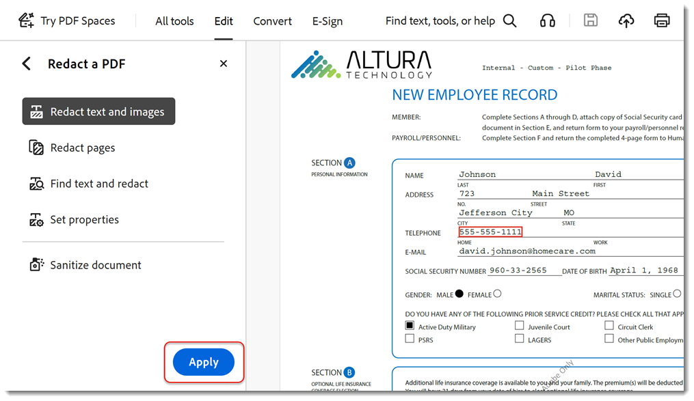

# 민감한 정보 제거

교정 도구를 사용하여 PDF에서 개인 정보 또는 민감한 정보를 영구적으로 제거한 다음, 문서를 기밀 정보로 처리하여 주석, 메타데이터 또는 숨겨진 레이어 등 파일에 표시되지 않는 정보를 제거하는 방법을 살펴봅니다. PDF을 게시할 때 정보가 전달되지 않도록 중요한 내용 및 숨겨진 데이터를 영구적으로 제거하는 것은 중요합니다. 이 튜토리얼에서는 [새로운 Acrobat 환경](../getting-started/new-workspace.md)을 사용합니다.

>[!NOTE]
>
>Acrobat Pro에서만 사용할 수 있습니다.

[!BADGE 조직 영향]
고객 데이터 보호, 위험 관리

## Acrobat 데스크탑에서 정보를 교정하는 방법

1. 파일을 열고 도구 모음에서 **[!UICONTROL 모든 도구]**&#x200B;를 선택한 다음 **[!UICONTROL PDF 교정]**을 선택합니다.
   

1. **[!UICONTROL 속성 설정]**&#x200B;을 선택하여 교정 상자 또는 텍스트 오버레이의 색상을 포함하여 교정의 모양을 사용자 지정합니다.

   

   정보를 교정하려면 먼저 제거할 항목에 표시를 한 다음 교정을 적용합니다. 전체 페이지 또는 선택한 내용을 교정할 수 있습니다.

1. **[!UICONTROL 텍스트 및 이미지 교정]**&#x200B;을 선택하고 커서를 사용하여 교정할 내용을 선택합니다.

   

   선택한 콘텐츠 위로 마우스를 가져가면 교정의 미리보기를 볼 수 있습니다.

1. **[!UICONTROL 텍스트 찾기 및 교정]**&#x200B;을 선택하여 특정 단어나 구를 검색하거나 패턴을 검색하여 특정 유형의 정보를 찾습니다. 검색을 설정하고 [텍스트 검색 및 제거]를 선택합니다.

   단계 교정

1. 검색 결과 대화 상자에서 항목 옆에 있는 상자를 선택하고 **[!UICONTROL 선택한 결과를 교정으로 표시]**&#x200B;를 선택합니다.

   

1. **[!UICONTROL 페이지 교정]**&#x200B;을 선택하여 전체 페이지를 교정으로 표시합니다.

   단계 교정

1. 페이지를 선택하고 **[!UICONTROL 확인]**&#x200B;을 선택하세요.

   

1. PDF 교정 패널에서 **[!UICONTROL 적용]**&#x200B;을 선택하여 표시된 교정을 적용합니다.

   

1. **[!UICONTROL 계속]**&#x200B;을 선택하여 숨겨진 정보의 기밀 정보를 가리고 제거합니다.

   

확인하고 나면 교정 및 숨겨진 정보가 영구적으로 제거되고 새 파일에 저장됩니다.

>[!TIP]
>
>교정 프로세스 속도를 높이려면 데스크탑용 Acrobat Pro에서 [Action Wizard](../advanced-tasks/action.md)를 확인하세요.
