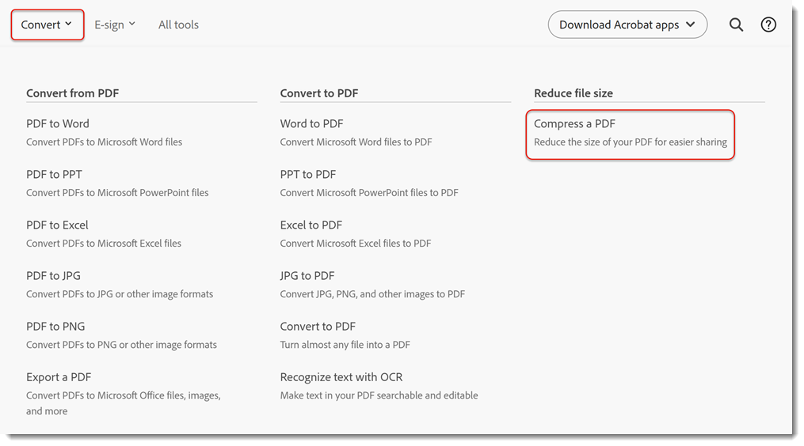
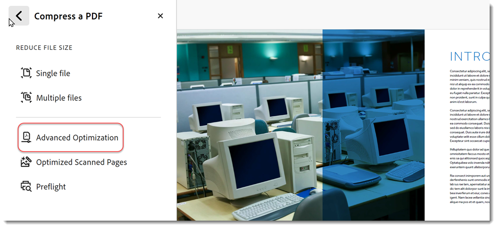

# PDF 압축 및 최적화

PDF 파일 크기를 압축하고 최적화하는 방법을 알아봅니다. PDF을 압축하면 파일 크기 제한이 있는 웹 사이트에 업로드할 때 이메일을 통해 간편하게 공유할 수 있습니다. 또한 PDF을 최적화하여 보기 환경을 개선하고 스토리지 비용을 절약할 수 있습니다.

## 데스크탑용 Acrobat에서 PDF을 압축하는 방법

1. 파일을 열고 도구 모음에서 **[!UICONTROL 모든 도구]**&#x200B;를 선택한 다음 **[!UICONTROL PDF 압축]**&#x200B;을 선택합니다.

   

1. **[!UICONTROL PDF 압축]** 패널에서 **[!UICONTROL 단일 파일]** 또는 **[!UICONTROL 여러 파일]**&#x200B;을 선택하고 **[!UICONTROL 저장]**&#x200B;을 선택합니다.

   문서의 품질을 유지하면서 파일이 가능한 가장 작은 크기로 줄어듭니다.

   

1. **[!UICONTROL 저장]**&#x200B;을 선택합니다.

   

## 웹용 Acrobat에서 PDF을 압축하는 방법

1. 브라우저에서 [acrobat.adobe.com](https://acrobat.adobe.com/)에 로그인합니다.

1. 상단 메뉴에서 **[!UICONTROL 변환 > PDF 압축]**&#x200B;을 선택합니다.

   

1. **[!UICONTROL 파일 선택]**&#x200B;을 선택하고 파일을 선택한 다음 [!UICONTROL 열기]를 선택합니다.

   

1. 압축 수준을 선택하고 **[!UICONTROL 압축]**&#x200B;을 선택합니다.

   

## 데스크탑용 Acrobat에서 PDF을 최적화하는 방법

>[!NOTE]
>
>PDF 최적화는 데스크탑용 Acrobat Pro에서만 사용할 수 있습니다.

1. 파일을 열고 도구 모음에서 **[!UICONTROL 모든 도구]**&#x200B;를 선택한 다음 **[!UICONTROL PDF 압축]**&#x200B;을 선택합니다.

   

1. **[!UICONTROL PDF 압축]** 패널에서 **[!UICONTROL 고급 최적화]**&#x200B;를 선택합니다.

   

   기본적으로 **표준**&#x200B;은 **설정** 메뉴에서 선택됩니다. [PDF 최적기] 대화 상자에서 설정을 변경하면 **설정** 메뉴가 자동으로 **사용자 지정**(으)로 전환됩니다.

1. **호환되는 항목 만들기** 드롭다운에서 **기존 항목 유지**&#x200B;를 선택하여 현재 PDF 버전을 유지하거나 Acrobat 버전을 선택하세요. 패널 옆의 확인란(예: 이미지, 글꼴, 투명도)을 선택한 다음 해당 패널에서 옵션을 선택하고 **[!UICONTROL 확인]**&#x200B;을 선택한 다음 파일을 저장합니다.

   

   최적화하는 동안 패널의 모든 옵션이 실행되지 않도록 하려면 해당 패널의 체크 상자를 선택 해제합니다.

1. (선택 사항) 사용자 지정 설정을 저장하려면 **[!UICONTROL 저장]**&#x200B;을 선택하고 설정의 이름을 지정합니다. 저장된 설정을 삭제하려면 **설정** 메뉴에서 해당 설정을 선택하고 **[!UICONTROL 삭제]**&#x200B;를 선택하세요.

   

>[!TIP]
>
>여러 PDF 파일을 최적화하려면 [Action Wizard](../advanced-tasks/action.md)를 사용해 보세요.

<table style="table-layout:fixed">
  <td>
    
    

    <a href="reduce.md"><strong>PDF 압축 및 최적화</strong></a>
    

    <em>공유, 게시 또는 보관 품질을 손상시키지 않고 대용량 파일을 줄이고 PDF을 최적화하십시오</em>
     
  </td>
  <td>
        
        

         
      </td>
    <td>
        
        

         
    </td>
    <td>
        
        

         
    </td>
</tr>
</table>