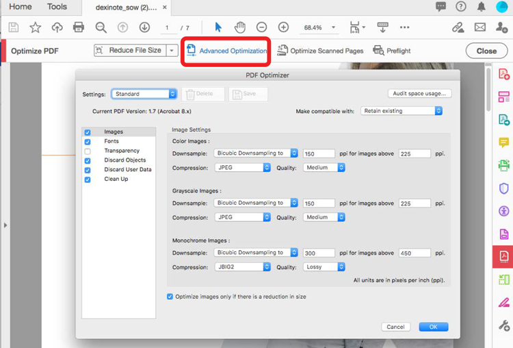
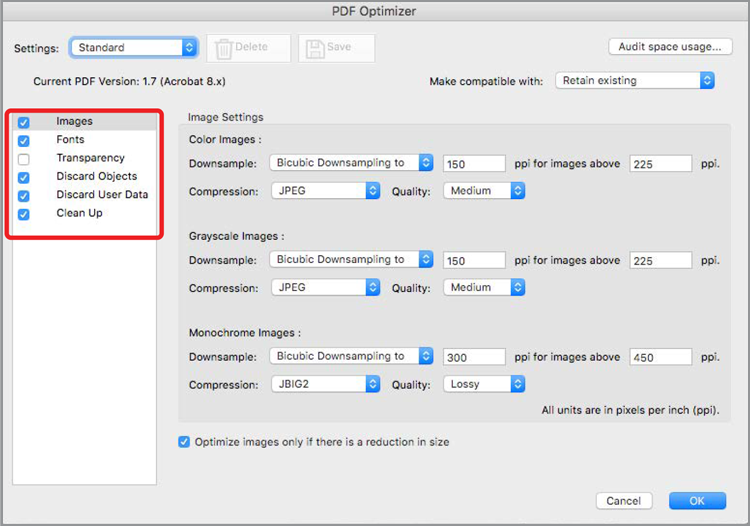

# 파일 크기 축소 및 최적화

공유, 게시 또는 아카이빙의 품질을 그대로 유지하면서 대용량 파일을 줄이고 PDF을 최적화할 수 있습니다.

>[!NOTE]
>
>Acrobat Pro DC에서만 사용할 수 있습니다.

1. 선택 **[!UICONTROL Optimize PDF]** 에서 [!UICONTROL 도구] 중앙 또는 오른쪽 창

   

1. 선택 **[!UICONTROL 파일 크기 축소]** 하나의 파일을 줄일지 여러 파일을 줄일지를 선택합니다.

   문서의 품질을 유지하면서 가능한 가장 작은 크기로 파일이 축소됩니다.

   

1. 선택 **[!UICONTROL 고급 최적화]**&#x200B;를 선택한 다음 [PDF 최적기]의 옵션 중에서 선택합니다.

   

1. 선택 **[!UICONTROL 표준]** 에서 **[!UICONTROL 설정]** 메뉴를 사용하여 기본 설정을 사용합니다.

   **[!UICONTROL [PDF 최적기]]** 대화 상자에서 설정을 변경할 경우 **[설정]** 메뉴가 자동으로 **[사용자 정의]**&#x200B;로 전환됩니다.

1. 선택 **[!UICONTROL 기존 유지]** 에서 **[!UICONTROL 호환 가능한]** 메뉴를 사용하여 현재 PDF 버전을 유지하거나 특정 Acrobat 버전을 선택합니다.

1. 패널(예: 이미지, 글꼴, 투명도) 옆의 확인란을 선택한 다음 해당 패널에서 옵션을 선택합니다.

   

   최적화 도중 패널의 모든 옵션이 실행되지 않도록 하려면 해당 패널의 확인란을 선택 해제합니다.

1. **(선택 사항)** 선택 **[!UICONTROL 저장]** 현재 설정의 이름을 입력하여 사용자 정의 선택 영역을 만듭니다. 저장된 설정을 삭제하려면 **설정** 메뉴와 선택 **삭제**.

   

>[!TIP]
>
>여러 PDF 파일을 최적화하려면 [Action Wizard](../advanced-tasks/action.md).

PDF 아이콘을 선택하여 *파일 크기 축소 및 최적화* 튜토리얼.

.
