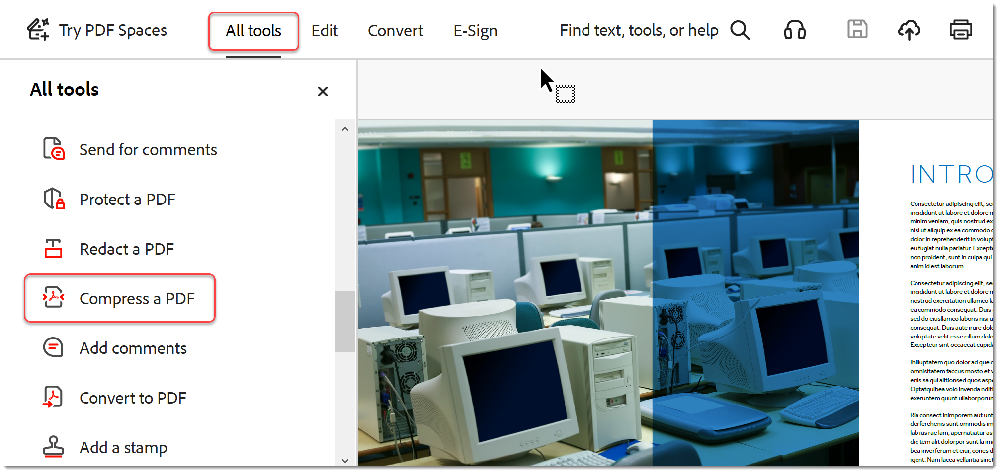

# 파일 크기 축소 및 최적화

공유, 게시 또는 아카이빙의 품질을 저하시키지 않고 대용량 파일을 줄이고 PDF을 최적화하십시오.

>[!NOTE]
>
>Acrobat Pro에서만 사용할 수 있습니다.

1. [!UICONTROL Optimize PDF] 중앙 또는 오른쪽 창에서 **[!UICONTROL 도구]**&#x200B;를 선택합니다.

   

1. **[!UICONTROL 파일 크기 축소]**&#x200B;를 선택하고 단일 파일을 줄일지 아니면 여러 파일을 줄일지 선택합니다.

   문서의 품질을 유지하면서 파일이 가능한 가장 작은 크기로 줄어듭니다.

   

1. **[!UICONTROL 고급 최적화]**&#x200B;를 선택한 다음 PDF 최적기에서 옵션을 선택하십시오.

   

1. **[!UICONTROL 설정]** 메뉴에서 **[!UICONTROL 표준]**&#x200B;을 선택하여 기본 설정을 사용합니다.

   **[!UICONTROL PDF 최적화 도구]** 대화 상자에서 설정을 변경하면 **설정** 메뉴가 자동으로 **사용자 지정**(으)로 전환됩니다.

1. **[!UICONTROL 호환되게 만들기]** 메뉴에서 **[!UICONTROL 기존 버전 유지]**&#x200B;를 선택하여 현재 PDF 버전을 유지하거나 특정 Acrobat 버전을 선택합니다.

1. 패널 옆에 있는 확인란(예: 이미지, 글꼴, 투명도)을 선택한 다음 해당 패널에서 옵션을 선택합니다.

   

   최적화하는 동안 패널의 모든 옵션이 실행되지 않도록 하려면 해당 패널의 체크 상자를 선택 해제합니다.

1. **(선택 사항)** **[!UICONTROL 저장]**&#x200B;을 선택하고 현재 설정의 이름을 지정하여 사용자 지정 선택 영역을 만듭니다. 저장된 설정을 삭제하려면 **설정** 메뉴에서 해당 설정을 선택하고 **삭제**&#x200B;를 선택하세요.

   

>[!TIP]
>
>여러 PDF 파일을 최적화하려면 [Action Wizard](../advanced-tasks/action.md)를 사용해 보세요.