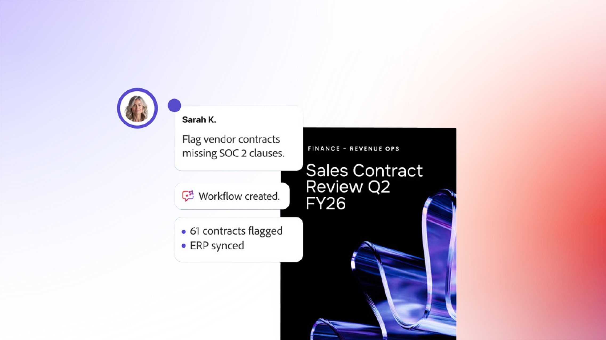

# Acrobat Studio의 Analyzer 개요

Acrobat Studio의 Analyzer를 사용하면 수만 개의 비정형 문서에서 감사 가능한 정형 인사이트를 추출하여 문서 중심의 비즈니스 프로세스를 자동화할 수 있습니다.

## 새로운 기능

>[!BEGINTABS]

>[!TAB 시작하기]

대량의 문서에서 구조화된 인용된 데이터를 가져오는 방법을 [시작](get-started.md)합니다.

>[!TAB 컬렉션 사용]

콘텐츠가 증가함에 따라 수동 및 연결된 [컬렉션](collections.md)을 만들고, 특성을 적용하고, 문서를 정리하는 방법을 알아봅니다.

>[!ENDTABS]

## Acrobat Studio의 Analyzer 튜토리얼

<table style="table-layout:fixed">
<tr>
  <td>
    
    

    <a href="get-started.md"><strong>시작하기</strong></a>
    

    Acrobat Studio의 Analyzer를 사용하여 대량의 문서에서 구조화된 인용 데이터를 가져오는 방법을 알아보십시오
     
  </td>
  <td>
    
    

    <a href="collections.md"><strong>컬렉션 사용</strong></a>
    

    콘텐츠가 커짐에 따라 수동 및 링크된 컬렉션을 만들고, 속성을 적용하고, 문서를 정리하는 방법을 살펴봅니다
     
  </td>
  <td>
    
    

    <a href="attributes.md"><strong>특성을 사용하여 작업</strong></a>
    

    Acrobat Studio에서 Analyzer를 사용하여 속성을 생성, 테스트 및 구체화하는 방법을 알아봅니다
     
  </td>
  <td>
    
    

    <a href="m-and-a-post-audit.md"><strong>통합 후 M&amp;A 계약 감사</strong></a>
    

    Analyzer를 사용하여 몇 주가 아닌 몇 분 만에 M&amp;A 통합 후 계약 감사를 실행하는 방법을 알아보십시오
     
  </td>
</tr>
</table>