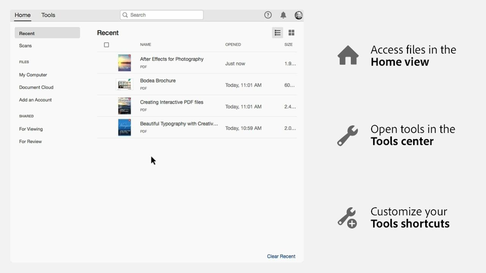

# Getting started overview

이 간단한(1-2분) 단계별 자습서를 통해 Adobe Acrobat 사용을 시작하는 방법을 알아봅니다. From creating a document to protecting your PDF files, this content is designed to ease you into PDF workflows.

## Acrobat 자습서

<table style="table-layout:fixed">
<tr>
  <td>
    
    

    <a href="get-to-know-the-acrobat-dc-interface.md"><strong>Acrobat DC 인터페이스 살펴보기</strong></a>
    

    <em>Adobe Acrobat DC 인터페이스를 통해 데스크톱, 웹 및 모바일 전반에서 파일 및 도구에 쉽게 액세스할 수 있는 방법을 확인합니다.</em>
     
  </td>
  <td>
    
    

    <a href="acrobatweb.md"><strong>Acrobat 웹을 사용하여 어디에서나 작업</strong></a>
    

    <em>브라우저의 Acrobat 웹 도구를 사용하여 어디에서나 비즈니스 문서 요청을 처리하는 방법 알아보기</em>
     
  </td>
  <td>
    
    

     <a href="../integrate/integrate-overview.md#microsoft"><strong>Microsoft 365 작업</strong></a>
    

    <em>Acrobat 및 [!DNL Microsoft 365]을(를) 사용하여 생산성 및 비즈니스 문서 워크플로 향상</em>
     
  </td>
</tr>
<tr>
   <td>
    
    

     <a href="collaborate.md"><strong>실시간 공동 작업</strong></a>
    

    <em>Move your projects forward by collecting comments, collaborating on responses, and tracking progress on your documents all in real-time, from anywhere</em>
     
  </td>
  <td>
    
    

     <a href="combine-to-pdf.md"><strong>Combine files to PDFs</strong></a>
    

    <em>여러 유형의 파일을 하나의 PDF로 결합</em>
     
  </td>
  <td>
    
    

    <a href="create-pdf.md"><strong>PDF 파일 만들기</strong></a>
    

    <em>다양한 종류의 문서에서 PDF 만들기</em>
     
  </td>
</tr>
<tr>
  <td>
    
    

    <a href="comment-on-pdf-files.md"><strong>Acrobat DC의 PDF 파일에 대한 주석</strong></a>
    

    <em>Add comments to a PDF file and then share it with others</em>
     
  </td>
  <td>
    
    

    <a href="edit-pdf.md"><strong>Acrobat DC에서 PDF 편집</strong></a>
    

    <em>Edit text and images in PDF files</em>
     
  </td>
   <td>
    
    

    <a href="export-pdf.md"><strong>편집 가능한 형식으로 PDF 내보내기</strong></a>
    

    <em>PDF 파일을 편집 가능한 형식으로 내보내는 방법 알아보기</em>
     
  </td>
</tr>
<tr>
  <td>
    
    

    <a href="create-fillable-forms.md"><strong>채울 수 있는 양식 만들기</strong></a>
    

    <em>다른 응용 프로그램에서 만든 문서를 채울 수 있는 PDF 양식으로 전환</em>
     
  </td>
  <td>
    
    

    <a href="scan-and-ocr.md"><strong>Scan &amp; OCR</strong></a>
    

    <em>공유, 게시 또는 아카이빙을 위한 품질 저하 없이 대용량 파일 감소 및 PDF 최적화</em>
     
  </td>
  <td>
    
    

    <a href="organize.md"><strong>페이지 구성</strong></a>
    

    <em>PDF에서 페이지 추가, 바꾸기, 추출, 회전, 삭제 및 이동</em>
     
  </td>
</tr>
<tr>
  <td>
    
    

    <a href="password-protect.md"><strong>암호로 PDF 파일 보호</strong></a>
    

    <em>Add a password to your PDF to protect others from opening or editing the file</em>
     
  </td>
  <td>
    
    

    <a href="fill-and-sign.md"><strong>PDF 양식 채우기 및 서명</strong></a>
    

    <em>Quickly fill in and sign a PDF form</em>
     
  </td>
  <td>
    
    

    <a href="where-do-pdfs-come-from.md"><strong>PDF는 어디에서 나오나요?</strong></a>
    

    <em>PDF의 출처 및 용도 이해</em>
     
  </td>
</tr>
</table>
