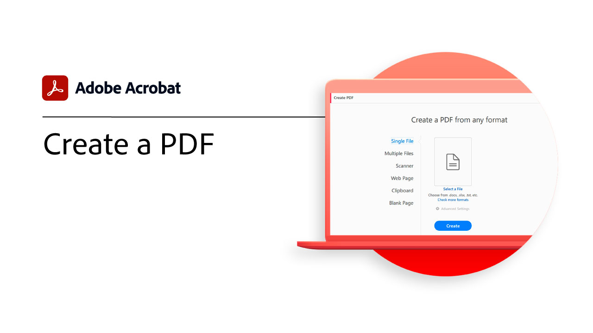

# 시작 개요

이 간단한 단계별 튜토리얼을 통해 Adobe Acrobat 사용을 시작하는 방법에 대해 알아봅니다. 문서 작성에서 PDF 파일 보호에 이르기까지 이 콘텐츠는 PDF 워크플로우를 간소화하도록 설계되었습니다.

## 시작하기 자습서

<table style="table-layout:fixed">
<tr>
  <td>
    
    

    <a href="get-to-know-the-acrobat-dc-interface.md"><strong>작업 영역 기본 사항</strong></a>
    

    <em>Acrobat 작업 영역을 통해 데스크탑, 웹, 모바일에서 파일과 도구에 간편하게 액세스하는 방법을 살펴보세요</em>
     
  </td>
  <td>
    
    

    <a href="new-workspace.md"><strong>새로운 작업 영역 환경</strong></a>
    

    <em>Acrobat에서 활성화할 수 있는 새로운 작업 영역 환경에 대해 알아봅니다.</em>
     
  </td>
  <td>
    
    

    <a href="acrobatweb.md"><strong>Acrobat 웹으로 어디에서나 작업</strong></a>
    

    <em>브라우저에서 Acrobat 웹 툴을 사용하여 어디에서나 비즈니스 문서 요청을 처리하는 방법을 살펴보세요</em>
     
  </td>
  <td>
    
    

     <a href="productivity.md"><strong>어디에서나 업무 생산성 향상</strong></a>
    

    <em>Acrobat Reader 모바일 앱을 사용하면 태블릿이나 스마트폰에서 업무 효율성을 높일 수 있습니다</em>
     
  </td>
</tr>
<tr>
    <td>
      
      

      <a href="../integrate/integrate-overview.md#microsoft"><strong>Microsoft 365로 작업</strong></a>
      

      <em>Acrobat 및 [!DNL Microsoft 365]</em>
       
    </td>
    <td>
      
      

      <a href="where-do-pdfs-come-from.md"><strong>PDF은 어디에서 제공됩니까?</strong></a>
      

      <em>PDF의 출처와 용도 이해</em>
       
    </td>
    <td>
    
      

       
    </td>
    <td>
    
      

       
    </td>
  </tr>
  </table>

## 자습서 만들기, 결합 및 구성

<table style="table-layout:fixed">
  <tr>
    <td>
      
      

      <a href="create-pdf.md"><strong>PDF 만들기</strong></a>
      

      <em>다양한 유형의 문서에서 PDF 만들기</em>
       
    </td>
    <td>
      
      

      <a href="combine-to-pdf.md"><strong>파일을 PDF에 결합</strong></a>
      

      <em>다양한 유형의 파일을 단일 PDF으로 결합</em>
       
    </td>
    <td>
      
      

      <a href="organize.md"><strong>페이지 구성</strong></a>
      

      <em>PDF에서 페이지 추가, 교체, 추출, 회전, 삭제 및 이동</em>
       
    </td>
    <td>
      
      

      <a href="add-custom-page.md"><strong>사용자 정의 페이지 추가</strong></a>
      

      <em>통합 Adobe Express 앱을 사용하여 PDF에 사용자 정의 페이지를 추가하는 방법 알아보기</em>
       
    </td>
  </tr>
  </table>

## 자습서 편집 및 내보내기

<table style="table-layout:fixed">
  <tr>
    <td>
      
      

      <a href="edit-pdf.md"><strong>PDF 편집</strong></a>
      

      <em>PDF 파일에서 텍스트 및 이미지 편집</em>
       
    </td>
    <td>
      
      

      <a href="auto-adjust-layout.md"><strong>레이아웃 자동 조정</strong></a>
      

      <em>콘텐츠를 자동으로 조정하는 새로운 편집 모드에 대해 알아봅니다</em>
       
    </td>
    <td>
      
      

      <a href="export-pdf.md"><strong>PDF을 편집 가능한 형식으로 내보내기</strong></a>
      

      <em>PDF 파일을 편집 가능한 형식으로 내보내는 방법에 대해 알아봅니다</em>
       
    </td>
    <td>
    
      

       
    </td>
  </tr>
  </table>

## 공동 작업 튜토리얼

<table style="table-layout:fixed">
  <tr>
    <td>
      
      

      <a href="collaborate.md"><strong>실시간 공동 작업</strong></a>
      

      <em>어디에서나 실시간으로 주석을 수집하고, 실시간 답변을 통해 원활하게 협업하고, 문서의 진행 상황을 추적하여 프로젝트를 향상시킬 수 있습니다</em>
       
    </td>
    <td>
      
      

      <a href="comment-on-pdf-files.md"><strong>PDF에 댓글 달기</strong></a>
      

      <em>PDF 파일에 주석을 추가한 다음 다른 사람과 공유</em>
       
    </td>
    <td>
    
      

       
    </td>
    <td>
    
      

       
    </td>
</tr>
</table>

## 추가 자습서

<table style="table-layout:fixed">
<tr>
  <td>
    
    

    <a href="create-fillable-forms.md"><strong>채울 수 있는 양식 만들기</strong></a>
    

    <em>다른 응용 프로그램에서 만든 문서를 입력 가능한 PDF 양식으로 변환</em>
     
  </td>
  <td>
    
    

    <a href="fill-and-sign.md"><strong>Fill &amp; Sign PDF forms</strong></a>
    

    <em>PDF 양식 빠르게 채우기 및 서명</em>
     
  </td>
  <td>
    
    

    <a href="scan-and-ocr.md"><strong>스캔 및 OCR</strong></a>
    

    <em>공유, 게시 또는 아카이빙의 품질을 그대로 유지하면서 대용량 파일을 줄이고 PDF 최적화</em>
     
  </td>
  <td>
    
    

    <a href="password-protect.md"><strong>암호로 PDF 파일 Protect</strong></a>
    

    <em>다른 사용자가 파일을 열거나 편집하지 못하도록 PDF에 암호를 추가합니다</em>
     
  </td>
</tr>
<tr>
  <td>
    
    

    <a href="signatures.md"><strong>서명 받기</strong></a>
    

    <em>어디에서나 다른 사람으로부터 법적으로 유효한 전자 서명을 수집하여 차질 없는 비즈니스 전개</em>
     
  </td>
  <td>
    
    

    <a href="track.md"><strong>문서 추적</strong></a>
    

    <em>서명 대기 중인 파일과 서명된 파일 항상 확인</em>
     
  </td>
  <td>
   
    

     
  </td>
  <td>
   
    

     
  </td>
</tr>
</table>
