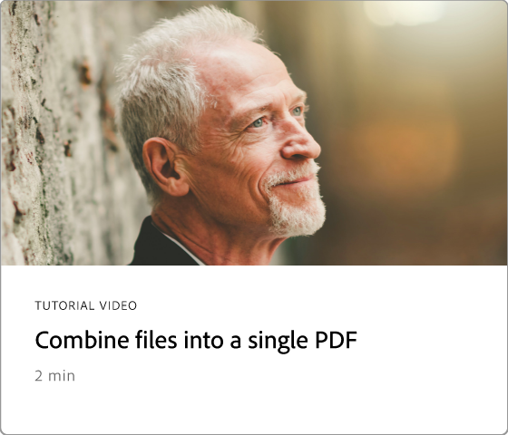

# 시작 개요

이 간단한 단계별 튜토리얼을 통해 Adobe Acrobat 사용을 시작하는 방법에 대해 알아보십시오. 이 콘텐츠는 문서를 만드는 것부터 [PDF 파일을 편집하거나](https://www.adobe.com/acrobat/online/pdf-editor.html){target="_blank"}하는 것까지 PDF 작업 과정에 쉽게 참여할 수 있도록 설계되었습니다. Acrobat을 시작하려면 전문적으로 선별된 이 [재생 목록](https://experienceleague.adobe.com/en/playlists/acrobat-get-started-business-users)을 확인하십시오.

## 새로운 기능

>[!BEGINTABS]

>[!TAB 실시간 공동 작업]

효율성을 높이고 콘텐츠 품질도 향상하는 [검토 프로세스](collaborate.md) 문서를 만드는 방법에 대해 알아봅니다.

>[!TAB 새 페이지 디자인]

Adobe Express을 사용하여 PDF에서 [전문적인 느낌의 새로운 페이지를 디자인](add-custom-page.md)하는 방법을 알아보세요.

>[!TAB PDF에서 그래픽 편집]

PDF에서 [그래픽을 만들고, 편집하고, 향상시키는 방법](edit-graphics.md)을 살펴보세요.

>[!TAB 새 작업 영역 환경]

도구를 빠르게 찾고 PDF 작업을 효율적으로 완료하는 데 도움이 되는 Acrobat의 [새 작업 영역](new-workspace.md)에 대해 알아보세요.

>[!ENDTABS]

## 시작하기 자습서

<!-- CARDS

* https://experienceleague.adobe.com/en/docs/document-cloud-learn/acrobat-learning/getting-started/new-workspace
  {title = New workspace experience}
  {description = Learn about the new workspace in Acrobat}
  {cta = Watch}
  {image = https://experienceleague.adobe.com/en/docs/document-cloud-learn/acrobat-learning/getting-started/media_1fd7846c8083ccd0da406c6abf96fe746d9b4539e.png?width=2000&format=webply&optimize=medium}
* https://experienceleague.adobe.com/en/docs/document-cloud-learn/acrobat-learning/getting-started/get-to-know-the-acrobat-dc-interface
  {title = Workspace basics}
  {description = Learn the basics of the Acrobat workspace}
  {cta = Watch}
  {image = https://experienceleague.adobe.com/en/docs/document-cloud-learn/acrobat-learning/getting-started/media_1829b23b3d26ba9ab2687a87be27ecf1b2adde71e.png?width=2000&format=webply&optimize=medium}
* https://experienceleague.adobe.com/en/docs/experience-manager-learn/getting-started-wknd-tutorial-develop/overview 
   { image = "https://cdn.experienceleague.adobe.com/thumbs/example.png" }
* https://experienceleague.adobe.com/en/docs/journey-optimizer/using/get-started/user-interface

-->

<table style="table-layout:fixed">
<tr>
  <td>
    
    

    <a href="new-workspace.md"><strong>새 작업 영역 환경</strong></a>
    

    Acrobat의 새로운 작업 영역에 대해 알아보기
     
  </td>
  <td>
    
    

    <a href="get-to-know-the-acrobat-dc-interface.md"><strong>작업 영역 기본 사항</strong></a>
    

    Acrobat 작업 영역의 기본 사항 학습
     
  </td>
  <td>
    
    

    <a href="ai-assistant.md"><strong>AI 도우미를 사용하여 PDF 인사이트 탐색</strong></a>
    

    AI 어시스턴트를 사용하여 PDF 파일에서 통찰력을 얻으십시오
     
  </td>
  <td>
    
    

    <a href="acrobatweb.md"><strong>Acrobat 웹으로 장소에 상관없이 작업</strong></a>
    

    어디서나 작업하는 방법 알아보기
     
  </td>
</tr>
<tr>
  <td>
    
    

    <a href="productivity.md"><strong>이동 중 생산성</strong></a>
    

    태블릿 또는 휴대폰에서 더 많은 작업을 수행하는 방법 알아보기
     
  </td>
    <td>
      
      

      <a href="../integrate/integrate-overview.md#microsoft"><strong>Microsoft 365로 작업</strong></a>
      

      Microsoft 365 내에서 PDF 파일로 원활하게 작업
        
    </td>
    <td>
      
      

      <a href="where-do-pdfs-come-from.md"><strong>PDF은 어디에서 오나요?</strong></a>
      

      PDF의 출처와 사용 방법 알아보기
       
    </td>
    <td>
    
      

       
    </td>
  </tr>
  </table>

## 튜토리얼 만들기, 결합 및 구성

<table style="table-layout:fixed">
  <tr>
    <td>
      
      

      <a href="create-pdf.md"><strong>PDF 파일 만들기</strong></a>
      

      모든 유형의 문서에서 PDF 만들기
       
    </td>
    <td>
      
      

      <a href="combine-to-pdf.md"><strong>단일 PDF으로 파일 결합</strong></a>
      

      다양한 유형의 파일을 단일 PDF으로 원활하게 결합
       
    </td>
    <td>
      
      

      <a href="organize.md"><strong>페이지 구성</strong></a>
      

      페이지를 원하는 방식으로 다시 정렬하는 방법 알아보기
       
    </td>
    <td>
      
      

      <a href="add-custom-page.md"><strong>새 페이지 디자인</strong></a>
      

     PDF에서 전문적인 느낌을 주는 페이지를 새로 만드는 방법을 살펴보세요
       
    </td>
  </tr>
  </table>

## 튜토리얼 편집 및 내보내기

<table style="table-layout:fixed">
  <tr>
    <td>
      
      

      <a href="edit-pdf.md"><strong>PDF에서 텍스트 편집</strong></a>
      

      PDF에서 단어, 구 또는 전체 페이지 편집
       
    </td>
    <td>
      
      

      <a href="edit-graphics.md"><strong>PDF에서 그래픽 편집</strong></a>
      

      PDF에서 그래픽을 만들고 편집하고 향상시키는 방법을 살펴봅니다
       
    </td>
    <td>
      
      

      <a href="stylize-this-pdf.md"><strong>이 PDF 스타일화</strong></a>
      

      전문가 수준의 PDF을 만드는 방법 알아보기
       
    </td>
   <td>
      
      

      <a href="auto-adjust-layout.md"><strong>자동 조정 레이아웃</strong></a>
      

      콘텐츠를 리플로우하는 새로운 편집 모드에 대해 알아봅니다.
       
    </td>
  </tr>
    <td>
      
      

      <a href="export-pdf.md"><strong>PDF을 다른 파일 형식으로 변환</strong></a>
      

      PDF 파일을 다른 파일 형식으로 변환
       
    </td>
    <td>
   
    

     
  </td>
  <td>
   
    

     
  </td>
   <td>
   
    

     
  </td>
</tr>
</table>

## 공동 작업 튜토리얼

<table style="table-layout:fixed">
  <tr>
    <td>
      
      

      <a href="collaborate.md"><strong>실시간 공동 작업</strong></a>
      

      실시간 공동 작업을 통해 프로젝트 진행
    </td>
    <td>
      
      

      <a href="comment-on-pdf-files.md"><strong>PDF에 댓글</strong></a>
      

      댓글을 추가한 다음 다른 사람과 PDF 공유
       
    </td>
    <td>
    
      

       
    </td>
    <td>
    
      

       
    </td>
</tr>
</table>

## 추가 자습서

<table style="table-layout:fixed">
<tr>
  <td>
    
    

      <a href="create-fillable-forms.md"><strong>채울 수 있는 양식 만들기</strong></a>
      

      스캔한 용지를 채울 수 있는 양식으로 변환
       
  </td>
  <td>
    
    

    <a href="fill-and-sign.md"><strong>PDF 양식 Fill &amp; Sign</strong></a>
    

    PDF 양식을 빠르고 쉽게 작성하고 서명하는 방법에 대해 알아봅니다.
     
  </td>
  <td>
    
    

    <a href="scan-and-ocr.md"><strong>스캔 및 OCR</strong></a>
    

    스캔 파일 또는 이미지 파일을 검색 및 수정 가능한 PDF 파일로 변환
     
  </td>
  <td>
    
    

    <a href="password-protect.md"><strong>암호가 있는 PDF 파일 Protect</strong></a>
    

    PDF에 암호를 추가하는 방법 알아보기
     
  </td>
</tr>
<tr>
  <td>
    
    

    <a href="signatures.md"><strong>서명 받기</strong></a>
    

    법적 구속력이 있는 전자 서명을 수집하는 방법 알아보기
     
  </td>
  <td>
    
    

    <a href="track.md"><strong>문서 추적</strong></a>
    

    전자 서명 문서 추적 및 관리
     
  </td>
  <td>
   
    

     
  </td>
  <td>
   
    

     
  </td>
</tr>
</table>
