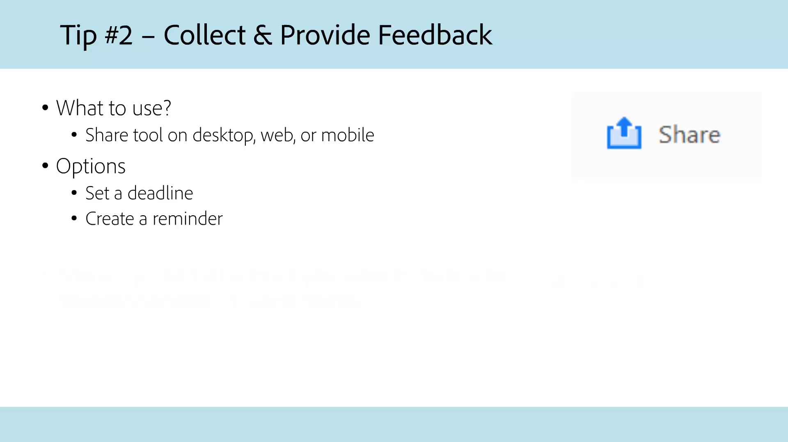
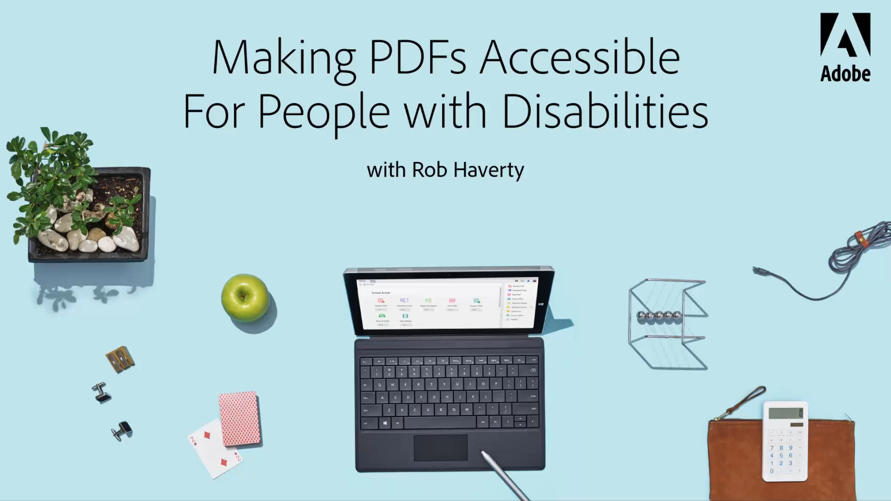
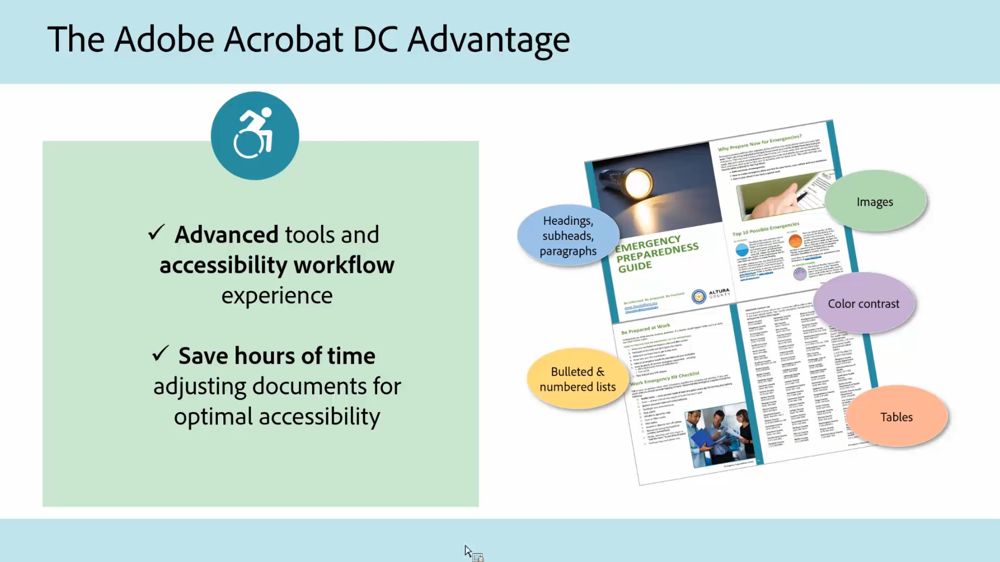

# 공공 기관을 위한 Acrobat

연방, 주 및 지방 자치 기관을 위해 특별히 고안된 Acrobat 튜토리얼을 살펴보십시오.

## 어디에서나 Acrobat으로 작업하기 위한 5가지 팁

<table style="table-layout:fixed">
<tr>
  <td>
    
    

    <a href="5-tips-for-working-anywhere-with-acrobat-dc-for-government.md"><strong>어디에서나 Acrobat으로 작업하기 위한 5가지 팁(완료 15:12)</strong></a>
    

    <em>Acrobat의 툴과 함께 사용 가능한 모바일 앱을 사용하여 어디에서나 작업하는 방법을 살펴보세요</em>
     
  </td>
  <td>
    
    

    <a href="get-your-tools.md"><strong>팁 1: 툴 다운로드</strong></a>
    

    <em>어디에서나 작업을 시작할 수 있는 첫 번째 단계는 Acrobat 툴과 함께 제공되는 모바일 앱을 이용하는 것입니다</em>
     
  </td>  
  <td>
    
    

    <a href="collaborate-on-documents.md"><strong>팁 2: 문서에서 공동 작업</strong></a>
    

    <em>문서 공동 작업을 위한 간단하고 간편한 워크플로우 구축</em>
     
  </td>  
</tr>
<tr>
  <td>
    
    

    <a href="protect-digital-documents.md"><strong>팁 3: Protect 디지털 문서</strong></a>
    

    <em>복사, 편집 또는 인쇄를 방지하기 위해 PDF에 암호를 추가합니다</em>
     
  </td>
  <td>
    
    

    <a href="work-with-forms-and-signatures.md"><strong>팁 4: 양식 및 서명을 사용하여 작업</strong></a>
    

    <em>양식 작성 시 디지털을 유지하는 방법 알아보기</em>
     
  </td>
  <td>
    
    

    <a href="scan-and-edit-on-mobile.md"><strong>팁 5: 모바일 디바이스에서 스캔 및 편집</strong></a>
    

    <em>Adobe Scan 및 Acrobat Reader 모바일 앱을 사용하여 어디에서나 작업을 수행하는 방법에 대해 알아봅니다</em>
     
  </td>
</tr>
</table>

## 접근성

<table>
<tr>
  <td>
    
    

    <a href="making-pdfs-accessible.md"><strong>PDF 액세스 가능(완료 14:11)</strong></a>
    

    <em>액세스 가능한 PDF 파일을 만들기 위한 최적의 작업 과정에 대해 알아봅니다.</em>
     
  </td>
  <td>
    
    

    <a href="understanding-accessibility.md"><strong>PDF 액세스 가능: 액세스 가능성 이해</strong></a>
    

    <em>장애가 있는 사용자가 액세스할 수 있는 PDF을 만드는 것의 의미를 알아봅니다</em>
     
  </td>  
  <td>
    
    

    <a href="collaborate-on-documents.md"><strong>PDF 액세스 가능: Word에서 작성</strong></a>
    

    <em>에서 작성된 PDF 파일을 만들기 위한 모범 사례 [!DNL Microsoft Word]</em>
     
  </td>  
</tr>
<tr>
  <td>
    
    

    <a href="finishing-in-acrobat.md"><strong>PDF 액세스 가능: Acrobat에서 마무리</strong></a>
    

    <em>Acrobat Pro의 툴을 사용하여 PDF 파일에 액세스 가능하게 만드는 방법을 살펴봅니다</em>
     
  </td>
  <td>
    
    

    <a href="making-pdf-ballots-accessible.md"><strong>PDF 투표용지의 접근성 향상</strong></a>
    

    <em>이 온라인 세미나는 화면 판독기와 같은 보조 기술 사용자가 투표지를 읽고 완료할 수 있도록 하는 데 필요한 PDF 접근성의 주요 영역을 다룹니다</em>
     
  </td>  
  <td>
   
    

     
  </td>
</tr>
</table>
