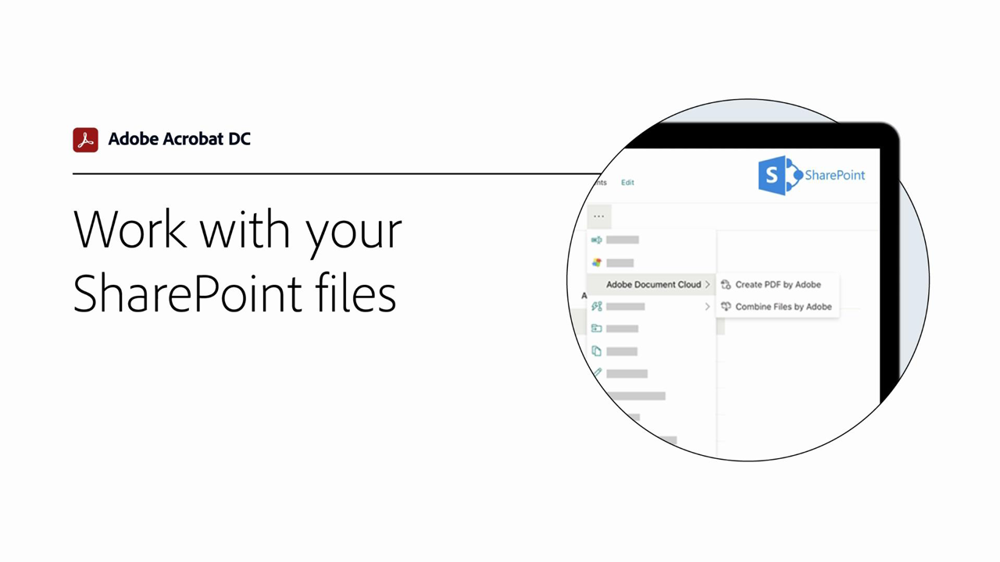
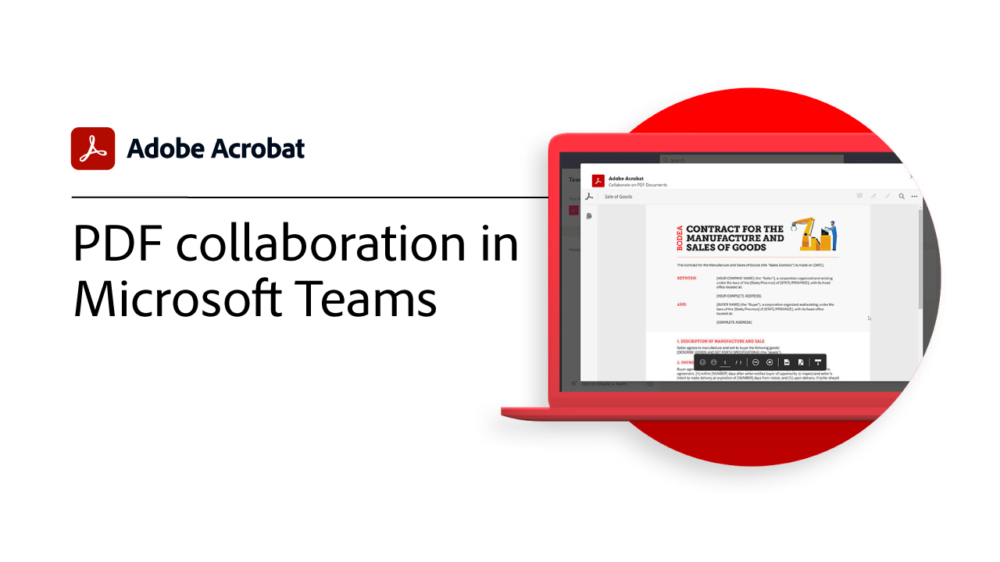

# 통합 개요

[!DNL Box], [!DNL Dropbox], [!DNL Google Drive], [!DNL OneDrive] 및 [!DNL Microsoft] 앱과 Acrobat을 통합합니다.

## Microsoft

[Microsoft 365](https://www.adobe.com/documentcloud/integrations/microsoft-office-365.html) 바로 내부에서 팀의 모든 사용자가 PDF 파일을 사용하여 원활하게 작업하는 방법을 알아봅니다.

<table style="table-layout:fixed">
<tr>
  <td>
    
    

    <a href="createfromword.md"><strong>[!DNL Microsoft Word]에서 PDF 파일 만들기</strong></a>
    

    <em>하이퍼링크로 연결된 목차, 상호 참조, 책갈피 및 첨부 파일이 포함된 풍부하고 강력한 PDF 파일을 [!DNL Microsoft Word]에서 직접 만듭니다.</em>
     
  </td>
  <td>
    
    

    <a href="acrobatandsp.md"><strong>[!DNL SharePoint] 파일 작업</strong></a>
    

    <em>[!DNL SharePoint] 및 Acrobat DC를 사용하여 문서 워크플로를 간소화합니다.</em>
     
  </td>  
  <td>
    
    

    <a href="acrobatandteams.md"><strong>[!DNL Microsoft Teams]에서 PDF 공동 작업</strong></a>
    

    <em>[!DNL Microsoft Teams]을(를) 떠나지 않고 PDF를 보고 주석을 달고 검토함으로써 동료와 공동 작업을 합니다.</em>
     
  </td>
</tr>
<tr>
  <td>
    
    

    <a href="outlook.md"><strong>[!DNL Outlook]에서 전자 메일 메시지 및 첨부 파일을 PDF로 변환</strong></a>
    

    <em>[!DNL Outlook] 내부에서 보다 전문적이고 안전한 방식으로 정보를 전달하는 방법 알아보기</em>
     
  </td>
  <td>
    
    

    <a href="edge.md"><strong>[!DNL Microsoft Edge]을(를) 사용하여 검색하는 동안 PDF 콘텐츠 만들기</strong></a>
    

    <em>[!DNL Microsoft Edge]에 대한 Adobe Acrobat 확장명을 사용하여 웹 페이지를 PDF에 즉시 보관하는 방법 알아보기</em>
     
  </td>
  <td>
   
    

     
  </td>
</tr>
</table>

## Google Drive

[!DNL Google Drive] 내의 필수 PDF 및 전자 서명 도구를 사용하여 짧은 시간 내에 더 많은 작업을 수행하는 방법을 알아봅니다.

<table style="table-layout:fixed">
<tr>
  <td>
    
    

    <a href="acrobatandgoogle.md"><strong>[!DNL Google Drive]용 Adobe Acrobat</strong></a>
    

    <em>[!DNL Google Drive] 앱 내에서 직접 시간을 절약하는 PDF 도구 및 전자 서명 워크플로를 액세스할 수 있습니다.</em>
     
  </td>
  <td>
   
    

     
  </td>
  <td>
   
    

     
  </td>
</tr>
</table>

## 상자

Acrobat DC와 [Box](https://www.adobe.com/documentcloud/integrations/box.html){target=&quot;_blank&quot;}을 통해 조직의 모든 사용자가 비즈니스를 계속 진행할 수 있도록 하는 방법을 알아봅니다.

## Dropbox

[Dropbox](https://www.adobe.com/documentcloud/integrations/dropbox.html){target=&quot;_blank&quot;}에 저장된 PDF에 액세스하고 작업하는 것이 얼마나 쉬운지 알아봅니다.
