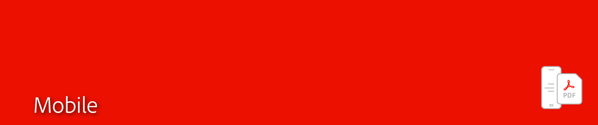

# 모바일 개요

모바일 장치에서 PDF를 만들고, 채우고, 서명합니다.

[Adobe Acrobat Reader 모바일 앱](https://acrobat.adobe.com/kr/ko/mobile/acrobat-reader.html){target=&quot;_blank&quot;}을(를) 다운로드하여 PDF를 안정적으로 보고 주석을 달고 서명할 수 있는 무료 글로벌 표준을 다운로드하십시오.

[iOS 모바일 가이드](https://www.adobe.com/go/v_acrobatios_en){target=&quot;_blank&quot;} Android용 
[Acrobat Reader 모바일 가이드](https://www.adobe.com/go/v_acrobatandroid_en){target=&quot;_blank&quot;}

[Adobe Scan 모바일 앱](https://acrobat.adobe.com/us/en/mobile/scanner-app.html){target=&quot;_blank&quot;}을 다운로드하여 종이 문서를 캡처하고 검색할 수 있는 텍스트를 사용하여 고품질 PDF로 변환합니다.

[iOS 모바일 가이드](https://www.adobe.com/go/adobescanios_en){target=&quot;_blank&quot;} Adobe Scan for Android 모바일 가이드
{target=&quot;_blank&quot;}

[Adobe Fill &amp; Sign 모바일 앱](https://acrobat.adobe.com/kr/ko/mobile/fill-sign-pdfs.html){target=&quot;_blank&quot;}을 다운로드하여 손가락이나 스타일러스를 사용하여 모든 장치에서 폼을 작성, 서명 및 보냅니다.
