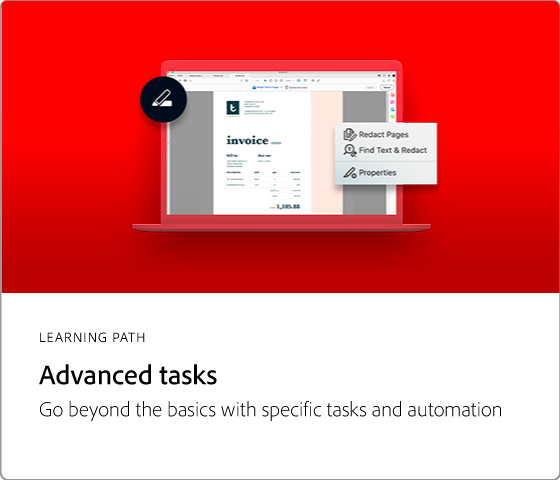

# Acrobat 튜토리얼

Adobe Document Cloud 솔루션인 Adobe Acrobat은 PDF을 변환, 편집, 공유 및 서명하여 비즈니스를 지속적으로 움직이는 데 도움이 됩니다. Adobe Acrobat에서 초보자와 고급 사용자를 모두 빠르게 최신 상태로 만들 수 있는 다양한 학습 환경을 살펴보세요.

## 추천 학습 경로

<table style="table-layout:fixed">
<tr>
  <td>
    
  </td>
  <td>
    
  </td>
  <td>
    
  </td>
  <td>
    
  </td>
</tr>
</table>
