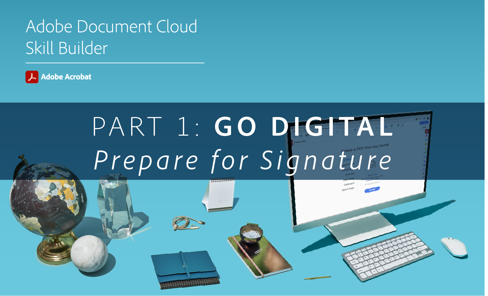

# Acrobat 스킬 빌더

인터랙티브한 스킬 빌더로 Acrobat을 빠르게 시작해 보세요. 또는 [월간 라이브 세션](skill-builder-webinars.md).

## 디지털로 변환

<table style="table-layout:fixed">
<tr>
  <td>
    
    

    <a href="https://doccloud.adobeconnect.com/paperpdf/" target="_blank"><strong>종이에서 PDF으로 이동</strong></a>
    

    <em>종이 문서를 PDF으로 디지털 변환</em>
     
  </td>
  <td>
    
    

    <a href="https://doccloud.adobeconnect.com/skillbuilder-sigforms/" target="_blank"><strong>서명 준비</strong></a>
    

    <em>전자 서명 필드를 사용하여 PDF 빌드</em>
     
  </td>
  <td>
    
    

     
  </td>
</tr>
</table>

## 최신 정보

<table style="table-layout:fixed">
<tr>
 <td>
    
    

    <a href="https://doccloud.adobeconnect.com/createpdfs/" target="_blank"><strong>PDF 만들기 및 구성</strong></a>
    

    <em>모든 파일 유형에서 PDF 만들기 및 구성</em>
     
  </td>
  <td>
    
    

    <a href="https://doccloud.adobeconnect.com/micro/" target="_blank"><strong>Acrobat 및 Microsoft 101</strong></a>
    

    <em>SharePoint에서 직접 PDF 만들기 및 관리</em>
     
  </td>
  <td>
    
    

    <a href="https://doccloud.adobeconnect.com/editpdf/" target="_blank"><strong>PDF 편집</strong></a>
    

    <em>PDF에 텍스트, 이미지, 링크 및 워터마크 추가</em>
     
  </td>
</tr>
<tr>
  <td>
    
    

    <a href="https://doccloud.adobeconnect.com/sign/" target="_blank"><strong>작업 서명</strong></a>
    

    <em>Microsoft Outlook에서 직접 문서에 서명</em>
     
  </td>
  <td>
    
    

    <a href="https://doccloud.adobeconnect.com/convertpdfs/" target="_blank"><strong>PDF 변환</strong></a>
    

    <em>PDF을 Word, Excel 및 PowerPoint로 변환</em>
     
  </td>
  <td>
    
    

    <a href="https://doccloud.adobeconnect.com/fillsign/" target="_blank"><strong>어디에서나 채우기 및 서명</strong></a>
    

    <em>모든 디바이스에서 양식을 채우고 서명하여 전자 방식으로 전송</em>
     
  </td>
</tr>
<tr>
  <td>
    
    

    <a href="https://doccloud.adobeconnect.com/optimizepdfs/" target="_blank"><strong>PDF 최적화</strong></a>
    

    <em>배포할 PDF 준비</em>
     
  </td>
  <td>
   
    

     
  </td>
  <td>
   
    

     
  </td>
</tr>
</table>

## 작업 완료

<table style="table-layout:fixed">
<tr>
  <td>
    
    

    <a href="https://doccloud.adobeconnect.com/skillbuilder-share/" target="_blank"><strong>피드백 공유 및 수집</strong></a>
    

    <em>PDF 수집 및 피드백 받기</em>
     
  </td>
  <td>
    
    

    <a href="https://doccloud.adobeconnect.com/securepdfs/" target="_blank"><strong>PDF 보호</strong></a>
    

    <em>PDF의 민감한 정보 교정 및 보호</em>
     
  </td>
  <td>
   
    

     
  </td>
</tr>
</table>
