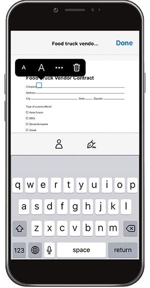

# 데스크탑 또는 모바일에서 양식 채우기 및 서명

데스크탑, 브라우저 또는 모바일 앱에서 양식을 빠르게 채우고, 서명하고 전송하세요. Adobe Sensei은 일반적으로 사용되는 데이터를 PDF 양식에서 인식하고 저장합니다. 서명을 그리거나 스캔을 가져오거나 이름을 입력하여 서명을 만든 다음 문서에 안전하게 적용합니다.

이 연습에서는 모바일 장치를 사용하여 를 가져오고, 채우고, 서명하고, 전송합니다.

여기 [데모 파일](assets/03_FillSignScan.zip) 사용합니다.

**1단계:** 다운로드 [!DNL Adobe Fill & Sign] 에 있는 [!DNL Apple App] 또는 [!DNL Google Play].

**2단계:** 앱을 열고 을 누릅니다. **[!UICONTROL 작성할 양식 선택]**.

**3단계:** 가져오기 옵션 중 하나를 선택합니다. 이 연습은 &quot;사진 찍기&quot;를 진행하겠습니다.

**4단계:** 흰색 단추를 사용하여 사진을 찍은 다음 을 탭합니다. **[!UICONTROL 사진 사용]**. 탭 **[!UICONTROL 완료]** 클릭합니다.

**5단계:** 앱 아래쪽에서 **[!UICONTROL 자르기]** 도구를 사용하고 안내선을 사용하여 이미지를 자릅니다. 탭 **[!UICONTROL 완료]** 완료 시.

**6단계:** 필요한 경우 [자동 선택] 도구를 사용하여 이미지를 지웁니다. 탭 **[!UICONTROL 완료]** 완료 시.

**7단계:** 필드를 만들고 문서에 필요한 정보를 추가하려면 페이지의 아무 곳이나 누르십시오. 더 많은 옵션을 보려면 타원을 선택합니다.

**8단계:** 을 누릅니다. **[!UICONTROL 서명]** 버튼을 클릭하여 서명을 추가합니다.

**9단계:** 서명 필드에 서명하려면 스타일러스 또는 손가락을 사용합니다. 서명 필드를 이동하고 배치합니다.

**10단계:** 을 누릅니다. **[!UICONTROL 프로필]** 이름 및 날짜와 같이 미리 채워진 값을 가져오려면 앱 아래쪽에 있는 단추를 클릭합니다. 이 정보를 한 번만 입력하면 Fill &amp; Sign 앱으로 작성한 향후 모든 양식에서 이 정보를 사용할 수 있습니다.

**11단계:** 양식이 완료되면, 오른쪽 하단에 있는 공유 단추를 눌러 이메일을 보냅니다.

## 요약:

* 디바이스 카메라로 이메일에서 파일을 열거나 종이 양식의 사진을 촬영합니다.

* 양식 필드에 텍스트 또는 체크 표시를 입력하려면 누릅니다. 자동 채우기 항목을 사용하여 양식 작성을 빠르게 완료할 수 있습니다.

* 손가락이나 스타일러스를 사용하여 서명을 만듭니다. 양식에 서명을 적용하거나 필요한 경우 이니셜을 추가할 수 있습니다.
