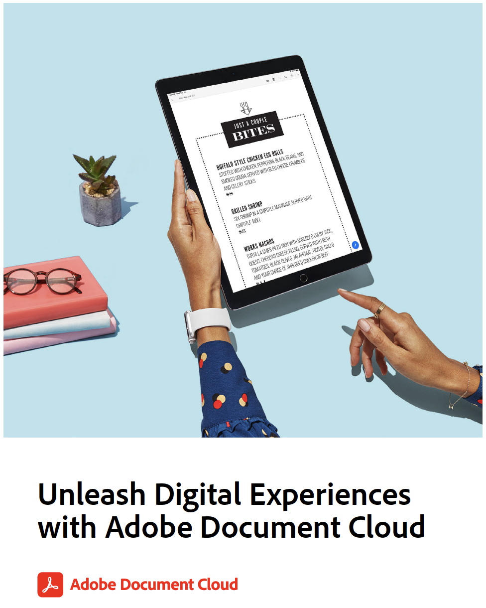

# Adobe Document Cloud를 이용한 디지털 환경 풀기 연습

이 참고 자료에는 더 많은 연습과 관련된 워크플로의 검토가 포함되어 있습니다. 다음은 다음 연습에서 사용하는 데모 파일입니다. 또한 각 연습에서는 다음 내용을 완화시킵니다.

* 예: 모든 양식 스캔 - 자신의 명함, 영수증 또는 기타 용지 문서 사용
* [예2: 모든 양식에 작성 및 서명](assets/03_FillSignScan.zip)
* [Ex.3: PDF 파일 공유 및 온라인 검토](assets/01_Review.zip)
