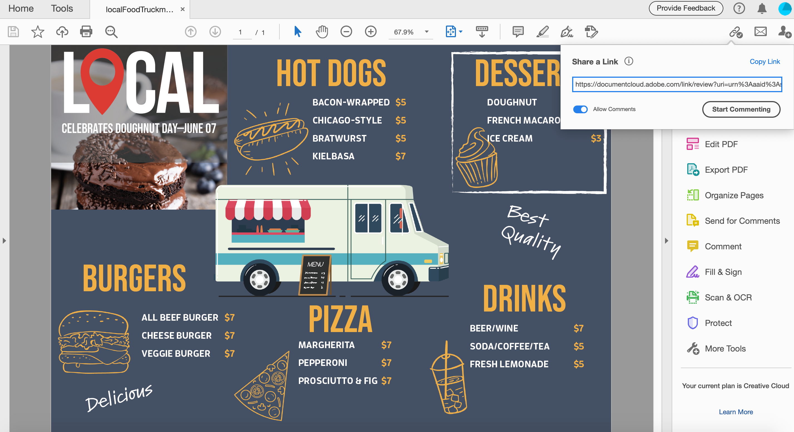

# 온라인으로 PDF 파일 공유 및 검토

Adobe Document Cloud 검토 서비스를 사용하면 Acrobat 데스크탑 응용 프로그램, Document Cloud 웹 또는 Acrobat Reader 모바일 앱에서 검토할 PDF 파일을 쉽게 공유할 수 있습니다. 검토자가 컴퓨터에서 전자 메일 초대장에 있는 URL을 클릭하면 로그인하거나 추가 소프트웨어를 설치하지 않고도 브라우저에서 피드백을 쉽게 제공할 수 있습니다.

이 연습에서는 다음 방법을 검토합니다.

* 주석 달기용 개인 맞춤 초대 보내기
* 전자 메일로 익명 또는 공개 링크 보내기

다음은 이 연습에 대한 [데모 파일](assets/01_Review.zip)입니다.

## 주석 달기용 개인 맞춤 초대 보내기

**단계 1:** Adobe Acrobat에서 `localFoodTruckmenu_start.pdf` 파일을 엽니다.

**단계 2:** 오른쪽 패널에서 **[!UICONTROL Send for Comments]**&#x200B;를 클릭하거나 오른쪽 상단에서 **[!UICONTROL 이 파일을 다른 사람과 공유]**  아이콘을 클릭합니다.

**3단계:** 수신자의 전자 메일 주소를 입력합니다. 수신자에게 메시지를 입력하거나 검토 기한을 추가할 수 있습니다.

수신자가 파일을 보면 이메일 알림을 수신하게 됩니다.

## 검토자 경험

검토자는 검토용 PDF에 대한 링크가 담긴 전자 메일 초대장을 받습니다. 초대에서 링크 또는 **[!UICONTROL 검토]** 단추를 클릭하면 PDF이 웹 브라우저에서 열립니다. 주석 도구를 사용하여 PDF에 주석을 추가할 수 있습니다. Acrobat Reader 또는 Acrobat 데스크탑 애플리케이션을 사용하여 댓글을 추가할 수도 있습니다.

## 전자 메일로 익명 또는 공개 링크 보내기

**단계 1:** Adobe Acrobat에서 `localFoodTruckmenu_start.pdf` 파일을 엽니다.

**단계 2:** **[!UICONTROL 링크 공유]** 을 클릭하세요. 공유 링크는 즉시 생성되므로 파일이 클라우드에 업로드될 때까지 기다릴 필요가 없습니다. 기본적으로 [!UICONTROL 주석 허용] 스위치가 켜져 있습니다.

**단계 3:** **[!UICONTROL 링크 복사]**&#x200B;를 클릭하고 수신자와 링크를 공유합니다.

## 주석 달기

**단계 1:** 오른쪽 패널에서 **[!UICONTROL 주석]**&#x200B;을 클릭합니다.

**2단계:** 맨 위의 리본 도구를 사용하여 문서에 태그를 지정하거나 주석을 입력합니다.

댓글은 자동으로 저장되며 다른 사용자가 볼 수 있습니다.

## PDF 주석을 InDesign으로 가져오기

InDesign CC 2019에서는 PDF 파일에서 직접 주석을 가져올 수 있습니다. 단 한 번의 클릭으로 변경 사항을 가져오고 적용하고 적용할 수 있습니다. 새 PDF 주석 패널에서 주석을 선택하면 InDesign 파일에서 해당 주석을 찾아 강조 표시합니다.

**단계 1:** 주석이 포함된 PDF 파일을 다운로드합니다.

**2단계:** InDesign 파일을 엽니다.

**단계 3:** 상단 메뉴에서 **[!UICONTROL 파일]**&#x200B;을 클릭합니다.

**단계 4:** 드롭다운에서 **[!UICONTROL PDF 주석 가져오기]**&#x200B;를 클릭합니다.

**5단계:** 주석이 포함된 PDF을 엽니다.

UI에 주석이 나타납니다.

## 개요:

Acrobat을 사용하여 디자인 버전을 검토하고 공유하세요. Acrobat을 사용하여 다음을 수행할 수 있습니다.

* 다른 사람이 검토할 수 있도록 PDF에 대한 링크를 보냅니다.
* 장소에 상관없이 검토 - 데스크탑, 브라우저, 모바일.
* 단일 문서에 수집합니다.
* 한 곳에서 피드백을 관리합니다.
* 브라우저만 있으면 됩니다.

주석을 한 곳에서 간편하게 보내고 추적할 수 있습니다. 수신자는 Acrobat이 없어도 볼 수 있습니다! 브라우저를 통해 주석을 달 사람을 초대할 수 있습니다. 시간과 노력을 절약하세요.
