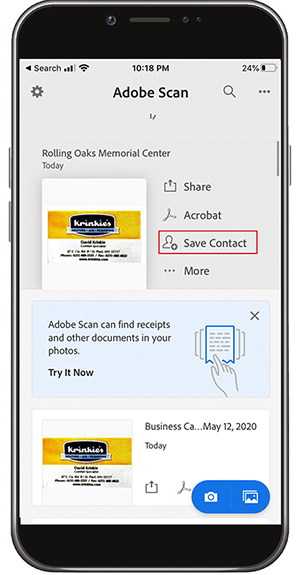

# Adobe Scan을 사용하여 디지털

낮은 우선 순위 메일, 정리 또는 공유 책상 위에 종이 더미를 쌓거나 지갑에 영수증을 넣을 필요가 없습니다. Adobe Scan 모바일 앱은 종이 문서를 PDF로 직접 스캔하고 자동으로 텍스트를 인식합니다.

이 연습에서는 명함의 내용을 연락처에 직접 업로드합니다. 영수증을 스캔하고 저장합니다.

함께 일하고 싶은 명함, 영수증 또는 기타 종이 항목을 수집합니다.

## 명함 스캔

**1단계: Apple App 스토어나 Google Play에서 Adobe Scan 앱을** 다운로드합니다.

**2단계:Adobe Scan 응용 프로그램을** 엽니다.

**3단계:앱에서** 휴대폰에 저장할 연락처 정보가 들어 있는 명함 사진을 찍으세요.

**4단계:** 스캔이 완료되면 카드가 테두리 상자 안에 있는지 확인하기 위해 조정합니다.

**5단계:** 오른쪽  **[!UICONTROL 위]** 모서리에 있는 PDF 저장을 탭합니다. 그런 다음 **[!UICONTROL 연락처 저장]**&#x200B;을 누릅니다.

**6단계:** 휴대폰에 저장하기 전에 연락처 정보를 원하는 대로 편집하거나 추가합니다. &quot;저장&quot;을 한 번 더 탭하여 연락처에 저장을 마무리합니다.

## 영수증 검색 및 저장

Adobe Scan 앱은 나중에 필요한 영수증(예: 경비 보고서 또는 기타 환급)을 스캔하고 저장하는 데 유용합니다.

**1단계: Adobe Scan 앱이** 열려 있는 상태에서 저장할 영수증 사진을 찍으세요.

**2단계: 앱이** 수신을 자동으로 감지하여 내용을 캡처합니다.

**3단계:** PDF  **[!UICONTROL 저장]** 을 휴대폰에 저장하려면 오른쪽 상단에 있습니다.

## 요약:

* 종이 문서 및 양식을 PDF로 스캔합니다.
* JPG 이미지를 PDF로 변환합니다.
* 장치에서 오른쪽으로 편집합니다.
* 연락처에 직접 명함 정보를 추가합니다.

종이를 버려!
