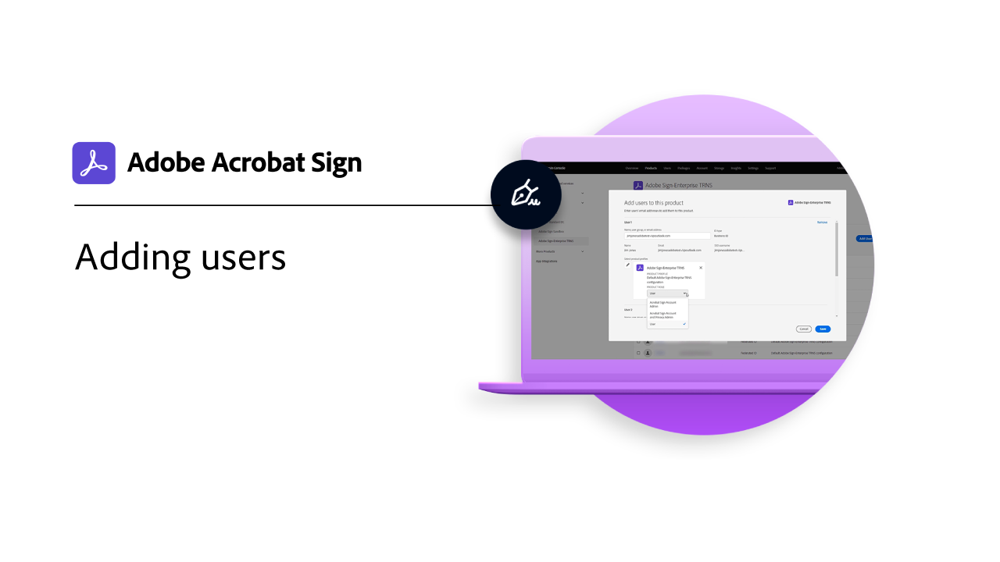
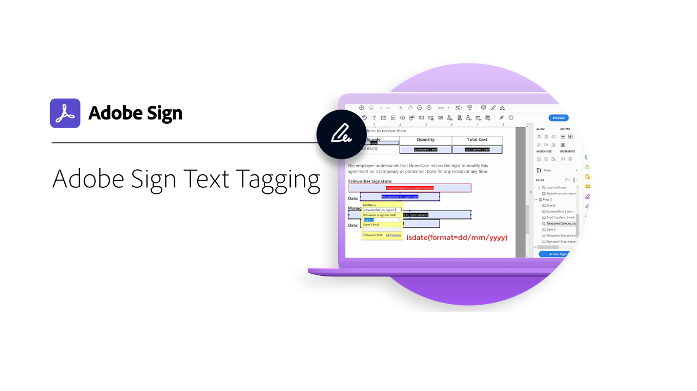

# 관리자 개요

계정에 사용자 추가, 그룹 설정, 액세스 공유, 워크플로우, 외부 보관, 공유 이벤트 및 경고 설정에 대해 알아보십시오. 이 튜토리얼은 설치 단계가 지난 관리자를 위해 마련되었으며 Acrobat Sign 관리를 시작할 준비가 되었습니다. 고급 작업에서는 관리자 설정을 지나 전역 설정 정의, 계정 액세스 및 공유, 텍스트 태그 지정으로 이동하는 주제를 다룹니다.

## 새로운 기능

* [Send in Bulk](../sign-advanced-users/megasign.md)
간단한 몇 단계만으로 모든 문서에 대해 한 번에 수천 개의 서명을 수집하는 방법을 알아봅니다
* [보고서 옵션](report-options.md)
사용자를 위한 보고서 옵션을 설정하는 방법에 대해 알아봅니다.
* [사용자 추가](add-users-to-your-account.md)
Acrobat Sign 사용자를 추가하고 관리하는 방법에 대해 알아보기

## 시작하기

<table style="table-layout:fixed">
<tr>
  <td>
    
    

    <a href="get-started-admin.md"><strong>새 관리자를 위해 시작하기</strong></a>
    

    <em>이 포괄적인 비디오 안내서에서 Acrobat Sign을 사용하여 조직을 시작하고 실행하는 데 필요한 모든 도구에 대해 알아보십시오</em>
     
  </td>
  <td>
    
    

    <a href="up-and-running-admin.md"><strong>관리자용 실행</strong></a>
    

    <em>관리자가 Acrobat Sign에서 빠르게 시작하고 실행할 수 있는 7가지 핵심 영역 개요</em>
     
  </td>
  <td>
    
    

    <a href="set-up-shared-events-and-alert.md"><strong>이벤트 및 경고에 대한 알림 구성</strong></a>
    

    <em>계정에 대한 이벤트 및 경고 알림 구성</em>
     
  </td>
  <td>
    
    

    <a href="add-users-to-your-account.md"><strong>사용자 추가</strong></a>
    

    <em>Acrobat Sign 사용자 추가 및 관리</em>
     
  </td>
</tr>
<tr>
 <td>
    
    

    <a href="create-and-manage-groups.md"><strong>그룹 생성 및 관리</strong></a>
    

    <em>그룹을 만들고, 그룹에 사용자를 추가하고, 그룹 설정을 편집합니다.</em>
     
  </td>
  <td>
    
    

    <a href="set-up-your-external-archive.md"><strong>외부 보관 설정</strong></a>
    

    <em>서명된 계약의 백업 복사본에 대한 외부 보관 만들기</em>
     
  </td>
  <td>
    
    

    <a href="../sign-advanced-users/create-a-template.md"><strong>문서 템플릿 만들기</strong></a>
    

    <em>속도와 일관성을 위해 재사용 가능한 문서 템플릿 만들기</em>
     
  </td>
  <td>
    
    

    <a href="create-a-report.md"><strong>보고서 차트 만들기</strong></a>
    

    <em>사용자 정의 보고서 및 데이터 내보내기를 빌드, 저장 및 관리하는 방법을 알아봅니다.</em>
     
  </td>
</tr>
<tr>
  <td>
    
    

    <a href="report-options.md"><strong>사용자를 위한 보고서 옵션</strong></a>
    

    <em>사용자를 위한 보고서 옵션을 설정하는 방법에 대해 알아봅니다.</em>
     
  </td>
  <td>
    
    

    <a href="../sign-advanced-users/webform.md"><strong>웹 양식 만들기</strong></a>
    

    <em>웹 사이트에서 직접 전자 서명할 수 있는 문서 만들기</em>
     
  </td>
  <td>
    
    

    <a href="../sign-advanced-users/modify-webform.md"><strong>기존 웹 양식 수정</strong></a>
    

    <em>기존 웹 양식을 비활성화, 편집 및 다시 활성화하는 방법 알아보기</em>
     
  </td>
  <td>
    
    

    <a href="../sign-advanced-users/megasign.md"><strong>대량 전송</strong></a>
    

    <em>모든 문서에 대해 한 번에 수천 개의 서명 수집</em>
     
  </td>
</tr>
<tr>
  <td>
    
    

    <a href="building-a-custom-workflow.md"><strong>워크플로우 설정</strong></a>
    

    <em>문서 워크플로우를 자동화하여 전자 서명 및 데이터 빠르게 받기</em>
     
  </td>
  <td>
    
    

     
  </td>
  <td>
    
    

     
  </td>
  <td>
    
    

     
  </td>
</table>

## 고급 작업

<table style="table-layout:fixed">
<tr>
  <td>
    
    

    <a href="learn-about-global-settings.md"><strong>전역 설정</strong></a>
    

    <em>전체 조직 또는 특정 그룹에 대한 제품 설정을 전역적으로 편집</em>
     
  </td>
  <td>
      
    

    <a href="share-account-access.md"><strong>계정 액세스 공유</strong></a>
    

    <em>다른 사용자 계정의 트랜잭션에 대한 보기 전용 액세스 설정</em>
     
  </td>
  <td>
    
    

    <a href="advanced-account-sharing.md"><strong>고급 계정 공유</strong></a>
    

    <em>관리자와 사용자가 자신의 전송, 수정 및 보기 권한을 위임할 수 있도록 계정 공유 설정</em>
     
  </td>
  <td>
    
    

    <a href="use-bio-pharma-settings.md"><strong>Bio-Pharma 설정 사용</strong></a>
    

    <em>FDA 21 CFR Part 11 요구 사항을 충족할 수 있도록 Bio-pharma 설정</em>
     
  </td> 
</tr>
<tr>
   <td>
     
    

    <a href="../sign-advanced-users/adobe-sign-text-tagging.md"><strong>Acrobat Sign 텍스트 태그 지정</strong></a>
    

    <em>Adobe Acrobat을 사용하여 텍스트 태그 지정으로 Acrobat Sign 양식 필드 작성</em>
     
  </td>
  <td>
    
    

     
  </td>
  <td>
    
    

     
  </td>
  <td>
    
    

     
  </td>
</tr>
</table>
