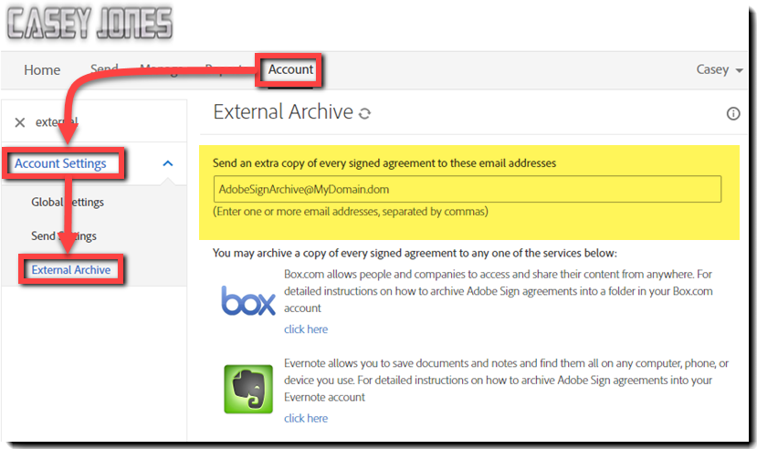
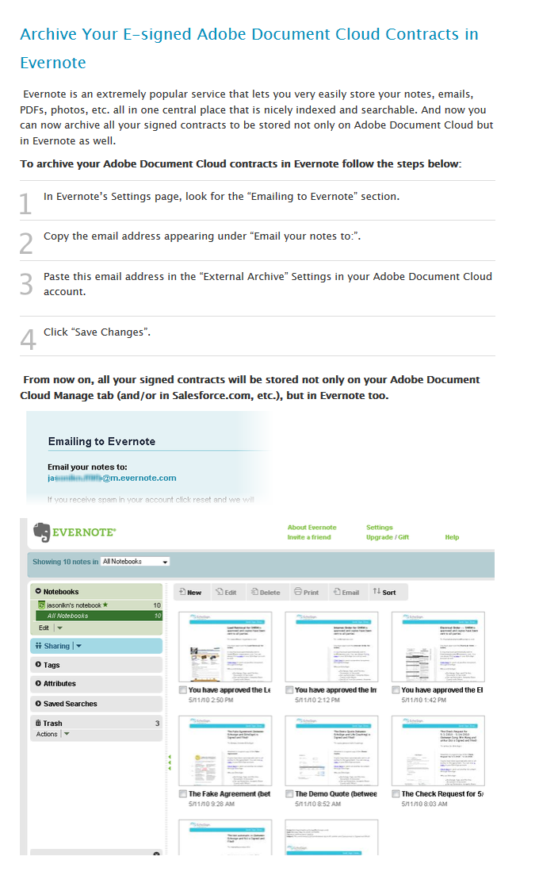

# 외부 아카이브 설정

전송된 계약의 백업 복사본을 위한 외부 아카이브를 만드는 방법을 알아봅니다. 서명된 계약의 복사본을 모든 전자 메일 주소 또는 Box 및 Evernote 에 보관할 수 있습니다. 서명 및 제출된 전자 메일의 사본은 전자 메일 주소 또는 설정한 서비스로 전송됩니다.

## 외부 아카이브: 전자 메일 주소

1. 계정 관리자로 로그인합니다.

1. [!UICONTROL 계정] 탭에서 **[!UICONTROL 계정 설정]** > **[!UICONTROL 외부 아카이브]**&#x200B;를 클릭합니다.

   

1. 아카이브 전자 메일 주소를 입력하고 **[!UICONTROL 변경 내용 저장]**&#x200B;을 클릭합니다.

   

## 외부 보관: Box.com

1. 계정 관리자로 로그인합니다.

1. [!UICONTROL 계정] 탭에서 **[!UICONTROL 계정 설정]** > **[!UICONTROL 외부 아카이브]**&#x200B;를 클릭합니다.

1. Box 로고 오른쪽에 있는 [!UICONTROL 여기를 클릭] 하십시오.

   

1. 팝업 창의 Box용 지침을 따릅니다.

   

## 외부 보관: Evernote

1. 계정 관리자로 로그인합니다.

1. [!UICONTROL 계정] 탭에서 **[!UICONTROL 계정 설정]** > **[!UICONTROL 외부 아카이브]**&#x200B;를 클릭합니다.

1. Evernote 로고 오른쪽에 있는 **[!UICONTROL 여기를 클릭]** 하십시오.

   

1. 팝업 창의 Evernote용 지침을 따릅니다.

   
