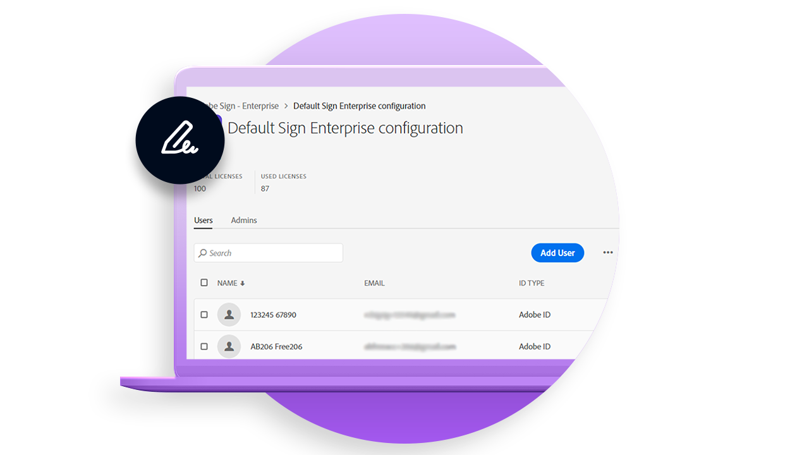

# 배포 개요

조직 내 Acrobat Sign 배포에 대한 유용한 정보를 제공하는 모범 사례 문서

<table style="table-layout:fixed">
<tr>
  <td>
    
    

    <a href="https://helpx.adobe.com/kr/enterprise/using/adobe-sign-for-enterprise.html" target="_blank"><strong>Admin Console에서 Acrobat Sign 관리</strong></a>
    

    <em>Adobe의 기업 플랫폼인 Adobe Admin Console에서 Acrobat Sign 사용자 및 라이선스를 관리하는 방법에 대해 알아봅니다.</em>
     
  </td>
  <td>
    
    

    <a href="https://www.adobe.com/trust/document-cloud-security.html" target="_blank"><strong>Adobe Trust Center</strong></a>
    

    <em>Acrobat Sign의 보안, 법률 및 표준에 대한 지속적인 노력에 대해 알아보십시오.</em>
     
  </td>
  <td>
    
    

    <a href="assets/SignStudyGuide.pdf"><strong>Acrobat Sign Essentials 학습 안내서</strong></a>
    

    <em>Acrobat Sign Essentials 평가(AD3-D104)를 위한 Acrobat Sign 연구 가이드</em>
     
  </td>
  <td>
    
    

     
  </td>
</tr>
</table>
