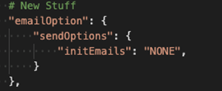

# 포함된 전자 서명 및 문서 환경 만들기

Adobe Sign API를 사용하여 웹 플랫폼 및 콘텐츠 및 문서 관리 시스템에 전자 서명 및 문서 경험을 포함하는 방법에 대해 알아봅니다. 아래 링크에서 설명하는 이 실습 자습서에는 네 부분이 있습니다.

<table style="table-layout:fixed">
<tr>
  <td>
    
    

    <a href="embeddedesignature.md#part1"><strong>1부: 필요한 것</strong></a>
    

  </td>
  <td>
    
    

    <a href="embeddedesignature.md#part2"><strong>2부: 낮은/코드 없음 — 웹 양식의 강력한 기능</strong></a>
    

  </td>
  <td>
   
    

    <a href="embeddedesignature.md#part3"><strong>제3부: 양식과 계약 보내기 및 데이터 병합</strong></a>
    

  </td>
  <td>
   
    

    <a href="embeddedesignature.md#part4"><strong>4부: 서명 경험, 리디렉션 등을 포함</strong></a>
    

  </td>
</tr>
</table>

## 1부: 필요한 것 {#part1}

1부에서는 2-4부에 필요한 모든 것을 시작하는 방법을 배웁니다. 먼저 API 자격 증명을 가져오겠습니다.

* [Adobe Sign 개발자 계정](https://acrobat.adobe.com/kr/ko/sign/developer-form.html)
* [시작 코드](https://github.com/benvanderberg/adobe-sign-api-tutorial)
* [VS 코드(또는 선택한 편집기)](https://code.visualstudio.com)
* Python 3.x
   * Mac - 홈브루어
   * Linux — 기본 제공 설치 관리자
   * Windows — 초콜릿
   * 모두 — https://www.python.org/downloads/

## 2부: 낮은/코드 없음 — 웹 양식의 강력한 기능 {#part2}

2부에서는 웹 양식을 사용할 때 낮은/코드 없음 옵션을 살펴봅니다. 처음에 코드를 쓰지 않는 것을 피할 수 있는지 보는 것은 항상 좋은 생각입니다.

1. 개발자 계정으로 Adobe Sign에 액세스합니다.
1. 홈 페이지에서 **웹 양식**&#x200B;을 클릭합니다.

   

1. 계약을 작성합니다.

   

1. 계약을 플랫 HTML 페이지에 포함합니다.
1. 동적 쿼리 매개 변수 추가

   

## 제3부: 양식과 계약 보내기 및 데이터 병합 {#part3}

3부에서는 동적으로 계약을 만듭니다.

먼저, 액세스 권한을 설정해야 합니다. Adobe Sign에서는 API를 통해 연결하는 두 가지 방법이 있습니다. OAuth 토큰 및 통합 키입니다. OAuth를 응용 프로그램과 함께 사용할 특별한 이유가 없으면 먼저 통합 키를 탐색해야 합니다.

1. Adobe Sign의 **Account** 탭에 있는 **API Information** 메뉴에서 **Integration Key**&#x200B;를 선택합니다.

   

이제 액세스 권한이 있으며 API와 상호 작용할 수 있으므로 API로 수행할 수 있는 작업을 확인하십시오.

1. [Adobe Sign REST API 버전 6 Methods](http://adobesign.com/public/docs/restapi/v6)로 이동합니다.

   

1. 토큰을 &quot;전달자&quot; 값으로 사용합니다.

   

첫 번째 계약을 보내려면 API 사용 방법을 이해하는 것이 좋습니다.

1. 임시 문서를 만들어 보냅니다.

>[!NOTE]
>
>JSON 기반 요청 호출에는 &quot;Model&quot; 및 &quot;Minimal Model Schema&quot; 옵션이 있습니다. 그러면 사양과 최소 페이로드 세트가 제공됩니다.

처음으로 계약서를 보낸 후 논리를 추가할 준비가 되었습니다. 반복을 최소화하기 위해 도움을 주는 사람들을 만드는 것은 항상 좋은 생각입니다. 몇 가지 예를 들면 다음과 같습니다.

**확인**

**헤더/인증**

**기본 URI**

Transient docs가 Sign 에코시스템의 거대한 체계 내에 어디에 있는지 알아야 합니다.
임시 -> 계약
임시 -> 템플릿 -> 계약
임시 -> 위젯 -> 계약

이 예제에서는 템플릿을 문서 소스로 사용합니다. 서명을 위해 문서를 동적으로 생성할 수 있는 확실한 이유(예: 레거시 코드 또는 문서 생성)가 없는 경우에는 일반적으로 이 경로가 가장 적합합니다.

코드는 매우 간단합니다. 문서 소스에 라이브러리 문서(템플릿)를 사용합니다. 첫 번째 서명자와 두 번째 서명자는 동적으로 할당됩니다. `IN_PROCESS` 상태는 문서가 즉시 전송됨을 의미합니다. 또한 `mergeFieldInfo`을 사용하여 필드를 동적으로 채웁니다.

## 4부: 서명 경험, 리디렉션 등을 포함 {#part4}

대부분의 시나리오에서는 트리거 참여자가 즉시 계약에 서명하도록 허용할 수 있습니다. 이 기능은 고객 대상 응용 프로그램 및 키오스크에 유용합니다.

처음 보내는 전자 메일을 트리거하지 않으려면 API 호출을 수정하여 동작을 쉽게 관리할 수 있습니다.

다음은 사후 서명 리디렉션을 제어하는 방법입니다.

계약 작성 프로세스를 업데이트한 후 최종 단계에서 서명 URL을 생성합니다. 또한 이 호출은 매우 간단하며 서명자가 서명 프로세스의 일부에 액세스하는 데 사용할 수 있는 URL을 생성합니다.

>[!NOTE]
>
>계약 작성 호출은 기술적으로 비동기적입니다. 이것은 &#39;POST&#39; 계약 요청을 할 수 있지만, 계약이 아직 준비되지 않았다는 것을 의미합니다. 재시도 루프를 설정하는 것이 좋습니다. 다시 시도를 사용하거나 환경에 가장 적합한 방법을 사용하십시오.

모든 것이 합쳐지면, 해결책은 꽤 간단하다. 계약을 체결한 다음 서명자가 클릭하여 서명 의식을 시작할 수 있도록 서명 URL을 생성합니다.

### 추가 항목

* [JS 이벤트](https://www.adobe.io/apis/documentcloud/sign/docs.html#!adobedocs/adobe-sign/master/events.md)
* Webhook 이벤트
   * [REST API](https://sign-acs.na1.echosign.com/public/docs/restapi/v6#!/webhook/createWebhook)
   * [Adobe Sign v6의 웹 후크](https://www.adobe.io/apis/documentcloud/sign/docs.html#!adobedocs/adobe-sign/master/webhooks.md)
* [요청 전자 메일 다시 활성화(이벤트 포함)](https://sign-acs.na1.echosign.com/public/docs/restapi/v6#!/agreements/update계약)
* [시간 초과를 다시 시도로 바꾸기](https://stackoverflow.com/questions/23267409/how-to-implement-retry-mechanism-into-python-requests-library)

     
* 사용자 지정 미리 알림
   * 초기 작성

      

   * 또는 [in-flight](https://sign-acs.na1.echosign.com/public/docs/restapi/v6#!/agreements/createReminderOnParticipant)

## 추가 리소스

http://bit.ly/Summit21-T126

포함 내용:
* Adobe Sign 개발자 계정
* Adobe Sign API 문서
* 샘플 코드
* Visual Studio 코드
* Python
