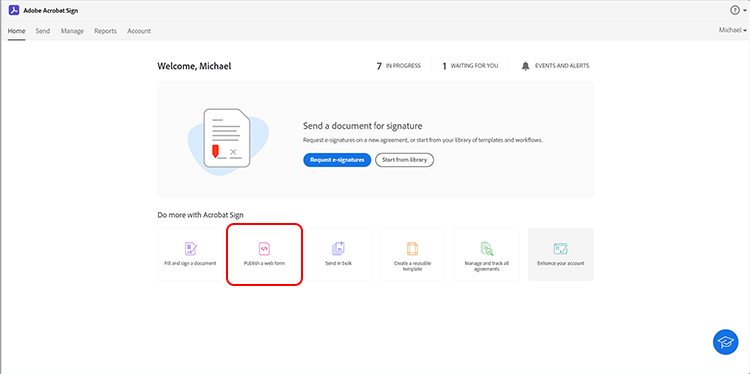

# 포함된 전자 서명 및 문서 경험 제작

Acrobat Sign API를 사용하여 웹 플랫폼, 콘텐츠 및 문서 관리 시스템에 전자 서명 및 문서 경험을 포함하는 방법에 대해 알아봅니다. 이 실습 튜토리얼에는 네 가지 부분이 있습니다.

## 1부: 필요한 기능

1부에서는 2-4부에 필요한 모든 것을 시작하는 방법을 알아봅니다. 먼저 API 자격 증명을 가져오겠습니다.

+++API 자격 증명을 가져오는 방법에 대한 세부 정보 보기

* [Acrobat Sign 개발자 계정](https://acrobat.adobe.com/kr/ko/sign/developer-form.html)
* [시작 코드](https://github.com/benvanderberg/adobe-sign-api-tutorial)
* [VS 코드(또는 선택한 편집기)](https://code.visualstudio.com)
* Python 3.x
   * Mac — Homebrew
   * Linux — 내장 설치 프로그램
   * Windows — Chocolatey
   * All — https://www.python.org/downloads/

+++

## 2부: Low/No Code — 강력한 웹 양식

2부에서는 웹 양식 사용의 낮은/코드 없음 옵션을 살펴봅니다. 처음에 코드를 작성하지 않아도 되는지 확인하는 것이 좋습니다.

+++웹 양식을 만드는 방법에 대한 세부 정보 보기

1. 개발자 계정으로 Acrobat Sign에 액세스합니다.

1. 선택 **웹 양식 게시** 를 참조하십시오.

   

1. 계약 만들기

   

1. 기본 HTML 페이지에 계약을 포함합니다.

1. 쿼리 매개 변수를 동적으로 추가해 보십시오.

   

+++

## 파트 3: 양식과 함께 계약 보내기 및 데이터 병합

3부에서 동적으로 계약을 생성합니다.

+++계약을 동적으로 만드는 방법에 대한 세부 정보 보기

먼저 액세스 권한을 설정해야 합니다. Acrobat Sign에는 API를 통해 연결하는 두 가지 방법이 있습니다. OAuth 토큰 및 통합 키. 응용 프로그램에서 OAuth를 사용해야 하는 특별한 이유가 없다면 먼저 통합 키를 살펴봐야 합니다.

1. 선택 **통합 키** 에 **API 정보** 메뉴를 **계정** 탭합니다.

   

액세스 권한을 보유하고 API와 상호 작용할 수 있으므로 API로 가능한 작업을 살펴보십시오.

1. 다음 위치로 이동합니다. [Acrobat Sign REST API 버전 6 메서드](http://adobesign.com/public/docs/restapi/v6).

   

1. 토큰을 &quot;전달자&quot; 값으로 사용합니다.

   

첫 번째 계약서를 보내려면 API 사용 방법을 이해하는 것이 가장 좋습니다.

1. 임시 문서를 만들어 보냅니다.

>[!NOTE]
>
>JSON 기반 요청 호출에는 &quot;모델&quot; 및 &quot;최소 모델 스키마&quot; 옵션이 있습니다. 사양 및 최소 페이로드 세트를 제공합니다.

계약서를 처음 보낸 후에는 논리를 추가할 준비가 됩니다. 반복을 최소화하기 위해 몇 가지 도우미를 두는 것은 항상 좋은 생각입니다. 몇 가지 예를 들면 다음과 같습니다.

**확인**

**헤더/인증**

**기본 URI**

임시 문서가 Sign 에코시스템의 전체 체계 내에서 배치되는 위치를 알아두세요.
임시 -> 계약 임시 -> 템플릿 -> 계약 임시 -> 위젯 -> 계약

이 예제에서는 문서 소스로 템플릿을 사용합니다. 서명을 위해 문서를 동적으로 생성해야 하는 확실한 이유(예: 레거시 코드 또는 문서 생성)가 없는 한 일반적으로 이 경로가 가장 좋습니다.

코드는 매우 간단합니다. 문서 소스로 라이브러리 문서(템플릿)를 사용합니다. 첫 번째 및 두 번째 서명자가 동적으로 할당됩니다. 추가 `IN_PROCESS` 상태 는 문서가 즉시 전송되고 있음을 의미합니다. 또한 `mergeFieldInfo` 필드를 동적으로 채우는 데 사용됩니다.

+++

## 4부: 서명 경험, 리디렉션 등을 임베드합니다.

많은 시나리오에서 트리거하는 참가자가 즉시 계약에 서명하도록 허용할 수 있습니다. 이는 고객 대면 애플리케이션 및 키오스크에 유용합니다.

+++서명 환경을 포함하는 방법에 대한 세부 정보 보기

첫 번째 전송 전자 메일이 트리거되지 않도록 하려면 API 호출을 수정하여 비헤이비어를 손쉽게 관리할 수 있습니다.

서명 후 리디렉션을 제어하는 방법은 다음과 같습니다.

계약 생성 프로세스를 업데이트한 후 마지막 단계는 서명 URL을 생성하는 것입니다. 이 호출은 매우 간단하며 서명자가 서명 프로세스의 해당 부분에 액세스하는 데 사용할 수 있는 URL을 생성합니다.

>[!NOTE]
>
>계약 작성 호출은 기술적으로 비동기적입니다. 즉, &#39;POST&#39; 계약을 호출할 수 있지만 계약이 아직 준비되지 않았습니다. 가장 좋은 방법은 재시도 루프를 설정하는 것입니다. 다시 시도 또는 환경에 가장 적합한 방법을 사용하십시오.

모든 것을 종합하면, 해결책은 상당히 간단하다. 계약을 만든 다음 서명자가 클릭하여 서명 의식을 시작할 서명 URL을 생성하는 것입니다.

+++

## 추가 항목

* [JS 이벤트](https://www.adobe.io/apis/documentcloud/sign/docs.html#!adobedocs/adobe-sign/master/events.md)
* Webhook 이벤트
   * [REST API](https://sign-acs.na1.echosign.com/public/docs/restapi/v6#!/webhooks/createWebhook)
   * [Acrobat Sign v6의 Webhook](https://www.adobe.io/apis/documentcloud/sign/docs.html#!adobedocs/adobe-sign/master/webhooks.md)
* [요청 전자 메일 재활성화(이벤트 포함)](https://sign-acs.na1.echosign.com/public/docs/restapi/v6#!/agreements/updateAgreement)
* [시간 제한을 다시 시도로 바꾸기](https://stackoverflow.com/questions/23267409/how-to-implement-retry-mechanism-into-python-requests-library)

     
* 사용자 지정 미리 알림
   * 초기 생성 시

      

   * 또는 하나 추가 [비행 중](https://sign-acs.na1.echosign.com/public/docs/restapi/v6#!/agreements/createReminderOnParticipant)
