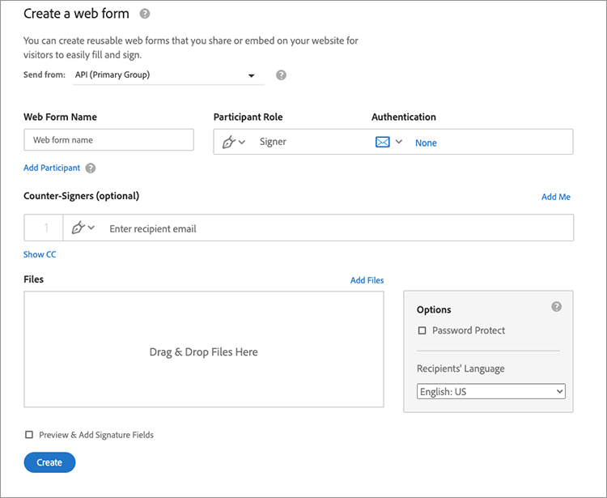
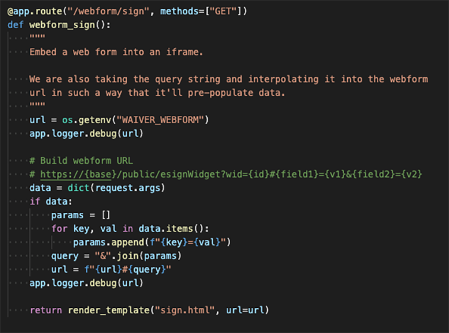
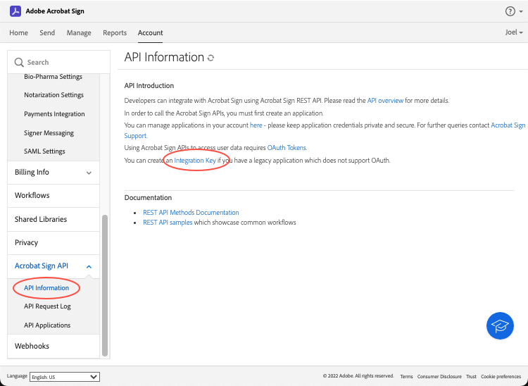

# 포함된 전자 서명 및 문서 환경 만들기

Acrobat Sign API를 사용하여 전자 서명 및 문서 경험을 웹 플랫폼과 콘텐츠 및 문서 관리 시스템에 포함하는 방법을 알아보십시오. 이 실습 튜토리얼에는 네 가지 부분이 있습니다.

## 1부: 필요한 것

1부에서는 2-4부에 필요한 모든 것을 시작하는 방법을 알아봅니다. 먼저 API 자격 증명을 가져오는 것으로 시작하겠습니다.

+++API 자격 증명을 가져오는 방법에 대한 세부 정보 보기

* [Acrobat Sign 개발자 계정](https://www.adobe.com/acrobat/business/developer-form.html)
* [시작 코드](https://github.com/benvanderberg/adobe-sign-api-tutorial)
* [VS 코드(또는 선택한 편집기)](https://code.visualstudio.com)
* 파이썬
   * Mac — Homebrew
   * Linux — 기본 설치 프로그램
   * Windows — Chocolatey
   * 모두 — https://www.python.org/downloads/

+++

## 2부: 로우/노 코드 — 웹 양식의 기능

2부에서 웹 폼 사용의 코드 낮음/코드 없음 옵션에 대해 살펴봅니다. 처음에 코드를 작성하지 않을 수 있는지 확인하는 것은 항상 좋은 생각입니다.

+++웹 양식 만들기 방법에 대한 세부 정보 보기

1. 개발자 계정으로 Acrobat Sign에 액세스합니다.

1. 홈 페이지에서 **웹 양식 Publish**&#x200B;를 선택합니다.

   

1. 계약을 생성합니다.

   

1. 플랫 HTML 페이지에 계약을 포함합니다.

1. 쿼리 매개 변수를 동적으로 추가해 보십시오.

   

+++

## 파트 3: 양식이 포함된 계약 전송 및 데이터 병합

3부에서 동적으로 계약을 생성합니다.

+++계약을 동적으로 만드는 방법에 대한 세부 정보 보기

먼저 액세스 권한을 설정해야 합니다. Acrobat Sign에는 API를 통해 연결하는 두 가지 방법이 있습니다. OAuth 토큰 및 통합 키. 애플리케이션에서 OAuth를 사용해야 하는 특별한 이유가 없는 경우 먼저 통합 키를 확인해야 합니다.

1. Acrobat Sign의 **계정** 탭 아래 **API 정보** 메뉴에서 **통합 키**&#x200B;를 선택합니다.

   

이제 API에 액세스하고 API와 상호 작용할 수 있으므로 API로 할 수 있는 작업을 확인하십시오.

1. [Acrobat Sign REST API 버전 6 메서드](http://adobesign.com/public/docs/restapi/v6)로 이동합니다.

   

1. 토큰을 &quot;전달자&quot; 값으로 사용합니다.

   

첫 번째 계약을 전송하려면 API 사용 방법을 이해하는 것이 가장 좋습니다.

1. 임시 문서를 만들어 보냅니다.

>[!NOTE]
>
>JSON 기반 요청 호출에는 &quot;모델&quot; 및 &quot;최소 모델 스키마&quot; 옵션이 있습니다. 사양과 최소 페이로드 세트가 제공됩니다.

계약을 처음 보낸 후 논리를 추가할 준비가 되었습니다. 반복을 최소화하기 위해 어떤 조력자를 세우는 것은 항상 좋은 생각입니다. 다음은 몇 가지 예입니다.

**유효성 검사**

**헤더/인증**

**기본 URI**

Sign 에코시스템의 거대한 체계 내에서 임시 문서가 어디에 위치하는지 인식하십시오.
임시 -> 계약
임시 -> 템플릿 -> 계약
임시 -> 위젯 -> 계약

이 예제에서는 템플릿을 문서 소스로 사용합니다. 일반적으로 이 방법이 가장 좋은 경로는 서명을 위해 문서를 동적으로 생성하는 확실한 이유가 없는 경우입니다(예: 레거시 코드 또는 문서 생성).

이 코드는 매우 간단합니다. 문서 소스에 라이브러리 문서(템플릿)를 사용합니다. 첫 번째 및 두 번째 서명자는 동적으로 할당됩니다. `IN_PROCESS` 상태는 문서가 즉시 전송됨을 의미합니다. 또한 `mergeFieldInfo`은(는) 필드를 동적으로 채우는 데 사용됩니다.

+++

## 파트 4: 서명 환경, 리디렉션 등 포함

많은 시나리오에서 트리거하는 참가자가 즉시 계약에 서명하도록 허용할 수 있습니다. 이 기능은 고객 대면 애플리케이션과 키오스크에 유용합니다.

+++서명 경험을 포함하는 방법에 대한 세부 정보 보기

첫 번째 전송 전자 메일이 트리거되지 않도록 하려면 API 호출을 수정하여 동작을 손쉽게 관리할 수 있습니다.

서명 후 리디렉션을 제어하는 방법은 다음과 같습니다.

계약 생성 프로세스를 업데이트한 후 마지막 단계에서는 서명 URL을 생성합니다. 이 호출은 또한 매우 간단하며 서명자가 서명 프로세스의 일부에 액세스하는 데 사용할 수 있는 URL을 생성합니다.

>[!NOTE]
>
>계약 생성 호출은 기술적으로 비동기적입니다. 즉, &#39;POST&#39; 계약 호출을 사용할 수 있지만 계약이 아직 준비되지 않았습니다. 재시도 루프를 설정하는 것이 좋습니다. 다시 시도 또는 해당 환경에 가장 적합한 방법을 사용하십시오.

모든 것을 종합하면 해결책은 매우 간단하다. 계약을 체결한 다음 서명자가 클릭하여 서명 의식을 시작할 수 있는 서명 URL을 생성합니다.

+++

## 추가 항목

* [JS 이벤트](https://www.adobe.io/apis/documentcloud/sign/docs.html#!adobedocs/adobe-sign/master/events.md)
* Webhook 이벤트
   * [REST API](https://sign-acs.na1.echosign.com/public/docs/restapi/v6#!/webhooks/createWebhook)
   * Acrobat Sign v6의 [Webhook](https://www.adobe.io/apis/documentcloud/sign/docs.html#!adobedocs/adobe-sign/master/webhooks.md)
* [요청 전자 메일(이벤트 포함) 다시 활성화](https://sign-acs.na1.echosign.com/public/docs/restapi/v6#!/agreements/updateAgreement)
* [시간 초과를 다시 시도로 바꾸기](https://stackoverflow.com/questions/23267409/how-to-implement-retry-mechanism-into-python-requests-library)
* 사용자 정의 미리 알림
   * 초기 생성 시

     Power Automate로 이동하는 

   * 또는 [진행 중](https://sign-acs.na1.echosign.com/public/docs/restapi/v6#!/agreements/createReminderOnParticipant) 추가
