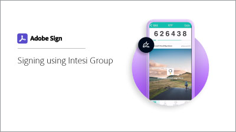

# [!DNL Intesi Group]&#x200B;(한정됨)에서 디지털 ID 가져오기

[!DNL Intesi Group]에서 자격을 갖춘 디지털 서명 인증서를 받는 방법에 대해 알아봅니다. 등록이 완료되고 ID가 확인되면 [!DNL Intesi Group]에서 Acrobat Sign 클라우드 서명을 적용하는 데 사용되는 디지털 ID를 발급합니다.

>[!VIDEO](https://video.tv.adobe.com/v/3449035?captions=kor&quality=12&learn=on&hidetitle=true)

  

**Acrobat Sign에서 정규화된 [!DNL Intesi Group] 디지털 ID를 사용하는 방법을 알아보려면 아래 이미지를 선택하세요.**

