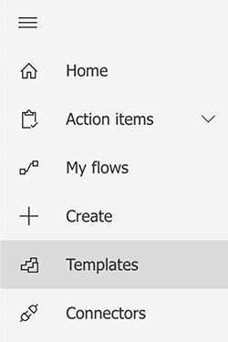
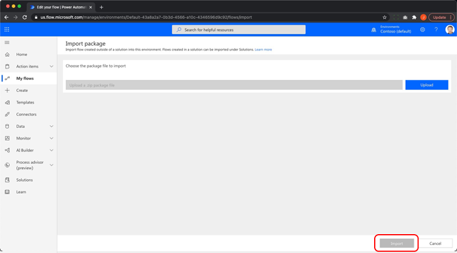

# Microsoft Power Platform용 Acrobat Sign으로 문서 자동화

Microsoft Power Apps용 Acrobat Sign 및 Adobe PDF Tools 커넥터를 활성화하고 사용하는 방법에 대해 알아봅니다. 코드 없이도 비즈니스 승인 및 서명 프로세스를 빠르고 안전하게 자동화하는 워크플로우를 구축할 수 있습니다. 아래 링크에 설명되어 있는 이 실습 튜토리얼의 네 가지 요소는 다음과 같습니다.

<table style="table-layout:fixed">
<tr>
  <td>
    
    

    <a href="documentautomation.md#part1"><strong>1부: Acrobat Sign을 사용하여 SharePoint에 서명된 계약 저장</strong></a>
    

  </td>
  <td>
    
    

    <a href="documentautomation.md#part2"><strong>2부: Acrobat Sign을 통해 전자 서명을 받기 위한 자동화된 승인 프로세스</strong></a>
    

  </td>
  <td>
   
    

    <a href="documentautomation.md#part3"><strong>파트 3: Adobe PDF 툴으로 자동화된 문서 OCR</strong></a>
    

  </td>
  <td>
   
    

    <a href="documentautomation.md#part4"><strong>4부: Adobe PDF 툴으로 자동화된 문서 취합</strong></a>
    

  </td>
</tr>
</table>

## 사전 요구 사항

* Microsoft 365와 Power Automate의 익숙함
* Acrobat Sign 지식
* SharePoint 및 Power Automate에 대한 액세스 권한이 있는 Microsoft 365 계정(Acrobat Sign의 경우 기본, Adobe PDF 툴의 경우 프리미엄)
* Acrobat Sign for enterprise 또는 Acrobat Sign 개발자 계정

**연습 1 및 2**

* API 액세스 권한이 있는 Acrobat Sign 계정 개발자 계정 또는 기업 계정입니다.
* 편집 권한이 있는 Power Automate에서 액세스할 수 있는 SharePoint 사이트 전체 관리자 액세스 권한이 권장됩니다.
* 서명 승인 요청 및 서명을 위한 샘플 문서.

**연습 3 및 4**

자료 다운로드 [여기](https://github.com/benvanderberg/adobe-sign-pdftools-powerautomate-tutorial)

## 1부: Acrobat Sign을 사용하여 SharePoint에 서명된 계약 저장 {#part1}

1부에서는 Power Automate Flow 템플릿을 사용하여 서명된 모든 계약서를 SharePoint 사이트에 저장하는 자동화된 워크플로우를 설정합니다.

1. Power Automate 로 이동합니다.
1. Acrobat Sign 검색

   

1. 선택 **Acrobat Sign 완료 계약을 SharePoint 라이브러리에 저장**.

   

1. 화면을 검토하고 필요한 연결을 구성합니다. Acrobat Sign 연결을 활성화합니다.
1. 파란색을 클릭합니다. `+` 기호입니다.

   

1. Acrobat Sign 계정 이메일을 입력하고 새 창에서 암호 필드를 클릭합니다.

   

   Adobe이 계정을 확인할 때까지 잠시 기다려 주십시오.

   >[!NOTE]
   >
   >Adobe ID 또는 회사 SSO를 사용하는 경우 이 검사를 통해 적절한 로그인으로 연결됩니다.

1. 로그인을 완료합니다.
1. 클릭 **계속** 플로우 편집 화면으로 이동합니다.
1. 트리거 이름을 지정합니다.

   

1. SharePoint 설정을 구성합니다.

   

   **사이트 주소:** 내 SharePoint 사이트
   **폴더 경로:** 사용할 공유 문서의 경로
   **파일 이름:** 기본값 적용
   **파일 내용:** 기본값 적용

1. 플로우 저장.

   

1. 파란색 뒤로 화살표가 있는 플로우 개요 화면으로 이동합니다. 2부에서 이 흐름을 테스트합니다.

   

다음 부분에서 이 흐름을 테스트합니다.

## 2부: Acrobat Sign을 통해 전자 서명을 받기 위한 자동화된 승인 프로세스 {#part2}

두 번째 부분에서는 첫 번째 부분을 더 견고한 흐름으로 구축하고 두 흐름을 테스트하여 실제 작동하는지 확인합니다.

1. 선택 **템플릿** 을 클릭합니다.

   

1. &quot;관리자 승인&quot;을 검색합니다.
1. 선택 **선택한 파일에 대한 관리자 승인 요청**.

   

   연결을 검토하고 누락된 연결을 추가합니다.

   >[!NOTE]
   >
   >승인 작업을 수행하는 첫 번째 흐름인 경우 흐름이 실행될 때 완전히 구성됩니다.

1. 클릭 **계속** 플로우 편집 화면으로 이동합니다.

   이 흐름에는 오류 검사 및 중첩된 조건부 단계를 포함하여 사전 구성된 단계가 많습니다.

1. 구성 **선택한 파일의 경우** 다음과 같습니다.
   **사이트 주소:** SharePoint 사이트
   **라이브러리 이름:** 내 문서 저장소
1. 다음과 같이 입력을 추가합니다.
   **유형**: 이메일
   **이름**: 서명자 전자 메일

   

1. 구성 **파일 속성 가져오기:** 다음과 같습니다.
   **사이트 주소:** SharePoint 사이트
   **라이브러리 이름:** 내 문서 저장소

1. 아래로 스크롤하여 **그렇다면**.

   

1. 클릭 **동작 추가** 에 **그렇다면** 서명을 위해 전송할 단계를 추가하려면 box(맨 아래가 아님)를 클릭하십시오.

   

1. 검색 대상 **SharePoint 파일 내용 가져오기** 선택 **파일 내용 가져오기**.

   

1. 구성 **파일 내용 가져오기** 다음과 같습니다.

   

   **사이트 주소:** SharePoint 사이트
   **파일 식별자:** &quot;identifier&quot;를 검색하고 **파일 속성 가져오기** 있습니다.
1. &quot;Adobe&quot;을 검색하고 **Acrobat Sign** 다른 동작을 추가합니다.

   

1. Acrobat Sign 검색 상자에 &quot;upload&quot;를 입력하고 **문서를 업로드하고 문서 ID 가져오기**.
1. 동적 변수 검색 **이름** 를 클릭합니다. **파일 이름**.
1. 클릭 **표현식** 아래의 변수 도우미 **파일 내용**.

   

1. 단일 아포스트로피를 추가한 다음 **다이내믹 콘텐츠**&#x200B;에서 아포스트로피를 삭제합니다. **파일 내용** 그런 다음 **확인**.

   추가 아포스트로피가 없는지 확인하고 아래 샘플과 같이 생겼습니다.

   

1. Acrobat Sign 검색 영역에서 &quot;만들기&quot;를 검색하여 다른 Acrobat Sign 동작을 추가합니다.
1. 선택 **업로드된 문서에서 작성 및 계약하고 서명을 위해 전송하기**.

   

1. 필요한 정보를 구성합니다. 선택 **이름** 의 동적 변수 도우미에서 **계약 이름**.
선택 **문서 ID** 의 동적 변수 도우미에서 **문서 ID**.
선택 **서명자 전자 메일** 의 동적 변수 도우미에서 **참가자 전자 메일**.
&quot;1&quot; 입력 **참가자 순서**.
선택 **서명자** 의 드롭다운에서 **참가자 역할**.

   

1. **저장** 있습니다.

### 흐름 테스트

SharePoint 사이트의 문서 리포지토리로 이동하여 테스트합니다.

1. 문서를 선택하고 **자동화** 및 **흐름** 방금 생성했습니다.

   

1. 흐름을 시작하여 연결을 확인합니다(첫 번째 흐름 실행만 해당).
1. 승인자에게 유용한 메시지 입력 **메시지**.
1. 문서 서명자의 전자 메일 입력 **서명자 전자 메일**.
1. 클릭 **흐름 실행**.

플로우를 시작하는 사용자에 대해 구성된 승인자는 승인 요청을 받습니다. 이메일 또는 Power Automate Action Items 메뉴를 통해 승인할 수 있습니다.
승인되면 문서에 서명합니다. 사용자에 따라 그리고 사용자가 Sign에 로그인한 경우, 비공개 브라우저 창에서 서명 창을 열어야 할 수 있습니다.

서명을 완료한 다음 SharePoint 폴더를 다시 살펴봅니다.

## 파트 3: Adobe PDF 툴으로 자동화된 문서 OCR {#part3}

3부에서는 Microsoft SharePoint으로 가져올 때 PDF에서 OCR을 자동화하는 방법을 알아봅니다. 이렇게 하면 SharePoint에서 검색할 수 없는 스캔한 PDF 문서에서 발생하는 문제가 해결됩니다.

### SharePoint에서 폴더 설정

문서를 저장하려는 Microsoft SharePoint으로 이동합니다.

1. 클릭 **+ 신규** &quot;처리된 계약&quot;이라는 새 폴더를 생성합니다.
1. 클릭 **+ 신규** &quot;이전 계약&quot;이라는 새 폴더를 만듭니다.

   

이러한 폴더는 이제 Power Automate 흐름의 일부로 참조됩니다.

### 템플릿에서 플로우 만들기

1. https://flow.microsoft.com에 로그인합니다.
1. 클릭 **템플릿** 를 클릭합니다.

   

1. 선택 **SharePoint에서 새로 추가된 파일을 텍스트 검색 가능한 PDF으로 변환**.
1. 오른쪽 상단의 **+** 기호가 있는 Adobe PDF 툴

   

1. 새 탭에서 https://www.adobe.com/go/powerautomate_getstarted으로 이동합니다.
1. **시작**&#x200B;을 클릭합니다.

   

1. Adobe ID로 로그인합니다.

   

1. 자격 증명 이름 및 자격 증명 설명을 입력하고 **자격 증명 만들기**.

   

   자격 증명이 열린 상태로 창을 유지합니다. Microsoft Power Automate에 입력해야 합니다.

   

1. 자격 증명을 입력하고 **Microsoft Power Automate에서 제작**.

   

1. **계속**&#x200B;을 클릭합니다.

   ![[계속]을 클릭할 위치의 스크린샷](assets/documentautomation/automation_33.png)

   이제 작업 과정을 볼 수 있으며 환경에 맞게 구성해야 합니다.

1. [사이트 주소] 필드를 선택하고 라는 트리거 아래에서 사용 중인 SharePoint 사이트를 선택합니다 **파일이 폴더에 생성된 경우**.

   

1. 폴더 아이콘을 클릭하여 폴더 ID 아래에 있는 이전 계약 폴더로 이동합니다.

   

1. 편집 **파일 만들기** 흐름 아래쪽의 작업:

   변경 **사이트 주소** (사이트 주소로)
폴더 경로에서 처리된 계약 폴더의 위치를 지정합니다.

1. 클릭 **저장** 클릭합니다.
1. 클릭 **테스트**.
1. 선택 **수동**.
1. 클릭 **테스트**.

   

### 새로운 흐름 만들기

1. SharePoint에서 이전 계약 폴더로 이동합니다.
1. 다운로드한 실습 파일에서 E03/이전 계약으로 이동합니다.
1. ReleaseFormXX.pdf 파일을 SharePoint의 Old Contracts 폴더에 복사합니다.

   

이제 처리된 계약 폴더로 이동하면 플로우에 몇 분 동안 실행할 수 있는 PDF을 볼 수 있습니다. PDF을 열면 텍스트를 선택할 수 있습니다.
또한 SharePoint에서는 SharePoint의 검색 막대에서 문서 내용을 검색할 수 있도록 문서의 색인을 작성합니다.

## 4부: Adobe PDF 툴으로 자동화된 문서 취합 {#part4}

4부에서는 Microsoft SharePoint에서 플로우를 선택하고 시작하는 동안 제공된 정보를 기반으로 여러 문서를 병합하는 방법을 살펴봅니다. 이 시나리오에서 플로우는 다음과 같습니다.

* 고객에게 패키지에 포함할 항목을 선택하기 위한 정보를 요청합니다.
* 제공된 정보를 기반으로 많은 문서를 병합합니다. 이러한 문서에는 표지 및 선택적 백서가 포함됩니다.
* 병합된 문서가 SharePoint에 저장됩니다.

### SharePoint으로 연습 파일 가져오기

1. Exercise 파일에서 E04 폴더를 엽니다.
1. 제안, 템플릿 및 생성된 문서 폴더를 SharePoint으로 가져옵니다.

   

이러한 폴더는 참조용으로 사용됩니다. 특히 제안서에는 Proposal.docx 파일이 사용됩니다.

Templates 폴더에는 여러 도시에 대한 표지 디자인이 포함된 Covers 폴더가 있습니다. 또한 Whitepapers 폴더에는 선택 사항인 추가 백서가 포함되어 있으며 이 백서는 선택된 경우 끝에 첨부됩니다.

### Microsoft Power Automate로 흐름 가져오기

1. Microsoft Power Automate(https://flow.microsoft.com)에 로그인합니다.
1. 클릭 **내 흐름**.

   

1. **가져오기**&#x200B;를 클릭합니다. 

   

1. 클릭 **업로드** E04/Flows/에서 GenerateProposal_20210311231623.zip 폴더를 선택합니다.

   

1. **가져오기**&#x200B;를 클릭합니다. 

1. 옆에 있는 동작 아래에 있는 렌치 아이콘을 클릭합니다. **고객에게 제안 보내기**.

   

1. 선택 **새로 만들기** 를 클릭합니다.
1. 리소스 이름 아래에 플로우 이름을 설정합니다.
1. **저장**&#x200B;을 클릭합니다.

   다른 관련 리소스에 대해 이 작업을 반복하고 연결을 선택합니다.

   

1. 클릭 **가져오기** 모든 연결을 완료한 후

### 선택한 파일에 대해 설정

플로우가 생성되면 다음을 수행합니다.

1. **편집**&#x200B;을 클릭합니다.

   

1. 트리거 선택 **선택한 파일의 경우**.

   사이트 주소에 SharePoint 사이트를 추가합니다.
라이브러리에 라이브러리를 추가합니다.

   

### templateFolderPath 설정

1. templateFolderPath 변수를 클릭합니다.
1. 가져온 SharePoint 사이트 내에서 Templates 폴더가 있는 위치로 경로를 설정합니다.

### 표지 파일 가져오기 내용 설정

1. 클릭 **표지** 액션을 사용하여 범위를 확장합니다.
1. 확장 **표지: 파일 내용 가져오기**.

   사이트 주소를 SharePoint 사이트로 설정합니다.

   

### 선택한 파일 설정

1. 확장 **선택한 파일** 범위 작업입니다.

   사이트 주소 및 라이브러리 이름을 SharePoint 사이트 및 라이브러리 로 각각 변경합니다 **파일 속성 가져오기**.
사이트 주소를 SharePoint 사이트로 변경합니다. **파일 내용 가져오기**.

   

### 백서 설정

1. 클릭 **백서** 액션입니다.
1. 확장 **조건: 백서 추가**.

   

1. 확장 **백서 1: 경로를 사용하여 파일 내용 가져오기**.
지정된 SharePoint 사이트에 대한 사이트 주소를 편집합니다.

에 대해 동일한 단계를 반복합니다 **조건: 백서 2 추가**.

### 파일 만들기 설정

1. 확장 **파일 만들기**.

   생성된 문서 폴더가 있는 SharePoint 사이트 및 경로에 대한 사이트 주소 및 폴더 경로를 편집합니다.

1. **저장**&#x200B;을 클릭합니다.

### 흐름 테스트

1. SharePoint에서 제안 폴더로 이동합니다.
1. Proposal.docx 폴더를 선택합니다.

   

1. 아래에서 플로우 선택 **자동화** 메뉴를 활성화합니다.

   

1. 클릭 **계속** 흐름을 시작합니다.

   

1. 표지와 추가할 백서를 선택합니다.
1. 클릭 **흐름 실행**.

   

문서 생성 폴더로 이동합니다. 이제 생성된 PDF 파일이 표시됩니다.

### 흐름에 Protect 및 기타 액션 추가

이제 플로우를 성공적으로 생성했으므로 플로우를 편집하여 암호로 PDF 문서를 암호화합니다. 또한 다른 동작을 활용하는 방법도 안내합니다.

1. 플로우의 끝으로 이동합니다.
1. 오른쪽 상단의 **+** 기호 사이 **PDF 병합** 및 **파일 만들기**.

   

1. 선택 **동작 추가**.
1. &quot;Adobe PDF Tools&quot;를 검색합니다.

   

1. 선택 **보기의 Protect PDF**.
1. 동적 내용을 사용하여 파일 이름 필드를 **병합 PDF의 PDF 파일 이름**.

   

   트리거에는 시작 양식의 일부인 암호 필드가 있습니다. 여기서 사용할 수 있습니다.

1. 검색 대상 **암호 필드** 동적 내용을 사용하여 암호 필드에 놓습니다.

   

1. 동적 내용을 사용하여 다음을 설정합니다. **병합 PDF의 PDF 파일 내용** 를 클릭합니다.
1. 변경 **파일 만들기** 병합 PDF 대신 Protect PDF에서 파일 내용을 가져옵니다.
1. 확장 **파일 만들기**.
1. 파일 내용 필드를 지웁니다.
1. 동적 내용을 사용하여 배치 **PDF 파일 내용** 에서 **보기의 Protect PDF**.

### 흐름 테스트

1. SharePoint에서 제안 폴더로 이동합니다.
1. Proposal.docx를 선택합니다.

   

1. 선택 **자동화** 를 클릭합니다.

   

1. 클릭 **계속** 흐름을 시작합니다.

   

1. 추가할 표지 및 백서를 선택합니다.
1. 암호 필드를 설정할 암호로 설정합니다.
1. 클릭 **흐름 실행**.

   

1. 문서 생성 폴더로 이동합니다.
생성된 PDF 파일이 표시됩니다. PDF 파일을 열면 PDF 암호를 입력하라는 메시지가 표시됩니다.

   
