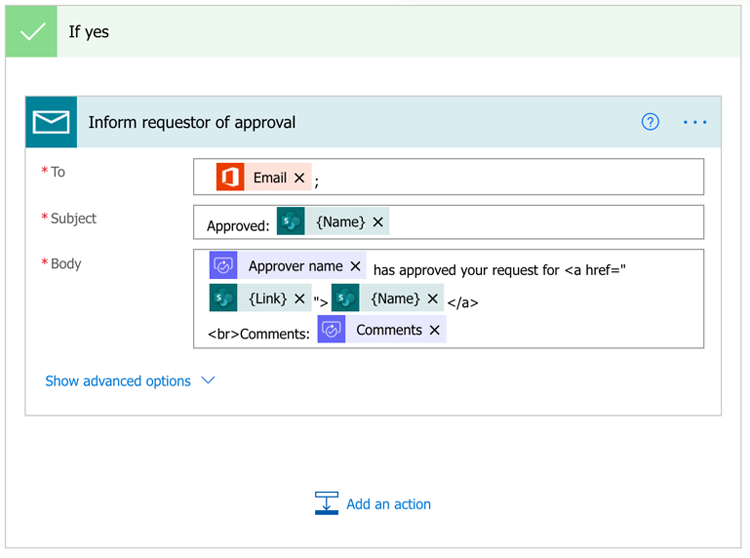
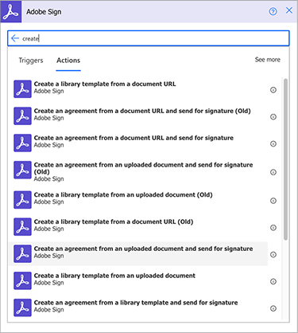

# Microsoft Power Platform용 Adobe Sign을 사용하여 문서 자동화

Microsoft Power Apps용 Adobe Sign 및 Adobe PDF Tools 커넥터를 활성화하고 사용하는 방법에 대해 알아봅니다. 코드 없이 비즈니스 승인 및 서명 프로세스를 빠르고 안전하게 자동화하는 워크플로를 구축합니다. 아래 링크에서 설명하는 이 실습 자습서에는 네 부분이 있습니다.

<table style="table-layout:fixed">
<tr>
  <td>
    
    

    <a href="documentautomation.md#part1"><strong>1부: Adobe Sign을 사용하여 SharePoint에서 서명된 계약 저장</strong></a>
    

  </td>
  <td>
    
    

    <a href="documentautomation.md#part2"><strong>2부: Adobe Sign으로 전자 서명을 받을 수 있는 자동 승인 프로세스</strong></a>
    

  </td>
  <td>
   
    

    <a href="documentautomation.md#part3"><strong>제3부: Adobe PDF 도구를 사용한 자동 문서 OCR</strong></a>
    

  </td>
  <td>
   
    

    <a href="documentautomation.md#part4"><strong>4부: Adobe PDF 도구를 사용한 자동 문서 어셈블리</strong></a>
    

  </td>
</tr>
</table>

## 사전 요구 사항

* Microsoft 365 및 전력 자동화
* Adobe 서명 기술
* SharePoint 및 Power Automated에 대한 액세스 권한이 있는 Microsoft 365 계정(Adobe Sign의 경우 기본, Adobe PDF 도구의 경우 Premium)
* 엔터프라이즈 또는 Adobe Sign 개발자 계정용 Adobe 서명

**연습 1 및 2**

* API에 액세스할 수 있는 Adobe Sign 계정입니다. 개발자 계정 또는 엔터프라이즈 계정
* 편집 권한이 있는 Power Automated에서 액세스할 수 있는 SharePoint 사이트입니다. 전체 관리자 액세스를 권장합니다.
* 서명 승인 요청 및 서명에 대한 샘플 문서입니다.

**연습 3 및 4**

자료 [을(를) 다운로드합니다.](https://github.com/benvanderberg/adobe-sign-pdftools-powerautomate-tutorial)

## 1부: Adobe Sign을 사용하여 SharePoint에서 서명된 계약 저장 {#part1}

1부에서는 Power Automated Flow 템플릿을 사용하여 서명된 모든 계약을 SharePoint 사이트에 저장하는 자동화된 워크플로를 설정합니다.

1. 전원 자동화로 이동합니다.
1. Adobe Sign 검색.

   

1. **Adobe Sign 완료 계약을 SharePoint 라이브러리**&#x200B;에 저장합니다.

   

1. 화면을 검토하고 필요한 연결을 구성합니다. Adobe Sign 연결을 활성화합니다.
1. 파란색 `+` 기호를 클릭합니다.

   

1. Adobe Sign 계정 전자 메일을 입력하고 새 창에서 암호 필드를 클릭합니다.

   

   Adobe에서 계정을 확인할 때까지 잠시 기다려 주십시오.

   >[!NOTE]
   >
   >Adobe ID 또는 회사 SSO를 사용하는 경우 이 확인을 통해 적절한 로그인으로 라우팅됩니다.

1. 로그인을 완료합니다.
1. **계속**&#x200B;을 클릭하여 흐름 편집 화면으로 이동합니다.
1. 트리거 이름을 지정합니다.

   

1. SharePoint 설정을 구성합니다.

   

   **사이트 주소:** SharePoint 사이트
   **폴더 경로:** 사용할 공유 문서의 경로
   **파일 이름:기본값** 적용
   **파일 컨텐트:** 기본값 적용

1. 플로우 저장.

   

1. 파란색 뒤로 화살표를 사용하여 흐름 개요 화면으로 이동합니다. 2부에서 이 흐름을 테스트할 것입니다.

   

다음 부분에서 이 흐름을 테스트합니다.

## 2부: Adobe Sign으로 전자 서명을 받을 수 있는 자동 승인 프로세스 {#part2}

2부에서는 첫 번째 부분을 더 강력한 흐름으로 만들고 두 흐름을 테스트하여 실행하는 것을 봅니다.

1. 전원 자동화 인터페이스에서 왼쪽에 있는 **템플릿**&#x200B;을 선택합니다.

   

1. &quot;관리자 승인&quot;을 검색합니다.
1. 선택한 파일&#x200B;**에 대한**&#x200B;요청 관리자 승인을 선택합니다.

   

   연결을 검토하고 누락된 항목을 추가합니다.

   >[!NOTE]
   >
   >이 흐름이 승인을 사용하여 수행하는 첫 번째 흐름인 경우 흐름이 실행될 때 완전히 구성됩니다.

1. **계속**&#x200B;을 클릭하여 흐름 편집 화면으로 이동합니다.

   이 흐름에는 오류 검사 및 중첩된 조건부 단계를 포함하여 사전 구성된 많은 단계가 있습니다.

1. 다음과 같이 선택한 파일&#x200B;**에 대해**을 구성합니다.
   **사이트 주소:** SharePoint 사이트
   **라이브러리 이름:** 문서 리포지토리
1. 다음과 같이 입력을 추가합니다.
   **유형**: 전자 메일
   **이름**: 서명자 전자 메일

   

1. 다음과 같이 **파일 속성 가져오기:**를 구성합니다.
   **사이트 주소:** SharePoint 사이트
   **라이브러리 이름:** 문서 리포지토리

1. 아래로 스크롤하여 **예**&#x200B;인 경우

   

1. **Add an action** in the **If yes** box(맨 아래가 아님) 를 클릭하여 서명을 위해 보낼 단계를 추가합니다.

   

1. **SharePoint에서 파일 콘텐츠 가져오기**&#x200B;를 검색하고 **파일 콘텐츠 가져오기**&#x200B;를 선택합니다.

   

1. 다음과 같이 **파일 콘텐츠 가져오기**&#x200B;를 구성합니다.

   

   **사이트 주소:** SharePoint 사이트입니다.
   **파일 식별자:** &quot;식별자&quot;를 검색하고 파일 속성 가져오기 단계에서  **식별자를** 선택합니다.
1. &quot;Adobe&quot;를 검색하고 **Adobe Sign**&#x200B;을 선택하여 다른 작업을 추가합니다.

   

1. Adobe Sign의 검색 상자에 &quot;upload&quot;를 입력하고 **문서 업로드를 선택하고 문서 ID**&#x200B;를 가져옵니다.
1. 동적 변수 **Name**&#x200B;을 검색하여 **파일 이름**&#x200B;에서 트리거에서 선택한 항목/문서의 이름을 가져옵니다.
1. **File Content** 아래의 변수 도우미에서 **Expression**&#x200B;을 클릭합니다.

   

1. 하나의 아포스트로피를 추가한 다음 **동적 콘텐츠**&#x200B;를 다시 클릭하고 아포스트로피를 삭제하고 **파일 콘텐츠**&#x200B;를 선택한 다음 **OK**&#x200B;를 클릭합니다.

   추가 아포스트로피가 없고 아래 샘플처럼 보이는지 확인합니다.

   

1. Adobe Sign 검색 영역에서 &quot;만들기&quot;를 검색하여 다른 Adobe Sign 작업을 추가합니다.
1. 업로드된 문서에서 **작성 및 계약을 선택하고 서명**&#x200B;을 위해 보냅니다.

   

1. 필요한 정보를 구성합니다.
**계약 이름**&#x200B;의 동적 변수 도우미에서 **이름**을 선택합니다.
**문서 ID**&#x200B;의 동적 변수 도우미에서 **문서 ID**를 선택합니다.
**참가자 전자 메일**&#x200B;의 동적 변수 도우미에서 **서명자 전자 메일**을 선택합니다.
**참가자 주문**에 &quot;1&quot;을 입력합니다.
**참가자 역할**&#x200B;의 드롭다운에서 **서명자**&#x200B;를 선택합니다.

   

1. **흐름** 을 저장합니다.

### 흐름 테스트

SharePoint 사이트의 문서 저장소로 이동하여 테스트합니다.

1. 문서를 선택하고 **Automate** 및 방금 만든 **Flow**&#x200B;를 선택합니다.

   

1. 흐름을 시작하여 연결을 검증합니다(첫 번째 흐름 실행만).
1. **Message**&#x200B;에서 승인자에게 보내는 메시지를 입력하십시오.
1. **서명자 전자 메일**&#x200B;에 문서 서명자의 전자 메일을 입력하십시오.
1. **흐름 실행**&#x200B;을 클릭합니다.

플로우를 시작하는 사용자에 대해 구성된 승인자는 승인 요청을 받게 됩니다. 전자 메일 또는 전원 자동 작업 항목 메뉴를 통해 승인할 수 있습니다.
승인되면 문서에 서명합니다. 사용자와 로그인에 로그인한 사용자에 따라 개인 브라우저 창에서 서명 창을 열어야 할 수 있습니다.

서명을 완료한 후 SharePoint 폴더에서 다시 확인하십시오.

## 제3부: Adobe PDF 도구를 사용한 자동 문서 OCR {#part3}

3부에서는 PDF를 Microsoft SharePoint로 가져올 때 OCR을 자동화하는 방법을 배웁니다. SharePoint에서 검색할 수 없는 스캔한 PDF 문서에서 발생하는 문제를 해결합니다.

### SharePoint에서 폴더 설정

문서를 저장할 Microsoft SharePoint로 이동합니다.

1. **+ New**&#x200B;를 클릭하여 &quot;Processed Contracts&quot;라는 새 폴더를 만듭니다.
1. **+ New**&#x200B;를 클릭하여 &quot;Old Contracts&quot;라는 새 폴더를 만듭니다.

   

이러한 폴더는 전원 자동화 흐름의 일부로 참조됩니다.

### 템플릿에서 흐름 만들기

1. https://flow.microsoft.com에 로그인합니다.
1. 사이드바에서 **템플릿**&#x200B;을 클릭합니다.

   

1. **새로 추가된 파일을 SharePoint**&#x200B;의 검색 가능한 텍스트로 변환 PDF를 선택합니다.
1. Adobe PDF 도구 옆에 있는 **+** 기호를 클릭합니다.

   

1. 새 탭에서 https://www.adobe.com/go/powerautomate_getstarted으로 이동합니다.
1. **시작**&#x200B;을 클릭합니다.

   

1. Adobe ID로 로그인합니다.

   

1. 자격 증명 이름 및 자격 증명 설명을 입력하고 **자격 증명 만들기**&#x200B;를 클릭합니다.

   

   자격 증명이 열려 있는 창을 유지합니다. Microsoft Power Automated에 입력해야 합니다.

   

1. 자격 증명을 입력하고 **Microsoft Power Automated**&#x200B;에서 만들기를 클릭합니다.

   

1. **[계속]**&#x200B;을 클릭합니다.

   

   이제 워크플로의 보기를 볼 수 있으며, 사용자 환경에 맞게 구성해야 합니다.

1. 사이트 주소 필드를 선택하고 **라는 트리거에서 사용 중인 SharePoint 사이트를 선택합니다. 폴더에 파일을 만드는 경우**

   

1. 폴더 아이콘을 눌러 폴더 ID 아래에 있는 이전 계약 폴더로 이동합니다.

   

1. 흐름 아래쪽에서 **파일 만들기** 작업을 편집합니다.

   **사이트 주소**를 사이트 주소로 변경합니다.
폴더 경로에 처리된 계약 폴더의 위치를 지정합니다.

1. 오른쪽 상단 모서리에서 **Save**&#x200B;를 클릭합니다.
1. **테스트**&#x200B;를 클릭합니다.
1. **수동**&#x200B;을 선택합니다.
1. **테스트**&#x200B;를 클릭합니다.

   

### 새 흐름 시도

1. SharePoint의 이전 계약 폴더로 이동합니다.
1. 다운로드한 연습 파일에서 E03/이전 계약으로 이동합니다.
1. ReleaseFormXX.pdf 파일을 SharePoint의 이전 계약 폴더에 복사합니다.

   

Processed Contracts 폴더로 이동하면 흐름을 실행할 수 있는 시간이 몇 분 후에 사용 가능한 PDF가 표시됩니다. PDF를 열면 텍스트를 선택할 수 있습니다.
또한 SharePoint는 문서를 인덱스화하여 SharePoint의 검색 표시줄에서 문서의 내용을 검색할 수 있습니다.

## 4부: Adobe PDF 도구를 사용한 자동 문서 어셈블리 {#part4}

4부에서는 Microsoft SharePoint에서 흐름을 선택하고 시작하는 동안 제공된 정보를 기반으로 여러 문서를 병합하는 방법을 배웁니다. 이 시나리오에서 플로우는 다음과 같습니다.

* 고객의 패키지에 포함할 항목을 선택하려면 정보를 요청하십시오.
* 제공된 정보를 기반으로 많은 문서를 병합합니다. 이 문서에는 표지 및 선택적 백서가 포함됩니다.
* 병합된 문서가 SharePoint에 저장됩니다.

### 연습 파일을 SharePoint로 가져오기

1. 연습 파일에서 E04 폴더를 엽니다.
1. 제안, 템플릿 및 생성된 문서 폴더를 SharePoint로 가져옵니다.

   

이 폴더는 참조에 사용됩니다. 특히 Proposal.docx 파일을 제안에 사용합니다.

Templates 폴더에는 여러 도시의 표지 디자인을 포함하는 Covers 폴더가 있습니다. 또한 선택하는 경우 끝에 연결될 추가 백서가 포함된 Whitepers 폴더도 있습니다.

### Microsoft 전원 자동화로 흐름 가져오기

1. Microsoft 전원 자동(https://flow.microsoft.com)에 로그인합니다.
1. **내 흐름**&#x200B;을 클릭합니다.

   

1. **가져오기**&#x200B;를 클릭합니다.

   

1. **업로드**&#x200B;를 클릭하고 E04/Flows/에서 GenerateProposal_20211231623.zip 폴더를 선택합니다.

   

1. **가져오기**&#x200B;를 클릭합니다.

1. **고객에게 제안 보내기** 옆의 작업 아래에 있는 렌치 아이콘을 클릭합니다.

   

1. 설치 프로그램에서 **새로 만들기**&#x200B;를 선택합니다.
1. 리소스 이름(Resource Name)에서 흐름 이름을 설정합니다.
1. **저장**&#x200B;을 클릭합니다.

   다른 관련 리소스에 대해 이 작업을 반복하고 연결을 선택합니다.

   

1. 모든 연결을 마친 후 **가져오기**&#x200B;를 클릭합니다.

### 선택한 파일에 대해 설정

흐름이 생성되었으므로 다음을 수행합니다.

1. **편집**&#x200B;을 클릭합니다.

   

1. 선택한 파일&#x200B;**의 트리거**&#x200B;를 선택합니다.

   사이트 주소에 SharePoint 사이트를 추가합니다.
라이브러리에 라이브러리를 추가합니다.

   

### templateFolderPath 설정

1. templateFolderPath 변수를 클릭합니다.
1. 가져온 SharePoint 사이트 내에서 Templates 폴더가 있는 위치의 경로를 설정합니다.

### 표지 가져오기 파일 콘텐츠 설정

1. **Cover** 동작을 클릭하면 범위가 확장됩니다.
1. **커버 확장: 파일 콘텐츠 가져오기**

   사이트 주소를 SharePoint 사이트로 설정합니다.

   

### 선택한 파일 설정

1. **선택한 파일** 범위 작업을 확장합니다.

   **파일 속성 가져오기** 아래에서 사이트 주소 및 라이브러리 이름을 각각 SharePoint 사이트와 라이브러리로 변경합니다.
**파일 콘텐츠 가져오기** 아래에서 사이트 주소를 SharePoint 사이트로 변경합니다.

   

### 백서 설정

1. **백서** 작업을 클릭합니다.
1. **조건 확장: 백서** 추가

   

1. **백서 1: 경로**을(를) 사용하여 파일 콘텐츠를 가져옵니다.
지정한 SharePoint 사이트의 사이트 주소를 편집합니다.

**조건에 대해 동일한 단계를 반복합니다. 백서 2**&#x200B;를 추가합니다.

### 파일 만들기 설정

1. **파일 만들기**&#x200B;를 확장합니다.

   SharePoint 사이트의 사이트 주소 및 폴더 경로를 편집하고 생성된 문서 폴더가 있는 경로입니다.

1. **저장**&#x200B;을 클릭합니다.

### 흐름 테스트

1. SharePoint의 제안 폴더로 이동합니다.
1. Proposal.docx 폴더를 선택합니다.

   

1. **자동화** 메뉴에서 흐름을 선택합니다.

   

1. **계속**&#x200B;을 클릭하여 흐름을 시작합니다.

   

1. 표지와 추가할 백서를 선택하십시오.
1. **흐름 실행**&#x200B;을 클릭합니다.

   

문서 생성 폴더로 이동합니다. 이제 생성된 PDF 파일이 표시됩니다.

### 흐름에 보호 및 기타 작업 추가

흐름을 성공적으로 만들었으므로 흐름을 편집하여 PDF 문서를 암호로 암호화합니다. 또한 다른 작업을 사용할 수 있는 방법을 설명합니다.

1. 흐름의 끝으로 돌아갑니다.
1. **PDF 병합**&#x200B;과 **파일 만들기** 사이에 있는 **+** 기호를 클릭합니다.

   

1. **작업 추가**&#x200B;를 선택합니다.
1. &quot;Adobe PDF 도구&quot;를 검색합니다.

   

1. **Protect PDF from Viewing**&#x200B;를 선택합니다.
1. 동적 내용을 사용하여 파일 이름 필드를 병합 PDF **의** PDF 파일 이름으로 설정합니다.

   

   트리거에는 시작 폼의 일부인 암호 필드가 있습니다. 여기서 사용할 수 있습니다

1. 동적 콘텐츠를 사용하여 **암호 필드**&#x200B;를 검색하고 암호 필드에 배치합니다.

   

1. 동적 내용을 사용하여 파일 컨텐트 필드의 PDF 병합에서 **PDF 파일 컨텐트로 설정합니다.**
1. **파일 만들기**&#x200B;를 변경하여 PDF 병합 대신 PDF 보호에서 파일 내용을 가져옵니다.
1. **파일 만들기**&#x200B;를 확장합니다.
1. 파일 컨텐트 필드를 지웁니다.
1. 동적 내용을 사용하여 **PDF 파일 내용**&#x200B;을 **에서 배치하고**&#x200B;에서 PDF를 보호합니다.

### 흐름 테스트

1. SharePoint의 제안 폴더로 이동합니다.
1. Proposal.docx를 선택합니다.

   

1. **자동**&#x200B;을 선택하여 흐름을 선택합니다.

   

1. **계속**&#x200B;을 클릭하여 흐름을 시작합니다.

   

1. 덮개와 추가할 백서를 선택합니다.
1. 암호 필드를 설정할 암호로 설정합니다.
1. **흐름 실행**&#x200B;을 클릭합니다.

   

1. 문서 생성 폴더로 이동합니다.
생성된 PDF 파일이 표시되어야 합니다. PDF 파일을 열면 PDF 암호를 입력하라는 메시지가 표시됩니다.

   
