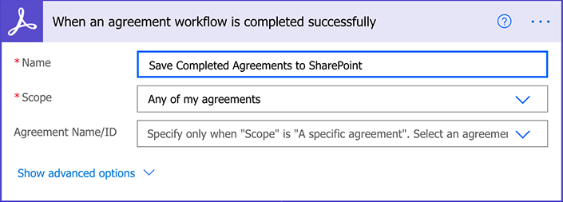
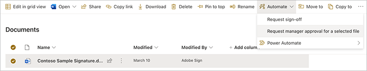
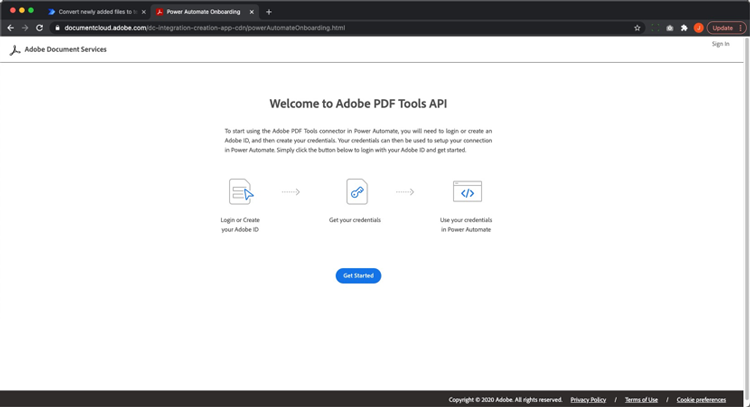
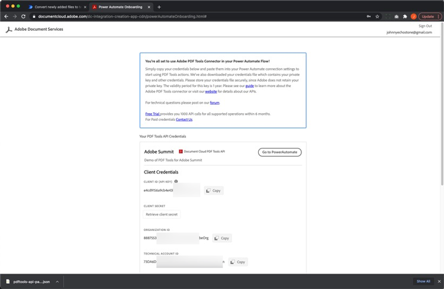
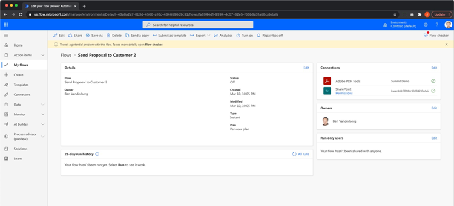

# Microsoft Power Platform용 Acrobat Sign을 사용한 문서 자동화

Microsoft Power Apps용 Acrobat Sign 및 Adobe PDF Tools 커넥터를 활성화하고 사용하는 방법에 대해 알아봅니다. 코드 없이 빠르고 안전하게 비즈니스 승인 및 서명 프로세스를 자동화하는 워크플로우를 구축합니다. 이 실습 튜토리얼에는 아래 링크에 요약된 네 가지 부분이 있습니다.

<table style="table-layout:fixed">
<tr>
  <td>
    
    

    <a href="documentautomation.md#part1"><strong>파트 1: Acrobat Sign과 함께 SharePoint에서 서명된 계약 저장</strong></a>
    

  </td>
  <td>
    
    

    <a href="documentautomation.md#part2"><strong>파트 2: Acrobat Sign으로 전자 서명을 받기 위한 자동 승인 프로세스</strong></a>
    

  </td>
  <td>
   
    

    <a href="documentautomation.md#part3"><strong>파트 3: Adobe PDF 도구를 사용한 자동화된 문서 OCR</strong></a>
    

  </td>
  <td>
   
    

    <a href="documentautomation.md#part4"><strong>파트 4: Adobe PDF 도구로 자동화된 문서 어셈블리</strong></a>
    

  </td>
</tr>
</table>

## 사전 요구 사항

* Microsoft 365 및 Power Automate에 익숙함
* Acrobat Sign 지식
* SharePoint 및 Power Automate(Acrobat Sign용 기본, Adobe PDF 도구용 프리미엄)에 액세스할 수 있는 Microsoft 365 계정
* Acrobat Sign for enterprise 또는 Acrobat Sign 개발자 계정

**연습 1 및 2**

* API에 액세스할 수 있는 Acrobat Sign 계정입니다. 개발자 계정 또는 기업 계정입니다.
* 편집 권한이 있는 Power Automate에서 액세스할 수 있는 SharePoint 사이트 전체 관리자 액세스 권한이 권장됩니다.
* 서명 승인 요청 및 서명을 위한 샘플 문서입니다.

**연습 3 및 연습 4**

[여기](https://github.com/benvanderberg/adobe-sign-pdftools-powerautomate-tutorial)에서 재질 다운로드

## 1부: Acrobat Sign과 SharePoint에서 서명된 계약 저장 {#part1}

첫 번째 단계에서는 Power Automate 플로우 템플릿을 사용하여 서명된 모든 계약을 SharePoint 사이트에 저장하는 자동화된 워크플로우를 설정합니다.

1. Power Automate로 이동합니다.
1. Acrobat Sign을 검색합니다.

   Power Automate로 이동하는 

1. **Acrobat Sign 완료 계약을 SharePoint 라이브러리에 저장**&#x200B;을 선택합니다.

   Acrobat Sign에서 완료한 계약을 SharePoint 라이브러리에 저장의 스크린샷

1. 화면을 검토하고 필요한 연결을 구성합니다. Acrobat Sign 연결을 활성화합니다.
1. 파란색 `+` 기호를 클릭합니다.

   

1. Acrobat Sign 계정 이메일을 입력하고 새 창에서 암호 필드를 클릭합니다.

   

   Adobe이 계정을 확인할 때까지 잠시 기다리십시오.

   >[!NOTE]
   >
   >이 검사는 Adobe ID 또는 회사 SSO를 사용하는 경우 적절한 로그인으로 연결해 줍니다.

1. 로그인을 완료합니다.
1. **계속**&#x200B;을 클릭하여 흐름 편집 화면으로 이동합니다.
1. 트리거 이름을 지정합니다.

   

1. SharePoint 설정을 구성합니다.

   

   **사이트 주소:** SharePoint 사이트
   사용할 공유 문서의 **폴더 경로:** 경로
   **파일 이름:** 기본값 사용
   **파일 내용:** 기본값 수락

1. 플로우를 저장합니다.

   

1. 파란색 뒤로 화살표가 있는 플로우 개요 화면으로 이동합니다. 2부에서 이 플로우를 테스트합니다.

   

다음 부분에서 이 흐름을 테스트합니다.

## 2부: Acrobat Sign으로 전자 서명을 받기 위한 자동 승인 프로세스 {#part2}

2부에서는 첫 번째 부분을 보다 견고한 Flow로 빌드하고 두 Flow를 테스트하여 작동 상태를 확인합니다.

1. Power Automate 인터페이스에서 왼쪽에 있는 **템플릿**&#x200B;을 선택합니다.

   

1. &#39;관리자 승인&#39;을 검색합니다.
1. **선택한 파일에 대한 관리자 승인 요청**&#x200B;을 선택합니다.

   

   연결을 검토하고 누락된 항목을 추가합니다.

   >[!NOTE]
   >
   >승인을 사용하여 수행하는 첫 번째 플로우인 경우 플로우가 실행될 때 완전히 구성됩니다.

1. **계속**&#x200B;을 클릭하여 흐름 편집 화면으로 이동합니다.

   이 플로우에는 오류 검사 및 중첩된 조건부 단계 등 사전 구성된 단계가 많습니다.

1. 다음과 같이 선택한 파일에 대해 **구성**:
   **사이트 주소:** SharePoint 사이트
   **라이브러리 이름:** 문서 리포지토리
1. 다음과 같이 입력을 추가합니다.
   **유형**: 전자 메일
   **이름**: 서명자 전자 메일

   

1. 다음과 같이 **파일 속성 가져오기:**&#x200B;을(를) 구성합니다.
   **사이트 주소:** SharePoint 사이트
   **라이브러리 이름:** 문서 리포지토리

1. 아래로 스크롤하여 **있는 경우**&#x200B;를 찾습니다.

   

1. **그런 경우** 상자(맨 아래가 아님)에서 **동작 추가**&#x200B;를 클릭하여 서명을 위해 보낼 단계를 추가합니다.

   

1. **SharePoint 파일 내용 가져오기**&#x200B;를 검색하고 **파일 내용 가져오기**&#x200B;를 선택합니다.

   

1. 다음과 같이 **파일 내용 가져오기**&#x200B;를 구성합니다.

   

   **사이트 주소:** SharePoint 사이트.
   **파일 식별자:** &quot;identifier&quot;를 검색하고 **파일 속성 가져오기** 단계에서 식별자를 선택합니다.
1. &quot;Adobe&quot;을 검색하고 **Acrobat Sign**&#x200B;을 선택하여 다른 동작을 추가하세요.

   

1. Acrobat Sign 검색 상자에 &quot;업로드&quot;를 입력하고 **문서 업로드 및 문서 ID 받기**&#x200B;를 선택합니다.
1. **파일 이름** 아래의 트리거에서 선택한 항목/문서의 이름을 가져오려면 동적 변수 **이름**&#x200B;을(를) 검색합니다.
1. **파일 내용** 아래의 변수 도우미에서 **식**&#x200B;을 클릭합니다.

   

1. 하나의 아포스트로피를 추가한 다음 **동적 콘텐츠**&#x200B;를 다시 클릭하고, 아포스트로피를 삭제하고, **파일 콘텐츠**&#x200B;를 선택한 다음 **확인**&#x200B;을 클릭하세요.

   추가 아포스트로피가 없고 아래 샘플과 같이 보이는지 확인하십시오.

   

1. Acrobat Sign 검색 영역에서 &quot;만들기&quot;를 검색하여 다른 Acrobat Sign 작업을 추가합니다.
1. **업로드된 문서에서 계약을 만들고 서명을 위해 보내기**&#x200B;를 선택합니다.

   

1. 필요한 정보를 구성합니다.
**계약 이름**&#x200B;의 동적 변수 도우미에서 **이름**&#x200B;을(를) 선택합니다.
**문서 ID**&#x200B;의 동적 변수 도우미에서 **문서 ID**&#x200B;을(를) 선택합니다.
**참가자 전자 메일**&#x200B;의 동적 변수 도우미에서 **서명자 전자 메일**&#x200B;을(를) 선택합니다.
**참가자 순서**&#x200B;에 &quot;1&quot;을 입력하십시오.
**참가자 역할**&#x200B;의 드롭다운에서 **서명자**&#x200B;를 선택합니다.

   

1. 흐름을 **저장**&#x200B;합니다.

### 흐름 테스트

SharePoint 사이트의 문서 리포지토리로 이동하여 테스트합니다.

1. 문서를 선택하고 **자동화** 및 방금 만든 **흐름**&#x200B;을 선택합니다.

   

1. 플로우를 시작하여 연결을 확인합니다(플로우의 첫 실행만 해당).
1. **메시지**&#x200B;에서 승인자에게 보낼 메시지를 입력하세요.
1. **서명자 전자 메일**&#x200B;에서 문서 서명자에 대한 전자 메일을 입력하십시오.
1. **흐름 실행**&#x200B;을 클릭합니다.

플로우를 시작하는 사용자에 대해 구성된 승인자는 승인 요청을 받습니다. 전자 메일 또는 Power Automate 작업 항목 메뉴를 통해 승인할 수 있습니다.
승인되면 문서에 서명합니다. 사용자에 따라 그리고 사용자가 서명에 로그인한 경우 비공개 브라우저 창에서 서명 창을 열어야 할 수 있습니다.

서명을 완료한 다음 SharePoint 폴더를 다시 확인합니다.

## 제3부: Adobe PDF Tools를 사용한 자동화된 문서 OCR {#part3}

3장에서는 Microsoft SharePoint으로 가져올 때 PDF에서 OCR을 자동화하는 방법에 대해 알아봅니다. 이 옵션은 SharePoint에서 검색할 수 없는 스캔한 PDF 문서에서 발생하는 문제를 해결합니다.

### SharePoint에서 폴더 설정

문서를 저장하려는 Microsoft SharePoint으로 이동합니다.

1. **+새로 만들기**&#x200B;를 클릭하여 &quot;처리된 계약&quot;이라는 새 폴더를 만듭니다.
1. **+ 새로 만들기**&#x200B;를 클릭하여 &quot;이전 계약&quot;이라는 새 폴더를 만듭니다.

   

이들 폴더는 이제 Power Automate 플로우의 일부로 참조됩니다.

### 템플릿에서 플로우 만들기

1. https://flow.microsoft.com에 로그인합니다.
1. 사이드바에서 **템플릿**&#x200B;을 클릭합니다.

   

1. **새로 추가된 파일을 SharePoint에서 검색 가능한 텍스트 PDF으로 변환**&#x200B;을 선택합니다.
1. Adobe PDF Tools 옆의 **+** 기호를 클릭합니다.

   &#x200B;+ 기호를 선택하는 

1. 새 탭에서 https://www.adobe.com/go/powerautomate_getstarted_kr 로 이동합니다.
1. **시작하기**&#x200B;를 클릭합니다.

   

1. Adobe ID로 로그인합니다.

   

1. 자격 증명 이름 및 자격 증명 설명을 입력하고 **자격 증명 만들기**&#x200B;를 클릭합니다.

   자격 증명 만들기 화면의 

   자격 증명이 열려 있는 창을 유지합니다. 해당 항목을 Microsoft Power Automate에 입력해야 합니다.

   

1. 자격 증명을 입력하고 **Microsoft Power Automate에서 만들기**&#x200B;를 클릭합니다.

   

1. **계속**&#x200B;을 클릭합니다.

   을 클릭할 위치의 스크린샷

   이제 워크플로우 보기를 볼 수 있으며, 사용자 환경에 맞게 구성해야 합니다.

1. [사이트 주소] 필드를 선택하고 **폴더에 파일이 만들어질 때**&#x200B;라는 트리거에서 사용 중인 SharePoint 사이트를 선택합니다.

   

1. 폴더 아이콘( )을 클릭하여 폴더 ID 아래에 있는 이전 계약 폴더로 이동합니다.

   

1. 흐름의 맨 아래에서 **파일 만들기** 작업을 편집합니다.

   **사이트 주소**&#x200B;을(를) 사이트 주소로 변경하십시오.
폴더 경로에서 처리된 계약 폴더의 위치를 지정합니다.

1. 오른쪽 상단에서 **저장**&#x200B;을 클릭합니다.
1. **테스트**&#x200B;를 클릭합니다.
1. **수동**&#x200B;을 선택합니다.
1. **테스트**&#x200B;를 클릭합니다.

   

### 새 플로우 사용해 보기

1. SharePoint의 이전 약정 폴더로 이동합니다.
1. 다운로드한 연습 파일에서 E03/이전 계약으로 이동합니다.
1. ReleaseFormXX.pdf 파일을 SharePoint의 이전 약정 폴더에 복사합니다.

   

이제 처리된 계약 폴더로 이동하면 플로우가 잠시 제공된 후 PDF을 사용할 수 있습니다. PDF을 열면 텍스트를 선택할 수 있습니다.
또한 SharePoint에서 문서의 색인을 지정하여 SharePoint의 검색 막대에서 문서의 콘텐츠를 검색할 수 있습니다.

## 파트 4: Adobe PDF Tools를 사용한 자동화된 문서 어셈블리 {#part4}

제4장에서는 Microsoft SharePoint에서 플로우를 선택하고 시작하는 동안 제공된 정보를 기반으로 여러 문서를 병합하는 방법에 대해 알아봅니다. 이 시나리오에서 플로우는 다음을 수행합니다.

* 고객에게 패키지에 포함할 항목을 선택하기 위한 정보를 요청합니다.
* 제공된 정보를 기반으로 여러 문서를 병합합니다. 이 문서에는 표지와 백서 옵션이 포함되어 있습니다.
* 병합된 문서가 SharePoint에 저장됩니다.

### SharePoint으로 연습 파일 가져오기

1. 연습 파일에서 E04 폴더를 엽니다.
1. 제안서, 템플릿 및 생성된 문서 폴더를 SharePoint으로 가져옵니다.

   

이러한 폴더는 참조용으로 사용됩니다. 특히, 제안서에 Proposal.docx 파일을 사용합니다.

Templates 폴더에는 다양한 도시에 대한 표지 디자인이 포함된 Covers 폴더가 있습니다. 또한 선택된 경우 끝에 첨부될 추가 백서(선택 사항)가 포함된 백서 폴더도 있습니다.

### Microsoft Power Automate로 플로우 가져오기

1. Microsoft Power Automate(https://flow.microsoft.com)에 로그인합니다.
1. **내 흐름**&#x200B;을 클릭합니다.

   

1. **가져오기**&#x200B;를 클릭합니다. 

   

1. **업로드**&#x200B;를 클릭하고 E04/Flows/에서 GenerateProposal_20210311231623.zip 폴더를 선택합니다.

   

1. **가져오기**&#x200B;를 클릭합니다. 

1. **고객에게 제안 보내기** 옆의 작업 아래에 있는 렌치 아이콘을 클릭합니다.

   렌치 아이콘의 

1. 설정에서 **새로 만들기**&#x200B;를 선택합니다.
1. 자원 이름에서 플로우 이름을 설정합니다.
1. **저장**&#x200B;을 클릭합니다.

   다른 관련 리소스에 대해 이 단계를 반복하고 연결을 선택합니다.

   

1. 모든 연결을 마친 후 **가져오기**&#x200B;를 클릭하세요.

### 선택한 파일에 대해 설정

플로우가 생성되면 다음을 수행합니다.

1. **편집**&#x200B;을 클릭합니다.

   

1. 선택한 파일에 대한 **트리거**&#x200B;를 선택합니다.

   사이트 주소에 SharePoint 사이트를 추가합니다.
라이브러리에 라이브러리를 추가합니다.

   

### templateFolderPath 설정

1. templateFolderPath 변수를 클릭합니다.
1. 가져온 SharePoint 사이트에서 Templates 폴더가 있는 경로를 설정합니다.

### 표지 가져오기 파일 내용 설정

1. **커버** 작업을 클릭하여 범위를 확장합니다.
1. **커버 확장: 파일 내용 가져오기**.

   사이트 주소를 SharePoint 사이트로 설정합니다.

   

### 선택한 파일 설정

1. **선택한 파일** 범위 작업을 확장합니다.

   **파일 속성 가져오기**&#x200B;에서 사이트 주소와 라이브러리 이름을 각각 SharePoint 사이트 및 라이브러리로 변경하십시오.
**파일 내용 가져오기**&#x200B;에서 사이트 주소를 SharePoint 사이트로 변경합니다.

   

### 백서 설정

1. **백서** 작업을 클릭합니다.
1. **조건: 백서 추가**&#x200B;를 확장합니다.

   

1. **백서 1 확장: 경로**&#x200B;을(를) 사용하여 파일 내용을 가져옵니다.
사이트 주소를 지정한 SharePoint 사이트로 편집합니다.

**조건: 백서 추가**&#x200B;에 대해 동일한 단계를 반복합니다.

### 파일 만들기 설정

1. **파일 만들기**&#x200B;를 확장합니다.

   생성된 문서 폴더가 있는 SharePoint 사이트 및 경로의 사이트 주소 및 폴더 경로 를 편집합니다.

1. **저장**&#x200B;을 클릭합니다.

### 플로우 테스트

1. SharePoint의 제안 폴더로 이동합니다.
1. Proposal.docx 폴더를 선택합니다.

   

1. **자동화** 메뉴에서 플로우를 선택합니다.

   

1. **계속**&#x200B;을 클릭하여 흐름을 시작합니다.

   

1. 표지 및 추가할 백서를 선택합니다.
1. **흐름 실행**&#x200B;을 클릭합니다.

   

문서 생성 폴더로 이동합니다. 이제 생성된 PDF 파일이 표시됩니다.

### 플로우에 Protect 및 기타 액션 추가

플로우를 성공적으로 만들었으므로 플로우를 편집하여 암호로 PDF 문서를 암호화합니다. 또한 다른 작업을 활용하는 방법도 살펴봅니다.

1. 플로우의 맨 뒤로 이동합니다.
1. **PDF 병합**&#x200B;과 **파일 만들기** 사이에 있는 **+** 기호를 클릭합니다.

   

1. **동작 추가**&#x200B;를 선택합니다.
1. &quot;Adobe PDF Tools&quot;를 검색합니다.

   

1. **보기에서 Protect PDF**&#x200B;를 선택합니다.
1. 동적 콘텐츠를 사용하여 파일 이름 필드를 **병합 PDF의 PDF 파일 이름**(으)로 설정합니다.

   

   트리거에는 시작 양식의 일부인 암호 필드가 있습니다. 여기서 사용하시면 됩니다

1. 동적 콘텐츠를 사용하여 **암호 필드**&#x200B;를 검색하고 암호 필드에 배치합니다.

   

1. 동적 콘텐츠를 사용하여 파일 콘텐츠 필드에서 **병합 PDF의 파일 콘텐츠 PDF**(으)로 설정하십시오.
1. 병합 PDF 대신 Protect PDF에서 파일 내용을 가져오려면 **파일 만들기**&#x200B;를 변경하십시오.
1. **파일 만들기**&#x200B;를 확장합니다.
1. 파일 내용 필드를 지웁니다.
1. 동적 콘텐츠를 사용하여 **보는 Protect PDF**&#x200B;에서 **PDF 파일 콘텐츠**&#x200B;를 가져옵니다.

### 플로우 테스트

1. SharePoint의 제안 폴더로 이동합니다.
1. Proposal.docx 를 선택합니다.

   

1. **자동화**&#x200B;를 선택하여 플로우를 선택합니다.

   ![메뉴에서 [자동화]를 선택한 스크린샷](assets/documentautomation/automation_59.png)

1. **계속**&#x200B;을 클릭하여 흐름을 시작합니다.

   

1. 표지 및 추가할 백서를 선택합니다.
1. 암호 필드를 설정하려는 암호로 설정합니다.
1. **흐름 실행**&#x200B;을 클릭합니다.

   

1. 문서 생성 폴더로 이동합니다.
생성된 PDF 파일이 표시되어야 합니다. PDF 파일을 열면 PDF 암호를 입력하라는 메시지가 표시됩니다.

   SharePoint 디렉터리에서 생성된 PDF의 
