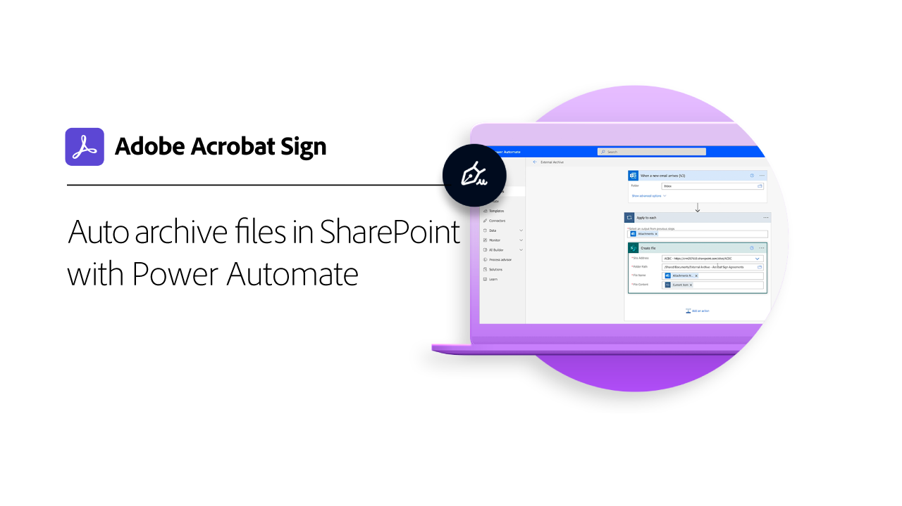

# 통합 개요

Acrobat Sign, Salesforce, Workday 및 Marketo과 같이 조직에서 이미 사용하고 있는 다른 응용 프로그램 내에서 Microsoft을 사용할 수 있습니다. 이러한 통합 안내서 및 튜토리얼에서 전자 서명 작업 과정을 간소화하는 방법을 알아봅니다.

>[!NOTE]
> 이러한 기능에 액세스하는 데 문제가 있는 경우 귀사의 관리자에게 문의하여 통합이 활성화되어 있는지 확인하십시오.

## 새로운 기능

* [의 문서 탭 통합 [!DNL Microsoft Teams]](acrobat-sign-teams-documents-tab.md)
의 문서 탭에서 직접 서명을 위해 문서를 전송하는 방법을 알아보십시오. [!DNL Microsoft Teams]
* [다음에 대한 Adobe Acrobat Sign의 라이브 서명 [!DNL Microsoft Teams]](live-sign-microsoft-teams.md)
서명하는 동안 직접 서명과 유사한 온라인 서명 경험을 만드는 방법에 대해 알아봅니다. [!DNL Microsoft Teams] 회의
* [고급 워크플로우 만들기 [!DNL Power Automate]](advanced-workflow-power-automate.md)
고급 워크플로우를 만드는 방법 알아보기 [!DNL Power Automate] 커넥터

## Microsoft 통합 튜토리얼

<table style="table-layout:fixed">
<tr>
  <td>
    
    

    <a href="fill-and-sign-doc-microsoft-outlook.md"><strong>Microsoft Outlook 작성 및 서명</strong></a>
    

    <em>Microsoft Outlook 내에서 직접 양식 작성 및 서명</em>
     
  </td>
  <td>
    
    

    <a href="send-for-signature-with-outlook.md"><strong>Outlook에서 서명을 위해 보내기</strong></a>
    

    <em>Microsoft Outlook 내에서 직접 서명할 문서 보내기</em>
     
  </td>
  <td>
    
    

    <a href="send-for-signature-with-sharepoint-online.md"><strong>SharePoint Online에서 서명을 위해 보내기</strong></a>
    

    <em>Sharepoint Online 내에서 직접 서명할 문서 보내기</em>
     
  </td>
   <td>
    
    

    <a href="track-an-agreement-with-sharepoint-online.md"><strong>SharePoint Online에서 추적</strong></a>
    

    <em>Microsoft Sharepoint 내에서 직접 계약의 진행 상황 추적</em>
     
  </td>
</tr>
<tr>
  <td>
    
    

    <a href="integrate-web-form-sharepoint-online.md"><strong>웹 양식을 다음과 통합 [!DNL SharePoint Online]</strong></a>
    

    <em>웹 양식에서 수집된 데이터를 [!DNL SharePoint] 목록</em>
     
  </td>
  <td>
    
    

    <a href="auto-archive-sharepoint-power-automate.md"><strong>파일 자동 보관 위치 [!DNL SharePoint] 적용 [!DNL Power Automate]</strong></a>
    

    <em>서명된 문서를 [!DNL SharePoint] 다음을 사용하여 라이브러리: [!DNL Power Automate]</em>
     
  </td>
  <td>
    
    

    <a href="documentautomation.md"><strong>문서 자동화: [!DNL Acrobat Sign for Microsoft Power Platform]</strong></a>
    

    <em>활성화 및 사용 방법 알아보기 [!DNL Acrobat Sign] 및 [!DNL Adobe PDF Tools] 커넥터: [!DNL Microsoft Power] 앱</em>
     
  </td>
   <td>
    
    

    <a href="adobe-sign-teams-mortgage.md"><strong>서명을 위해 보내기 [!DNL Microsoft Teams]</strong></a>
    

    <em>다음에서 바로 서명할 문서 보내기 [!DNL Microsoft Teams]</em>
     
  </td>
</tr>
<tr>
  <td>
    
    

    <a href="live-sign-microsoft-teams.md"><strong>다음에 대한 Adobe Acrobat Sign의 라이브 서명 [!DNL Microsoft Teams]</strong></a>
    

    <em>서명하는 동안 직접 서명과 유사한 온라인 서명 경험을 만드는 방법에 대해 알아봅니다. [!DNL Microsoft Teams] 회의</em>
     
  </td>
   <td>
    
    

    <a href="acrobat-sign-teams-documents-tab.md"><strong>의 문서 탭 통합 [!DNL Microsoft Teams]</strong></a>
    

    <em>의 문서 탭에서 직접 서명을 위해 문서를 전송하는 방법을 알아보십시오. [!DNL Microsoft Teams]</em>
     
  </td>
 <td>
    
    

    <a href="simple-workflow-power-automate.md"><strong>다음을 사용하여 간단한 작업 과정 만들기 [!DNL Power Automate]</strong></a>
    

    <em>다음을 사용하여 간단한 워크플로우를 만드는 방법에 대해 알아봅니다. [!DNL Power Automate] 커넥터</em>
     
  </td>
  <td>
    
    

    <a href="advanced-workflow-power-automate.md"><strong>Power Automate로 고급 워크플로우 만들기</strong></a>
    

    <em>고급 워크플로우를 만드는 방법 알아보기 [!DNL Power Automate] 커넥터</em>
     
  </td>
<tr>
  <td>
    
    

    <a href="dynamics-customer-service.md"><strong>Microsoft Dynamics 365 for Customer Service</strong></a>
    

    <em>Acrobat Sign 및 [!DNL Microsoft Dynamics 365] 고객 서비스는 셀프서비스 고객 웹 포털에서 고객 만족도를 향상시키는 데 사용됩니다.</em>
     
  </td>
  <td>
    
    

    <a href="dynamics-field-service.md"><strong>Microsoft Dynamics 365 for Field Service</strong></a>
    

    <em>Acrobat Sign에서 [!DNL Power Automate], 및 [!DNL Microsoft Dynamics 365] 현장 서비스에서는 고객의 현장 작업을 간소화하기 위해 사용됩니다.</em>
     
  </td>
  <td>
    
    

    <a href="dynamics-sales.md"><strong>Microsoft Dynamics 365 for Sales</strong></a>
    

    <em>Acrobat Sign 및 [!DNL Microsoft Dynamics 365] for Sales는 sales quote 서명 프로세스를 자동화하는 데 사용됩니다.</em>
     
  </td>
  <td>
    
    

     
  </td>
</tr>
</table>

## [!DNL Notarize] 통합 튜토리얼

<table style="table-layout:fixed">
<tr>
  <td>
    
    

    <a href="send-document-notarize.md"><strong>공증을 위해 문서 전송</strong></a>
    

    <em>공증을 위해 문서를 보내는 방법 알아보기</em>
     
  </td>
  <td>
    
    

     
  </td>
  <td>
    
    

     
  </td>
  <td>
    
    

     
  </td>
</tr>
</table>

## Salesforce 통합 튜토리얼

<table style="table-layout:fixed">
<tr>
  <td>
    
    

    <a href="create-an-agreement-template.md"><strong>문서작성기 [!DNL Salesforce]</strong></a>
    

    <em>Document Builder를 사용하여 재사용 가능한 문서 템플릿을 만드는 방법을 알아보십시오 [!DNL Salesforce]</em>
     
  </td>
  <td>
    
    

    <a href="set-up-data-mapping.md"><strong>데이터 매핑 설정</strong></a>
    

    <em>계약에 서명한 후 Salesforce로 데이터를 다시 가져옵니다.</em>
     
  </td>
  <td>
    
    

    <a href="set-up-merging-map.md"><strong>Salesforce에서 병합 매핑 설정</strong></a>
    

    <em>Salesforce의 데이터를 Acrobat Sign 문서로 직접 병합하는 방법에 대해 알아보십시오</em>
     
  </td>
  <td>
    
    

    <a href="create-a-custom-button.md"><strong>사용자 정의 단추 만들기</strong></a>
    

    <em>전송 프로세스를 시작하고 Salesforce 내에서 계약을 자동으로 채우는 사용자 정의 단추를 만듭니다.</em>
     
  </td>
</tr>
</table>

## Workday 통합 튜토리얼

<table style="table-layout:fixed">
<tr>
 <td>
    
    

    <a href="acrobat-sign-workday-onboarding.md"><strong>Acrobat Sign + Workday 신규 채용 온보딩</strong></a>
    

    <em>Acrobat Sign + Workday으로 온보딩 워크플로를 간소화하는 방법에 대해 알아봅니다.</em>
     
  </td>
 <td>
    
    

     
  </td>
  <td>
    
    

     
  </td>
  <td>
    
    

     
  </td>
</tr>
</table>

## Marketo 통합 튜토리얼 및 구성 안내서

<table style="table-layout:fixed">
<tr>
  <td>
    
    

    <a href="marketo-salesforce-sms.md"><strong>Salesforce 및 Marketo용 Acrobat Sign을 사용하여 알림 보내기</strong></a>
    

    <em>서명자에게 계약이 진행 중임을 알리기 위해 문자 메시지, 이메일 또는 푸시 알림을 보내는 방법에 대해 알아봅니다.</em>
     
  </td>
  <td>
    
    

    <a href="marketo-salesforce-reminder.md"><strong>Salesforce용 Adobe Sign 및 Marketo 비디오 튜토리얼을 사용하여 미리 알림 보내기</strong></a>
    

    <em>일정 기간 후 계약이 서명되지 않은 상태로 유지되는 경우 Marketo에서 이메일 알림 메시지를 보내는 방법을 알아봅니다.</em>
     
  </td>
  <td>
    
    

    <a href="marketo-salesforce-reminder.md"><strong>Salesforce용 Acrobat Sign 및 Marketo 구성 안내서를 사용하여 미리 알림 보내기</strong></a>
    

    <em>일정 기간 후 계약이 서명되지 않은 상태로 유지될 때 Marketo에서 이메일 알림 메시지를 보내는 방법을 읽어보십시오</em>
     
  </td>
   <td>
    
    

    <a href="marketo-dynamics-reminder.md"><strong>Microsoft Dynamics 및 Marketo용 Acrobat Sign을 사용하여 미리 알림 보내기</strong></a>
    

    <em>일정 기간 후 계약이 서명되지 않은 상태로 유지되는 경우 전자 메일 알림 메시지를 보내는 방법을 알아봅니다.</em>
     
  </td>
</tr>
<tr>
  <td>
    
    

    <a href="marketo-dynamics-sms.md"><strong>Microsoft Dynamics 및 Marketo용 Acrobat Sign을 사용하여 알림 보내기</strong></a>
    

    <em>서명자에게 계약이 진행 중임을 알리기 위해 문자 메시지, 이메일 또는 푸시 알림을 보내는 방법에 대해 알아봅니다.</em>
     
  </td>
  <td>
    
    

     
  </td>
  <td>
    
    

     
  </td>
  <td>
    
    

     
  </td>
</tr>
</table>
