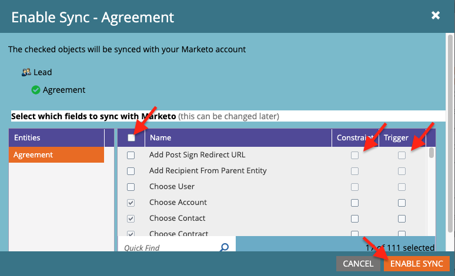
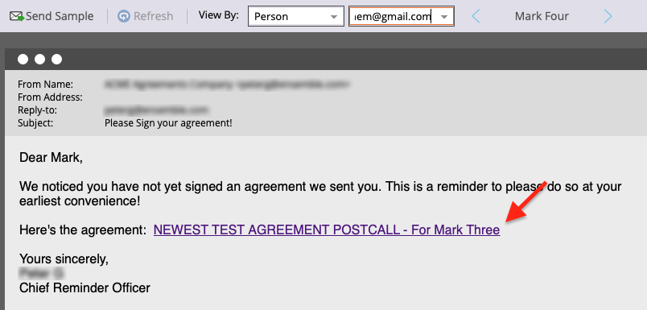
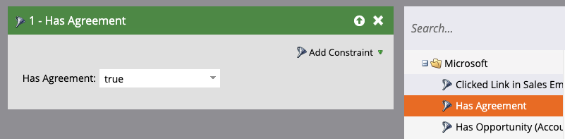

# Microsoft Dynamics 365 및 Marketo용 Acrobat Sign을 사용하여 미리 알림 보내기

일정 기간 후 계약이 서명되지 않은 경우 전자 메일 미리 알림을 보내는 방법을 알아봅니다. 이 통합에서는 Acrobat Sign, Microsoft Dynamics용 Acrobat Sign, Marketo 및 Marketo Microsoft Dynamics Sync를 사용합니다.

## 사전 요구 사항

1. Marketo Microsoft Dynamics Sync를 설치합니다.

   정보 및 Microsoft Dynamics Sync용 최신 플러그인을 사용할 수 있습니다. [여기](https://experienceleague.adobe.com/docs/marketo/using/product-docs/crm-sync/microsoft-dynamics/marketo-plugin-releases-for-microsoft-dynamics.html)

1. 설치 [Microsoft Dynamics용 Acrobat Sign](https://appsource.microsoft.com/ko-KR/product/dynamics-365/adobesign.f3b856fc-a427-4d47-ad4b-d5d1baba6f86).

   이 플러그인에 대한 정보를 사용할 수 있습니다. [여기](https://helpx.adobe.com/ca/sign/using/microsoft-dynamics-integration-installation-guide.html)

## 사용자 정의 개체 찾기

Marketo Microsoft Dynamics Sync 및 Acrobat Sign for Dynamics 구성이 완료되면 Marketo 관리 터미널에 두 개의 새로운 옵션이 나타납니다.


1. 클릭 **[!UICONTROL Dynamics 엔터티 동기화]**.

   사용자 정의 엔티티를 동기화하려면 먼저 동기화를 비활성화해야 합니다. 클릭 **스키마 동기화** 처음이시면 그렇지 않으면 **스키마 새로 고침**.

   

## 사용자 정의 개체 동기화

1. 오른쪽에서 [!UICONTROL 리드], [!UICONTROL 연락처]및 [!UICONTROL 계정]- 기반 사용자 정의 개체입니다.

   * **동기화 사용** 아래의 개체 **[!UICONTROL 리드]** 알림 메시지를 보낼 때 [!UICONTROL 리드] 가 Dynamics에서 계약에 서명하지 않았습니다.

   * **동기화 사용** 아래의 개체 **[!UICONTROL 연락처]** 알림 메시지를 보낼 때 [!UICONTROL 연락처] 가 Dynamics에서 계약에 서명하지 않았습니다.

   * **동기화 사용** 아래의 개체 **[!UICONTROL 계정]** 알림 메시지를 보낼 때 [!UICONTROL 계정] 가 Dynamics에서 계약에 서명하지 않았습니다.

   * **동기화 사용** 를 클릭합니다. **[!UICONTROL 상위]** ([!UICONTROL 리드], [!UICONTROL 연락처], 또는 [!UICONTROL 계정]).

   

1. 새 창의 계약에서 원하는 속성을 선택한 다음 아래의 상자를 활성화합니다. **제한** 및 **트리거** 를 클릭하여 마케팅 활동에 알립니다.

   

   

1. 사용자 정의 개체에서 동기화를 활성화한 후 동기화를 다시 활성화합니다.

   관리 터미널로 돌아가서 **Microsoft Dynamics**&#x200B;을 클릭한 다음 **동기화 사용**.

   

   

## 프로그램 및 토큰 만들기

1. Marketo의 마케팅 활동 섹션에서 마우스 오른쪽 버튼을 클릭합니다 **마케팅 활동** 왼쪽 막대에 있습니다.

   선택 **새 캠페인 폴더**&#x200B;이름을 지정합니다.

   

1. 생성된 폴더를 마우스 오른쪽 단추로 클릭하고 **새 프로그램**&#x200B;이름을 지정합니다.

   다른 모든 항목을 기본값으로 두고 **만들기**.

   

   

1. 다음을 클릭합니다. **내 토큰**, 드래그 **전자 메일 스크립트** 캔버스로 이동합니다.

   

1. 이름을 지정한 다음 **클릭하여 편집**.

   

1. 확장 **[!UICONTROL 사용자 정의 개체]** 을 선택한 다음 **[!UICONTROL 계약]** 있습니다.

   찾기 및 드래그 [!UICONTROL 이름], 계약 상태, 전송된 시간 및 현재 서명자 URL 을 캔버스에 추가합니다.

1. 이러한 토큰을 사용하여 Velocity 스크립트를 작성하면 일주일 동안 서명되지 않은 계약의 계약 URL이 표시됩니다. 다음은 현재 날짜와 보낸 날짜를 비교하는 예입니다.

   ```
   #foreach($agreement in $adobe_agreementList)
       #if($agreement.adobe_esagreementstatus == "Out for Signature")
           #set($todayCalObj = $date.toCalendar($date.toDate("yyyy-MM-dd",$date.get('yyyy-MM-dd'))) )
           #set($dateSentCalObj = $date.toCalendar($date.toDate("yyyy-MM-dd",$agreement.adobe_datesent)) )
           #set($dateDiff = ($todayCalObj.getTimeInMillis() - $dateSentCalObj.getTimeInMillis()) / 86400000 )
   
           #if($dateDiff >= 7)
               #set($agreementName = $agreement.adobe_name)
               #set($agreementURL = $agreement.adobe_currentsignerurl.substring(8))
               #break
           #else
           #end
       #else
       #end
   #end
   
   #if(${agreementName})
       <a href="https://${agreementURL}">${agreementName}</a>
   #else
       Please contact us. 
   #end
   ```

1. **[!UICONTROL 저장]**&#x200B;을 클릭합니다.

## 알림 메시지 생성 및 개인화 추가

개인화의 예는 다음과 같습니다. 서명자 이름, 계약 이름, 계약 링크 등

1. 만든 프로그램을 마우스 오른쪽 단추로 클릭하고 **[!UICONTROL 새 로컬 에셋]**&#x200B;을 선택한 다음 **[!UICONTROL 이메일]**.

   

1. 새 탭에서 **[!UICONTROL 이름]** 및 **[!UICONTROL 설명]** 을 선택하고 템플릿 선택기에서 템플릿을 선택합니다.

   

1. **[!UICONTROL 만들기]**&#x200B;를 클릭합니다.

1. 설정 **[!UICONTROL 보낸 사람 이름]** 및 **[!UICONTROL 보낸 사람 주소]**.

   

1. 메시지 본문을 클릭하여 편집기를 활성화합니다.

   오른쪽 상단의 **[!UICONTROL 토큰 삽입]** 단추를 클릭하고 작성한 사용자 정의 계약 URL 토큰을 찾은 다음 을 클릭합니다. **[!UICONTROL 삽입]**. 전자 메일 사용자 정의를 완료한 다음 **[!UICONTROL 저장]**.

   

1. 계약이 할당된 프로파일을 사용하여 미리 봅니다.

   계약 이름이 레이블인 URL에 대한 링크가 표시됩니다.

   

## 스마트 캠페인 필터 설정

1. 만든 프로그램을 마우스 오른쪽 단추로 클릭한 다음 **[!UICONTROL 새로운 스마트 캠페인]**.

   

1. 선택한 이름을 지정한 다음 을 클릭합니다. **[!UICONTROL 만들기]**.

   

1. 검색한 다음 클릭하고 드래그 **[!UICONTROL 계약 있음]** 스마트 목록에 추가합니다.

   

   트리거에 노출된 필드는 **[!UICONTROL 제약 조건 추가]**.

1. 선택 **[!UICONTROL 계약 상태]** 및 필터링할 기타 필드.

   추가된 각 필드에 대해 필터링할 값을 정의합니다. 이 경우 트리거는 **[!UICONTROL 계약 상태]** 이 *서명을 위해 전송됨* 및 **[!UICONTROL 전송 날짜]** 이 *지난 1주일 전에*.

   

   >[!NOTE]
   >
   > 다음과 같이 제약 조건에 고유 식별자를 추가합니다 **이름**&#x200B;특정 계약에 대해서만 이 캠페인을 실행하도록 하려면 다음을 수행하십시오.

1. [일정] 탭에서 캠페인 대상자를 확인하고 자격이 되는 사람을 확인합니다.

   

## 스마트 캠페인 흐름 설정

캠페인 필터 **만료까지 남은 일 수** 이(가) 사용되었으므로 캠페인에 예약된 되풀이를 사용할 수 있습니다.

1. 오른쪽 상단의 **[!UICONTROL 흐름]** 탭 [!UICONTROL Smart Campaign].

   를 검색하고 **전자 메일 보내기** 캔버스로 이동하고 이전 섹션에서 생성한 알림 전자 메일을 선택합니다.

   

1. 오른쪽 상단의 **[!UICONTROL 일정]** 탭을 클릭합니다. 캠페인 흐름이 **Smart Campaign 설정**. 그런 다음 **되풀이 예약** 탭합니다.

   

1. 설정 **일정** 에 _매일_. 필요한 경우 캠페인의 시작 일자와 시간 및 종료 일자를 선택합니다.

   

>[!TIP]
>
>이 튜토리얼은 [Microsoft Dynamics 및 Marketo에서 Acrobat Sign을 사용하여 세일즈 주기 단축](https://experienceleague.adobe.com/?recommended=Sign-U-1-2021.1) Experience League에서 무료로 사용할 수 있습니다!