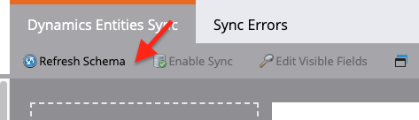

# Microsoft Dynamics 365용 Acrobat Sign 및 Marketo을 사용하여 미리 알림 보내기

계약이 일정 기간 후 서명되지 않은 상태로 유지되는 경우 전자 메일 알림 메시지를 보내는 방법을 알아봅니다. 이 통합은 Acrobat Sign, Microsoft Dynamics용 Acrobat Sign, Marketo 및 Marketo Microsoft Dynamics Sync를 사용합니다.

## 사전 요구 사항

1. Marketo Microsoft Dynamics Sync를 설치합니다.

   Microsoft Dynamics Sync에 대한 정보 및 최신 플러그인은 [여기서 사용할 수 있습니다.](https://experienceleague.adobe.com/docs/marketo/using/product-docs/crm-sync/microsoft-dynamics/marketo-plugin-releases-for-microsoft-dynamics.html?lang=ko)

1. [Microsoft Dynamics용 Acrobat Sign](https://appsource.microsoft.com/ko-KR/product/dynamics-365/adobesign.f3b856fc-a427-4d47-ad4b-d5d1baba6f86)을(를) 설치합니다.

   이 플러그인에 대한 정보는 [여기](https://helpx.adobe.com/ca/sign/using/microsoft-dynamics-integration-installation-guide.html)에서 사용할 수 있습니다.

## 사용자 정의 오브젝트 찾기

Marketo Microsoft Dynamics Sync 및 Dynamics용 Acrobat Sign 구성이 완료되면 Marketo 관리 터미널에 두 개의 새로운 옵션이 나타납니다.


1. **[!UICONTROL Dynamics 엔터티 동기화]**&#x200B;를 클릭합니다.

   사용자 정의 엔티티를 동기화하기 전에 동기화를 비활성화해야 합니다. 처음 사용하는 경우 **스키마 동기화**&#x200B;를 클릭하세요. 그렇지 않으면 **스키마 새로 고침**&#x200B;을 클릭하세요.

   

## 사용자 정의 오브젝트 동기화

1. 오른쪽에서 [!UICONTROL 리드], [!UICONTROL 연락처] 및 [!UICONTROL 계정] 기반 사용자 지정 개체를 찾습니다.

   * [!UICONTROL 리드]가 Dynamics에서 계약에 서명하지 않은 경우 미리 알림을 보내려면 **[!UICONTROL 리드]**&#x200B;의 개체에 대해 **동기화 사용**&#x200B;을 설정하십시오.

   * [!UICONTROL 연락처]가 Dynamics에서 계약에 서명하지 않은 경우 미리 알림을 보내려면 **[!UICONTROL 연락처]**&#x200B;의 개체에 대해 **동기화 사용**&#x200B;을 설정하십시오.

   * [!UICONTROL 계정]이 Dynamics에서 계약에 서명하지 않은 경우 미리 알림을 보내려면 **[!UICONTROL 계정]**&#x200B;의 개체에 대해 **동기화 사용**&#x200B;을 설정하십시오.

   * 원하는 **[!UICONTROL 부모]** 아래의 계약 개체에 대해 **동기화 사용**([!UICONTROL 리드], [!UICONTROL 연락처] 또는 [!UICONTROL 계정]).

   

1. 새 창의 계약에서 원하는 속성을 선택한 다음 **제약 조건** 및 **트리거** 아래의 상자를 활성화하여 마케팅 활동에 표시합니다.

   

   

1. 사용자 정의 개체에서 동기화를 활성화한 후 동기화를 다시 활성화합니다.

   관리자 터미널로 돌아가서 **Microsoft Dynamics**&#x200B;를 클릭한 다음 **동기화 사용**&#x200B;을 클릭하십시오.

   

   

## 프로그램 및 토큰 만들기

1. Marketo의 마케팅 활동 섹션에서 왼쪽 막대의 **마케팅 활동**&#x200B;을 마우스 오른쪽 단추로 클릭합니다.

   **새 캠페인 폴더**&#x200B;를 선택하고 이름을 지정하십시오.

   

1. 만든 폴더를 마우스 오른쪽 단추로 클릭하고 **새 프로그램**&#x200B;을 선택하고 이름을 지정합니다.

   다른 모든 것을 기본값으로 두고 **만들기**&#x200B;를 클릭합니다.

   

   

1. **내 토큰**&#x200B;을 클릭한 다음 **전자 메일 스크립트**&#x200B;를 캔버스로 끌어 옵니다.

   

1. 이름을 지정한 다음 **편집하려면 클릭**&#x200B;하세요.

   

1. 오른쪽에 있는 **[!UICONTROL 사용자 지정 개체]**&#x200B;를 확장한 다음 **[!UICONTROL 계약]** 개체를 확장합니다.

   [!UICONTROL 이름], 계약 상태, 보낸 사람 및 현재 서명자 URL을 찾아 캔버스로 끌어 옵니다.

1. 일주일 동안 서명되지 않은 계약의 계약 URL을 표시하려면 이러한 토큰을 사용하여 Velocity 스크립트를 작성합니다. 다음은 현재 날짜를 보낸 날짜와 비교한 예제입니다.

   ```
   #foreach($agreement in $adobe_agreementList)
       #if($agreement.adobe_esagreementstatus == "Out for Signature")
           #set($todayCalObj = $date.toCalendar($date.toDate("yyyy-MM-dd",$date.get('yyyy-MM-dd'))) )
           #set($dateSentCalObj = $date.toCalendar($date.toDate("yyyy-MM-dd",$agreement.adobe_datesent)) )
           #set($dateDiff = ($todayCalObj.getTimeInMillis() - $dateSentCalObj.getTimeInMillis()) / 86400000 )
   
           #if($dateDiff >= 7)
               #set($agreementName = $agreement.adobe_name)
               #set($agreementURL = $agreement.adobe_currentsignerurl.substring(8))
               #break
           #else
           #end
       #else
       #end
   #end
   
   #if(${agreementName})
       <a href="https://${agreementURL}">${agreementName}</a>
   #else
       Please contact us. 
   #end
   ```

1. **[!UICONTROL 저장]**&#x200B;을 클릭합니다.

## 알림 메시지 만들기 및 개인 맞춤화 추가

개인 설정의 예로는 서명자 이름, 계약 이름, 계약 링크 등이 있습니다.

1. 만든 프로그램을 마우스 오른쪽 단추로 클릭하고 **[!UICONTROL 새 로컬 자산]**&#x200B;을 클릭한 다음 **[!UICONTROL 전자 메일]**&#x200B;을 선택합니다.

   

1. 새 탭에서 이메일의 **[!UICONTROL 이름]** 및 **[!UICONTROL 설명]**&#x200B;을 입력하고 템플릿 선택기에서 템플릿을 선택합니다.

   

1. **[!UICONTROL [만들기]]**&#x200B;를 클릭합니다.

1. **[!UICONTROL 보낸 사람 이름]** 및 **[!UICONTROL 보낸 사람 주소]**&#x200B;을 설정합니다.

   

1. 메시지 본문을 클릭하여 편집기를 활성화합니다.

   **[!UICONTROL 토큰 삽입]** 단추를 클릭하고 만든 사용자 지정 계약 URL 토큰을 찾은 다음 **[!UICONTROL 삽입]**&#x200B;을 클릭합니다. 전자 메일 사용자 지정을 마치고 **[!UICONTROL 저장]**&#x200B;을 클릭하세요.

   

1. 계약이 할당된 프로필을 사용하여 미리 봅니다.

   계약 이름 을 레이블로 사용하는 URL에 대한 링크가 표시되어야 합니다.

   

## 스마트 캠페인 필터 설정

1. 만든 프로그램을 마우스 오른쪽 단추로 클릭한 다음 **[!UICONTROL 새 스마트 캠페인]**&#x200B;을 클릭합니다.

   

1. 원하는 이름을 지정한 다음 **[!UICONTROL 만들기]**&#x200B;를 클릭하세요.

   

1. 검색한 다음 **[!UICONTROL 계약 있음]**&#x200B;을 클릭하여 스마트 목록으로 끕니다.

   

   트리거에 노출한 필드는 **[!UICONTROL 제약 조건 추가]**&#x200B;에서 사용할 수 있어야 합니다.

1. **[!UICONTROL 계약 상태]** 및 필터링할 다른 필드를 선택합니다.

   추가된 각 필드에 대해 필터링 기준을 적용할 값을 정의합니다. 이 경우 **[!UICONTROL 계약 상태]**&#x200B;가 *서명을 위해 전송됨*&#x200B;이고 **[!UICONTROL 전송 날짜]**&#x200B;가 *지난 1주*&#x200B;인 경우에만 트리거됩니다.

   

   >[!NOTE]
   >
   > 이 캠페인을 특정 계약에서만 실행하려면 **이름**&#x200B;과 같은 고유 식별자를 제약 조건에 추가합니다.

1. 캠페인 참가자를 확인하고 일정 탭에서 자격이 부여될 사람을 확인합니다.

   

## 스마트 캠페인 플로우 설정

캠페인 필터 **만료될 때까지 남은 일 수**&#x200B;이(가) 사용되었으므로 캠페인에 대해 예약된 되풀이를 사용할 수 있습니다.

1. [!UICONTROL 스마트 캠페인]에서 **[!UICONTROL 흐름]** 탭을 클릭합니다.

   **전자 메일 보내기** 흐름을 검색하고 캔버스로 끌어 이전 섹션에서 만든 미리 알림 전자 메일을 선택합니다.

   

1. 스마트 캠페인에서 **[!UICONTROL 일정]** 탭을 클릭합니다. 캠페인 흐름이 **스마트 캠페인 설정**&#x200B;에서 한 사람당 한 번만 실행되도록 제한되어 있는지 확인합니다. 그런 다음 **되풀이 예약** 탭을 클릭합니다.

   

1. **일정**&#x200B;을 _매일_(으)로 설정합니다. 필요한 경우 캠페인의 시작 날짜와 시간 및 종료 날짜를 선택합니다.

   
