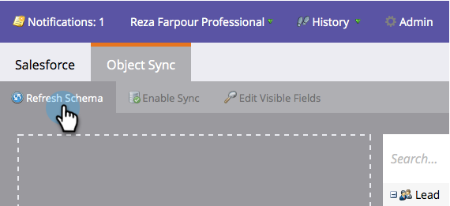

# Salesforce용 Acrobat Sign 및 Marketo 구성 안내서를 사용하여 미리 알림 보내기

일정 기간이 지난 후에도 계약이 서명되지 않은 상태로 유지되는 경우 Marketo에서 전자 메일 미리 알림을 보내는 방법에 대해 알아봅니다. 이 통합은 Acrobat Sign, Salesforce용 Acrobat Sign, Marketo 및 Marketo과 Salesforce Sync를 사용합니다.

## 사전 요구 사항

1. Marketo Salesforce Sync를 설치합니다.

   Salesforce Sync에 대한 정보 및 최신 플러그인은 [여기](https://experienceleague.adobe.com/docs/marketo/using/product-docs/crm-sync/salesforce-sync/understanding-the-salesforce-sync.html)에서 사용할 수 있습니다.

1. Salesforce용 Acrobat Sign을 설치합니다.

   이 플러그인에 대한 정보는 [여기](https://helpx.adobe.com/ca/sign/using/salesforce-integration-installation-guide.html)에서 사용할 수 있습니다.

## 사용자 정의 오브젝트 찾기

Marketo Salesforce 동기화 및 Salesforce용 Acrobat Sign 구성이 완료되면 Marketo 관리 터미널에 몇 가지 새로운 옵션이 나타납니다.


1. 처음 사용하는 경우 **스키마 동기화**&#x200B;를 클릭하세요. 그렇지 않으면 **스키마 새로 고침**&#x200B;을 클릭하세요.

   

1. 전역 동기화가 실행 중인 경우 **전역 동기화 사용 안 함**&#x200B;을 클릭하여 비활성화합니다.

   

1. **스키마 새로 고침**&#x200B;을 클릭합니다.

   

## 사용자 정의 오브젝트 동기화

오른쪽에서 리드, 연락처 및 계정 기반 사용자 정의 개체를 참조하십시오.

리드가 Salesforce에서 계약에 서명하지 않았을 때 미리 알림을 보내려면 리드의 개체에 대해 **동기화 사용**&#x200B;을(를) 설정하십시오.

연락처가 Salesforce에서 계약에 서명하지 않았을 때 미리 알림을 보내려면 연락처의 개체에 대해 **동기화 사용**&#x200B;을(를) 설정합니다.

계정이 Salesforce에서 계약에 서명하지 않은 경우 미리 알림을 보내려면 계정의 개체에 대해 **동기화를 활성화**&#x200B;합니다.

1. 원하는 상위(잠재 고객, 연락처 또는 계정) 아래에 표시된 **계약** 개체에 대해 **동기화를 사용**&#x200B;합니다. 동기화할 다른 사용자 정의 개체에 대해 이 작업을 수행합니다.

   

1. 다음 에셋은 **동기화를 활성화**&#x200B;하는 방법을 보여 줍니다.

   

   

## 트리거에 사용자 정의 개체 필드 표시

1. 전역 동기화가 비활성화된 상태에서 동기화를 활성화한 계약 사용자 지정 개체를 선택한 다음 **표시 필드 편집**&#x200B;을 선택합니다.

1. 트리거 열의 &quot;계약 이름&quot; 필드를 확인하여 캠페인 액션 트리거에 표시합니다. 필터링할 다른 필드를 확인한 다음 **저장**&#x200B;하세요.

   

   

1. 사용자 정의 개체에서 동기화 사용을 완료하고 트리거 값을 노출하면 동기화를 다시 활성화해야 합니다.

   

## 프로그램 및 토큰 만들기

1. Marketo의 마케팅 활동 섹션에서 왼쪽 막대의 **마케팅 활동**&#x200B;을 마우스 오른쪽 단추로 클릭하고 **새 캠페인 폴더**&#x200B;를 선택하고 이름을 지정합니다.

   

1. 만든 폴더를 마우스 오른쪽 단추로 클릭하고 **새 프로그램**&#x200B;을 선택하고 이름을 지정합니다. 다른 모든 것을 기본값으로 두고 **만들기**&#x200B;를 클릭합니다.

   

   

1. **내 토큰**&#x200B;을 클릭한 다음 **전자 메일 스크립트**&#x200B;를 캔버스로 끌어 옵니다.

   

1. 이름을 지정한 다음 **편집하려면 클릭**&#x200B;하세요.

   

1. 오른쪽에 있는 **사용자 지정 개체**&#x200B;를 확장한 다음 **계약** 개체를 확장합니다. 계약 이름, 계약 상태, 서명일 및 서명 URL 을 찾아 캔버스로 드래그합니다.

1. 일주일 동안 서명되지 않은 계약의 계약 URL을 표시하려면 이러한 토큰을 사용하여 Velocity 스크립트를 작성합니다. 다음은 현재 날짜와 보낸 날짜를 비교하는 예제입니다.

   ```
   #foreach($agreement in $echosign_dev1__SIGN_Agreement__cList)
       #if($agreement.echosign_dev1__Status__c == "Out for Signature")
           #set($todayCalObj = $date.toCalendar($date.toDate("yyyy-MM-dd",$date.get('yyyy-MM-dd'))) )
           #set($dateSentCalObj = $date.toCalendar($date.toDate("yyyy-MM-dd",$agreement.echosign_dev1__DateSent__c)) )
           #set($dateDiff = ($todayCalObj.getTimeInMillis() - $dateSentCalObj.getTimeInMillis()) / 86400000 )
   
           #if($dateDiff >= 7)
               #set($agreementName = $agreement.Name)
               #set($agreementURL = $agreement.echosign_dev1__Signing_URL__c.substring(8))
               #break
           #else
           #end
       #else
       #end
   #end
   
   #if(${agreementName})
       <a href="https://${agreementURL}">${agreementName}</a>
   #else
       Please contact us. 
   #end
   ```

1. **저장**&#x200B;을 클릭합니다.

## 알림 메시지 만들기 및 개인 맞춤화 추가

개인 설정의 예로는 서명자 이름, 계약 이름, 계약 링크 등이 있습니다.

1. 만든 프로그램을 마우스 오른쪽 단추로 클릭하고 **새 로컬 자산**&#x200B;을 클릭한 다음 **전자 메일**&#x200B;을 선택합니다.

   

1. 새 탭에서 이메일의 **이름** 및 **설명**&#x200B;을 입력하고 템플릿 선택기에서 템플릿을 선택합니다. **[만들기]**&#x200B;를 클릭합니다.

   

1. **보낸 사람 이름** 및 **보낸 사람 주소**&#x200B;을 설정합니다.

   

1. 메시지 본문을 클릭하여 편집기를 활성화합니다. **토큰 삽입** 단추를 클릭하고 만든 사용자 지정 계약 URL 토큰을 찾은 다음 **삽입**&#x200B;을 클릭합니다. 전자 메일 사용자 지정을 마치고 **저장**&#x200B;을 클릭하세요.

   

1. 계약이 할당된 프로필을 사용하여 미리 봅니다. 계약 이름 을 레이블로 사용하는 URL에 대한 링크가 표시되어야 합니다.

   

## 스마트 캠페인 필터 설정

1. 만든 프로그램을 마우스 오른쪽 단추로 클릭한 다음 **새 스마트 캠페인**&#x200B;을 클릭합니다.

   

1. 원하는 이름을 지정한 다음 **만들기**&#x200B;를 클릭하세요.

   

1. 검색한 다음 **계약 있음**&#x200B;을 클릭하여 스마트 목록으로 끕니다.

   

1. 이제 트리거에 노출한 필드를 **제약 조건 추가**&#x200B;에서 사용할 수 있습니다. **계약 상태** 및 필터링할 다른 필드를 선택합니다. 추가된 각 필드에 대해 필터링 기준을 적용할 값을 정의합니다. 이 경우 **계약 상태**&#x200B;가 서명을 위해 전송되었으며 **전송 날짜**&#x200B;가 7일 이전인 경우에만 트리거됩니다.

   

   >[!NOTE]
   >
   > 이 캠페인을 특정 계약에 대해서만 실행하려면 **계약 이름**&#x200B;과 같은 제약 조건에 대한 고유 식별자를 지정합니다.

1. 캠페인 참가자를 확인하고 일정 탭에서 자격이 부여될 사람을 확인합니다.

   

## 스마트 캠페인 플로우 설정

캠페인 필터 **서명되지 않은 일**&#x200B;이(가) 사용되었으므로 캠페인에 대해 예약된 되풀이를 사용할 수 있습니다.

1. 스마트 캠페인에서 **흐름** 탭을 클릭합니다. **전자 메일 보내기** 흐름을 검색하고 캔버스로 끌어 이전 섹션에서 만든 미리 알림 전자 메일을 선택합니다.

   

1. 스마트 캠페인에서 **일정** 탭을 클릭합니다. 캠페인 흐름이 **스마트 캠페인 설정**&#x200B;에서 한 사람당 한 번만 실행되도록 제한되어 있는지 확인합니다. 그런 다음 **되풀이 예약** 탭을 클릭합니다.

   

1. **일정**&#x200B;을 매일(Daily)로 설정하고, 필요한 경우 캠페인의 시작 날짜와 시간 및 종료 날짜를 선택합니다.

   

