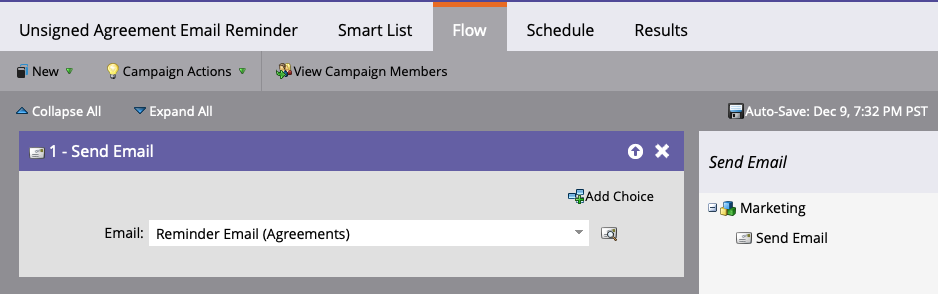

# Adobe Sign for Salesforce 및 Marketo 구성 가이드를 사용하여 미리 알림 보내기

계약이 일정 기간 후에도 서명되지 않은 상태로 있을 때 Marketo에서 전자 메일 미리 알림을 보내는 방법을 알아봅니다. 이 통합은 Adobe Sign, Salesforce용 Adobe Sign, Marketo 및 Marketo 및 Salesforce Sync를 사용합니다.

## 사전 요구 사항

1. Marketo Salesforce 동기화를 설치합니다.

   Salesforce Sync에 대한 정보 및 최신 플러그 인은 여기에서 [사용할 수 있습니다.](https://experienceleague.adobe.com/docs/marketo/using/product-docs/crm-sync/salesforce-sync/understanding-the-salesforce-sync.html)

1. Salesforce용 Adobe Sign을 설치합니다.

   이 플러그 인에 대한 정보는 여기에서 [사용할 수 있습니다.](https://helpx.adobe.com/ca/sign/using/salesforce-integration-installation-guide.html)

## 사용자 지정 개체 찾기

Marketo Salesforce Sync 및 Adobe Sign for Salesforce 구성이 완료되면 Marketo 관리 터미널에 몇 가지 새로운 옵션이 나타납니다.


1. 처음 사용하는 경우 **동기화 스키마**&#x200B;를 클릭합니다. 그렇지 않으면 **스키마 새로 고침**&#x200B;을 클릭합니다.

   

1. 전역 동기화가 실행 중인 경우 **전역 동기화 사용 안 함** 을 클릭하여 사용 안함으로 설정합니다.

   

1. **스키마 새로 고침**&#x200B;을 클릭합니다.

   

## 사용자 지정 개체 동기화

오른쪽에 있는 Lead, Contact 및 Account 기반 사용자 정의 객체를 참조하십시오.

**Lead** 가 Salesforce에서 계약에 서명하지 않은 경우 미리 알림을 보내려면 Lead 아래의 객체에 Syncc를 사용합니다.

**연락처** 가 Salesforce에서 계약에 서명하지 않은 경우 미리 알림을 보내려면 연락처 아래의 개체에 Syncfor을 사용하도록 설정합니다.

**계정** 이 Salesforce에서 계약에 서명하지 않은 경우 미리 알림을 보내려면 계정 아래의 개체에 Syncfor을 사용하도록 설정합니다.

1. **원하는** 상위( **** Lead, Contact 또는 Account) 아래에 표시된 Agreementobject에 대해 Syncject를 활성화합니다. 동기화할 다른 사용자 지정 개체에 대해 이 작업을 수행합니다.

   

1. 다음 에셋에서는 **Sync**&#x200B;를 사용하는 방법을 보여 줍니다.

   

   

## 사용자 지정 개체 필드를 트리거에 노출

1. 글로벌 동기화가 비활성화되는 동안 동기화를 설정한 계약 사용자 지정 개체를 선택한 다음 **표시된 필드 편집**

1. 트리거 열의 &quot;계약 이름&quot; 필드를 선택하여 캠페인 조치 트리거에 표시합니다. 필터링할 다른 필드를 선택한 다음 **Save**&#x200B;를 선택합니다.

   

   

1. 사용자 지정 개체에서 동기화 활성화를 완료하고 트리거 값을 표시하는 경우 sync를 다시 활성화하십시오.

   

## 프로그램 및 토큰 만들기

1. Marketo의 마케팅 활동 섹션에서 왼쪽 막대의 **마케팅 활동**&#x200B;을 마우스 오른쪽 단추로 클릭하고 **새 캠페인 폴더**&#x200B;를 선택한 후 이름을 지정합니다.

   

1. 만든 폴더를 마우스 오른쪽 단추로 클릭하고 **새 프로그램**&#x200B;을 선택한 다음 이름을 지정합니다. 다른 모든 항목을 기본값으로 두고 **만들기**&#x200B;를 클릭합니다.

   

   

1. **내 토큰**&#x200B;을 클릭한 다음 **전자 메일 스크립트**&#x200B;를 캔버스로 끕니다.

   

1. 이름을 지정한 다음 **을 클릭하여**&#x200B;을 편집합니다.

   

1. 오른쪽에서 **사용자 지정 개체**&#x200B;를 확장한 다음 **계약** 개체를 확장합니다. 계약 이름, 계약 상태, 서명 날짜 및 서명 URL을 찾아서 캔버스로 끌어 옵니다.

1. 이 토큰을 사용하여 Velocity 스크립트를 작성하여 일주일 동안 서명되지 않은 계약의 계약 URL을 표시합니다. 다음은 현재 날짜와 보낸 날짜를 비교하는 예제입니다.

   ```
   #foreach($agreement in $echosign_dev1__SIGN_Agreement__cList)
       #if($agreement.echosign_dev1__Status__c == "Out for Signature")
           #set($todayCalObj = $date.toCalendar($date.toDate("yyyy-MM-dd",$date.get('yyyy-MM-dd'))) )
           #set($dateSentCalObj = $date.toCalendar($date.toDate("yyyy-MM-dd",$agreement.echosign_dev1__DateSent__c)) )
           #set($dateDiff = ($todayCalObj.getTimeInMillis() - $dateSentCalObj.getTimeInMillis()) / 86400000 )
   
           #if($dateDiff >= 7)
               #set($agreementName = $agreement.Name)
               #set($agreementURL = $agreement.echosign_dev1__Signing_URL__c.substring(8))
               #break
           #else
           #end
       #else
       #end
   #end
   
   #if(${agreementName})
       <a href="https://${agreementURL}">${agreementName}</a>
   #else
       Please contact us. 
   #end
   ```

1. **저장**&#x200B;을 클릭합니다.

## 미리 알림 만들기 및 개인 설정 추가

개인 설정의 예는 다음과 같습니다. 서명자 이름, 계약명, 계약에 대한 링크 등

1. 만든 프로그램을 마우스 오른쪽 단추로 클릭하고 **새 로컬 자산**&#x200B;을 클릭한 다음 **전자 메일**&#x200B;을 선택합니다.

   

1. 새 탭에서 전자 메일의 **Name** 및 **Description**&#x200B;을 입력하고 템플릿 선택기에서 템플릿을 선택합니다. **[만들기]**&#x200B;를 클릭합니다.

   

1. **From Name** 및 **From Address**&#x200B;를 설정합니다.

   

1. 편집기를 활성화하려면 메시지 본문을 클릭합니다. **토큰 삽입** 단추를 클릭하고 만든 사용자 지정 계약 URL 토큰을 찾은 다음 **삽입**&#x200B;을 클릭합니다. 전자 메일 사용자 지정을 완료하고 **Save**&#x200B;를 클릭합니다.

   

1. 계약이 할당된 프로파일을 사용하여 미리 봅니다. 계약 이름이 레이블로 표시된 URL에 대한 링크가 표시됩니다.

   

## 스마트 캠페인 필터 설정

1. 만든 프로그램을 마우스 오른쪽 단추로 클릭한 다음 **새 스마트 캠페인**&#x200B;을 클릭합니다.

   

1. 선택한 이름을 지정한 다음 **만들기**&#x200B;를 클릭합니다.

   

1. 을 검색한 다음 **계약 있음**&#x200B;을(를) 클릭하여 스마트 목록으로 끕니다.

   

1. 트리거에 노출된 필드는 **제약 조건 추가**&#x200B;에서 사용할 수 있어야 합니다. **계약 상태** 및 필터링할 기타 필드를 선택합니다. 추가된 각 필드에 대해 필터링할 값을 정의합니다. 이 경우 **Agreement Status**&#x200B;가 서명을 위해 Out이고 **Date Sent**&#x200B;이(가) 7일 이전인 경우에만 트리거됩니다.

   

   >[!NOTE]
   >
   > d **계약 이름**&#x200B;과 같은 제약 조건에 대한 고유 식별자입니다. 이 캠페인을 특정 계약에 대해서만 실행하려면

1. 캠페인 대상을 확인하고 일정 탭에서 자격을 얻을 대상을 확인합니다.

   

## 스마트 캠페인 플로우 설정

캠페인 필터 **Days Unsigned**&#x200B;가 사용되었으므로 캠페인에 예약된 되풀이를 사용할 수 있습니다.

1. 스마트 캠페인에서 **흐름** 탭을 클릭합니다. **전자 메일 보내기** 흐름을 캔버스로 끌어서 이전 섹션에서 만든 미리 알림 전자 메일을 선택합니다.

   

1. 스마트 캠페인에서 **일정** 탭을 클릭합니다. 캠페인 흐름이 **Smart Campaign Settings**&#x200B;에서 한 사람당 한 번만 실행되도록 제한되는지 확인하십시오. 그런 다음 **되풀이 일정 잡기** 탭을 클릭합니다.

   

1. **Schedule**&#x200B;을 Daily로 설정하고, 필요한 경우 캠페인의 시작 날짜와 시간 및 종료 날짜를 선택합니다.

   

>[!TIP]
>
>이 자습서는 [Adobe Sign for Salesforce 및 Marketo](https://experienceleague.adobe.com/?recommended=Sign-U-1-2021.1) Experience League에서 무료로 제공되는 영업 주기를 단축합니다.
