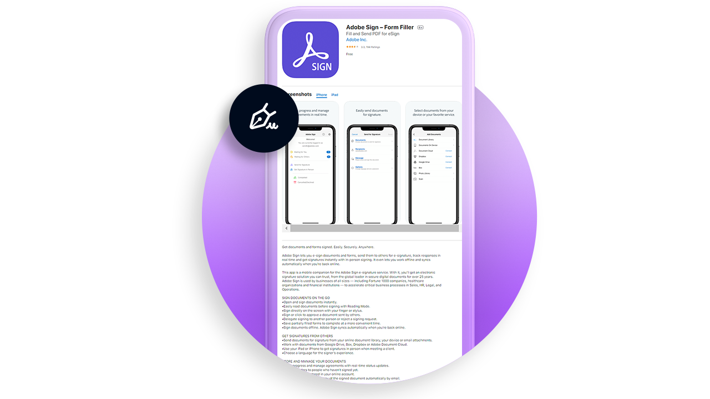

# 모바일 개요

서명이 필요한 문서 전송, 전자 서명 진행 상황 추적, 모바일 디바이스에서 실시간 업데이트 확인

<table style="table-layout:fixed">
<tr>
  <td>
    
    

    <a href="liquidmode.md"><strong>Acrobat Sign의 Liquid Mode</strong></a>
    

    <em>Liquid Mode가 모바일 서명 환경을 개선하는 방법 알아보기</em>
     
  </td>
  <td>
    
    

    <a href="https://itunes.apple.com/kr/app/adobe-sign/id481082197?mt=8" target="_blank"><strong>iOS용 Acrobat Sign 모바일 앱 다운로드</strong></a>
     
  </td>
  <td>
    
    

    <a href="https://play.google.com/store/apps/details?id=com.adobe.echosign&amp;hl=en" target="_blank"><strong>Android용 Acrobat Sign 모바일 앱 다운로드</strong></a>
     
  </td>
  <td>
    
    

     
  </td>
</tr>
</table>
