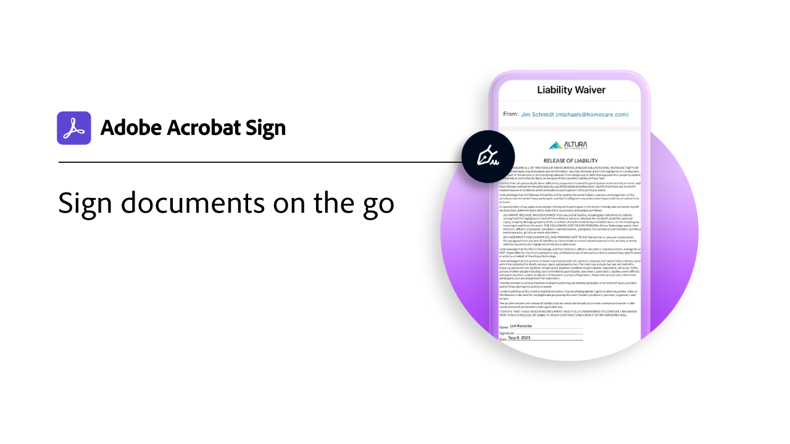

# 모바일 개요

모든 모바일 장치에서 서명을 위해 문서를 보내고, 전자 서명 진행 상황을 추적하고, 실시간 업데이트를 받을 수 있습니다.

<table style="table-layout:fixed">
<tr>
  <td>
    
    

    <a href="sign-mobile.md"><strong>이동 중에 문서에 서명</strong></a>
    

    <em>Acrobat Sign 모바일 앱을 사용하여 문서에 서명하는 방법 알아보기</em>
     
  </td>
  <td>
    
    

    <a href="liquidmode.md"><strong>Acrobat Sign의 Liquid Mode</strong></a>
    

    <em>Liquid Mode로 모바일 서명 환경을 개선하는 방법 알아보기</em>
     
  </td>
  <td>
    
    

    <a href="https://apps.apple.com/us/app/adobe-sign/id481082197" target="_blank"><strong>iOS용 Acrobat Sign 모바일 앱 다운로드</strong></a>
     
  </td>
  <td>
    
    

    <a href="https://play.google.com/store/apps/details?id=com.adobe.echosign&amp;hl=en" target="_blank"><strong>Android용 Acrobat Sign 모바일 앱 다운로드</strong></a>
     
  </td>
</tr>
</table>
