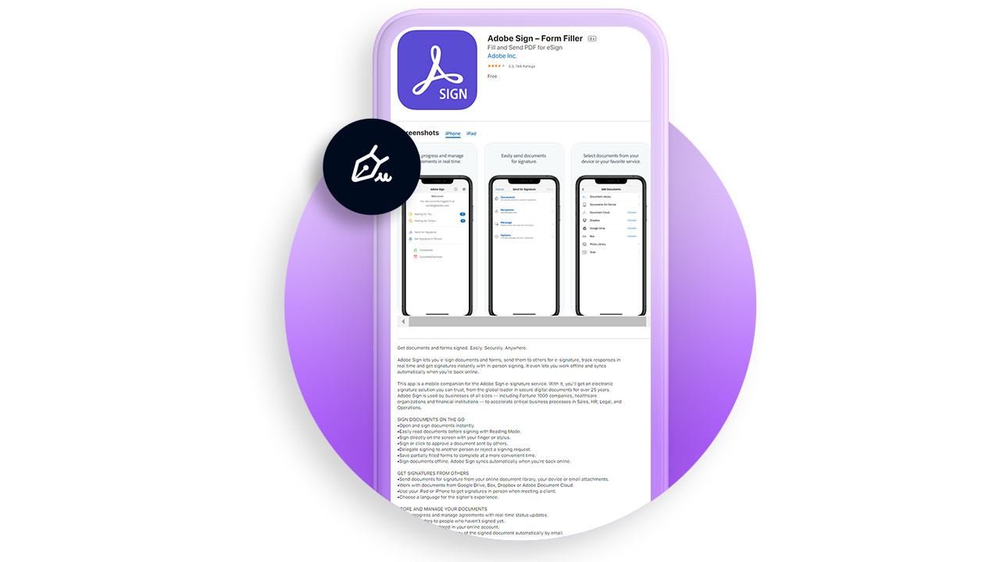

# 모바일 개요

모든 모바일 장치에서 서명을 위해 문서를 보내고, 전자 서명 진행 상황을 추적하고, 실시간 업데이트를 받을 수 있습니다.

## 새로운 기능

>[!BEGINTABS]

>[!TAB 모바일 친화적 보기]

[모바일 친화적 보기](mobile-friendly.md)를 사용하여 모바일 장치에서 양식을 완성하는 방법을 알아봅니다.

>[!TAB 모바일 친화적 보기 만들기]

개발자 지원 없이 [모바일 친화적](create-mobile-friendly.md) 문서를 원활하게 생성하는 방법을 알아봅니다.

>[!ENDTABS]

<table style="table-layout:fixed">
<tr>
  <td>
    
    

    <a href="sign-mobile.md"><strong>이동 중에 문서에 서명</strong></a>
    

    <em>Acrobat Sign 모바일 앱을 사용하여 문서에 서명하는 방법 알아보기</em>
     
  </td>
  <td>
    
    

    <a href="mobile-friendly.md"><strong>모바일 친화적 보기</strong></a>
    

    <em>모바일 친화적인 보기를 사용하여 모바일 장치에서 양식을 완성하는 방법에 대해 알아보세요</em>
     
  </td>  
  <td>
    
    

    <a href="create-mobile-friendly.md"><strong>모바일 친화적 보기 만들기</strong></a>
    

    <em>개발자 지원 없이도 모바일 친화적인 문서를 원활하게 생성하는 방법을 알아보세요</em>
     
  </td>
   <td>
    
    

    <a href="liquidmode.md"><strong>Acrobat Sign의 Liquid Mode</strong></a>
    

    <em>Liquid Mode로 모바일 서명 환경을 개선하는 방법 알아보기</em>
     
  </td>
</tr>
<tr>
  <td>
    
    

    <a href="https://apps.apple.com/us/app/adobe-acrobat-sign/id481082197_blank"><strong>iOS용 Acrobat Sign 모바일 앱 다운로드</strong></a>
    

    <em>App Store에서 Acrobat Sign 모바일 앱 다운로드</em>
     
  </td>
  <td>
    
    

    <a href="https://play.google.com/store/apps/details?id=com.adobe.echosign&amp;hl=en&amp;pli=1_blank"><strong>Android용 Acrobat Sign 모바일 앱 다운로드</strong></a>
    

    <em>Google Play에서 Acrobat Sign 모바일 앱 다운로드</em>
     
  </td>
  <td>
    
    

     
  </td>
  <td>
    
    

     
  </td>
</tr>
</table>
