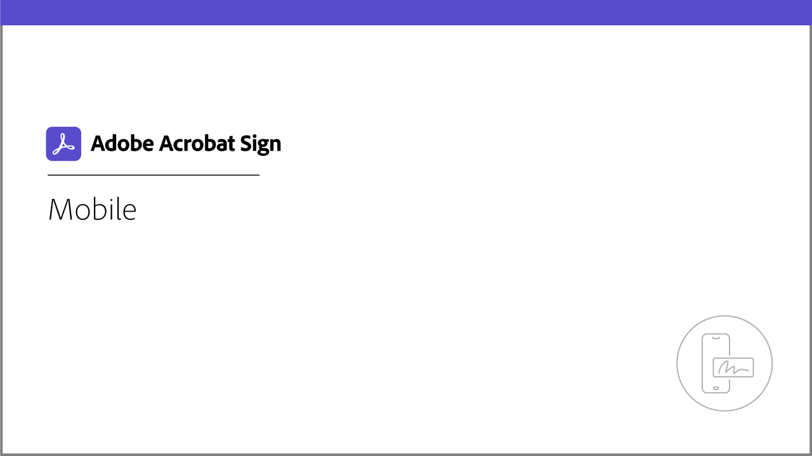

# Acrobat Sign 튜토리얼

Adobe Document Cloud 솔루션인 Acrobat Sign은 통합, API, 고급 인증, 추가 관리자 기능 등을 통해 기업의 요구에 맞게 확장할 수 있습니다. 여기에서 Acrobat Sign에 대한 초보자와 관리자 모두를 빠르게 향상시킬 수 있는 다양한 학습 경험을 찾을 수 있습니다.

## 학습 경로

<table style="table-layout:fixed">
<tr>
  <td>
    
    

    <a href="sign-beginner-tutorials/beginner-users-overview.md"><strong>시작하기</strong></a>
    

    <em>문서를 전송, 서명 및 추적하는 방법을 빠르게 습득</em>
     
  </td>
  <td>
    
    

    <a href="sign-advanced-users/advanced-users-overview.md"><strong>고급 작업</strong></a>
    

    <em>특정 작업 및 자동화를 통해 기본 기능 강화</em>
     
  </td>  
  <td>
    
    

    <a href="admin/intro-admin-overview.md"><strong>관리</strong></a>
    

    <em>조직을 위한 기본 및 고급 설정 팁</em>
     
  </td>
</tr>
<tr>
  <td>
    
    

    <a href="digitalid/digitalid-overview.md"><strong>디지털 ID</strong></a>
    

    <em>Acrobat Sign을 사용하여 전 세계 디지털 ID를 사용하는 방법 학습</em>
     
  </td>
  <td>
    
    

    <a href="integrations/integrations-overview.md"><strong>통합</strong></a>
    

    <em>조직에서 이미 사용 중인 다른 애플리케이션에 Acrobat Sign을 직접 추가할 수 있습니다</em>
     
  </td>
  <td>
    
    

    <a href="sign-usecase/expand-inspire-overview.md"><strong>업계 및 부서</strong></a>
    

    <em>실제 업계와 부서에서 사용하는 활용 사례와 기법을 통해 전자 서명으로 가능한 작업을 살펴보세요</em>
     
  </td>
</tr>
<tr>
  <td>
    
    

    <a href="develop/develop-overview.md"><strong>현상</strong></a>
    

    <em>Acrobat Sign I/O에 대한 개발 리소스 받기</em>
     
  </td>
   <td>
    
    

    <a href="deploy-overview.md"><strong>배포</strong></a>
    

    <em>조직 내 Acrobat Sign 배포에 대한 인사이트 및 모범 사례</em>
     
  </td>
  <td>
    
    

    <a href="mobile/mobile-overview.md"><strong>모바일</strong></a>
    

    <em>모바일 디바이스에서 실시간 업데이트 전송, 추적 및 가져오기</em>
     
  </td>  
</tr>
</table>
