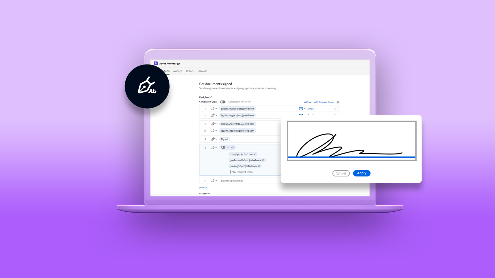
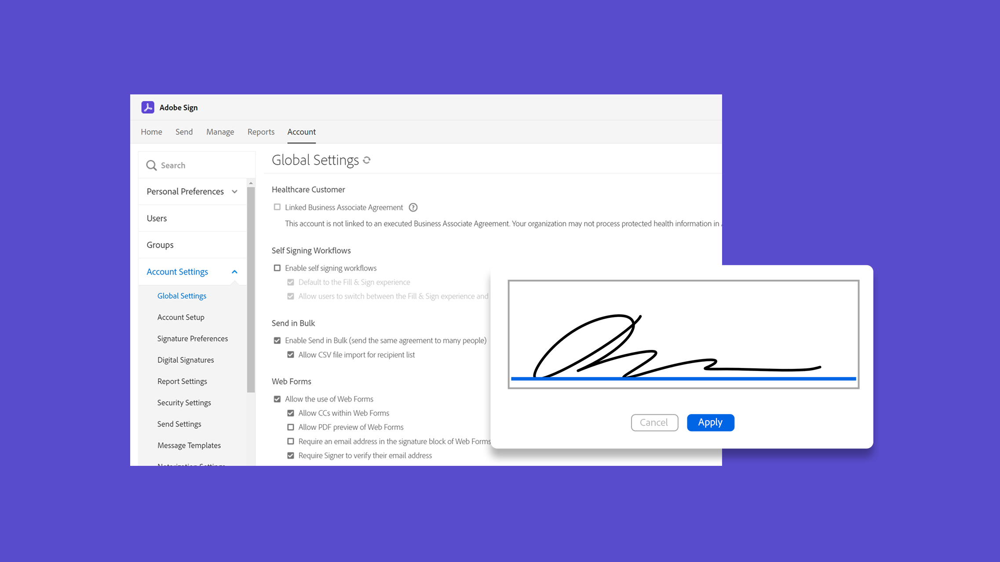

# Acrobat Sign 튜토리얼

Adobe Document Cloud 솔루션인 Acrobat Sign은 통합, API, 고급 인증, 추가 관리자 기능 등을 통해 조직의 요구 사항에 맞게 확장됩니다. Acrobat Sign에서 초보자와 책임자가 모두 빠르게 작업할 수 있도록 설계된 다양한 학습 환경을 살펴보세요.

## 학습 경로

<table style="table-layout:fixed">
<tr>
  <td>
    
    

    <a href="sign-beginner-tutorials/beginner-users-overview.md"><strong>시작하기</strong></a>
    

    문서를 전송, 서명 및 추적하는 방법에 대해 최신 정보를 얻으세요.
     
  </td>
  <td>
    
    

    <a href="sign-advanced-users/advanced-users-overview.md"><strong>고급 작업</strong></a>
    

    특정 작업 및 자동화를 통해 기본 사항 극대화
     
  </td>
   <td>
    
    

    <a href="admin/intro-admin-overview.md"><strong>관리자</strong></a>
    

    조직을 위한 기본 및 고급 설정 팁
     
  </td>
   <td>
    
    

    <a href="digitalid/digitalid-overview.md"><strong>디지털 ID</strong></a>
    

    Acrobat Sign에서 전 세계의 디지털 ID를 사용하는 방법 알아보기
     
  </td>
</tr>
<tr>
    <td>
    
    

    <a href="integrations/integrations-overview.md"><strong>통합</strong></a>
    

    다른 애플리케이션 내에서 직접 Acrobat Sign 추가
     
    </td>
  <td>
    
    

    <a href="sign-usecase/expand-inspire-overview.md"><strong>산업 및 부서</strong></a>
    

    실제 산업 및 부서 사용 사례 탐색
     
  </td>
  <td>
    
    

    <a href="develop/develop-overview.md"><strong>개발</strong></a>
    

    Acrobat Sign I/O에서 개발 리소스 다운로드
     
  </td>
  <td>
    
    

    <a href="deploy-overview.md"><strong>배포</strong></a>
    

    조직 내 Acrobat Sign 배포에 대한 인사이트 및 모범 사례
     
  </td>
</tr>
<tr>
  <td>
    
    

    <a href="mobile/mobile-overview.md"><strong>모바일</strong></a>
    

    모바일 디바이스에서 전송, 서명 및 실시간 업데이트 받기
     
  </td>
</tr>
</table>