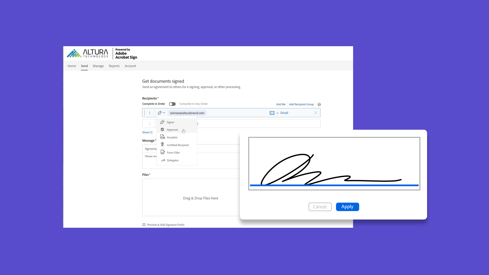

# 고급 작업 개요

한 번에 100명의 수신자에게 서명할 문서를 전송하고, 웹 사이트를 위한 서명 준비 문서를 설정하고, 서명 트랜잭션을 관리하고, 문서 템플릿을 만들고 관리하는 방법을 알아봅니다. 이 자습서는 서명 보내기 및 요청의 기본 사항에 이미 익숙하고, Acrobat Sign을 사용하여 작업할 수 있는 더 많은 방법을 알아보고자 하는 사용자를 위한 것입니다.

## 새로운 기능

>[!BEGINTABS]

>[!TAB 사용자 지정 워크플로우 구축]

사용자 정의 작업 과정을[&#x200B; 만들고 사용하여 &#x200B;](../admin/building-a-custom-workflow.md)계약 생성 및 전송 프로세스의 속도를 높이는 방법에 대해 알아봅니다.

>[!TAB 대량 전송]

간단한 몇 단계만으로 모든 문서에 대해 수천[&#x200B; 개의 서명을 한 번에 수집하는 방법을 &#x200B;](megasign.md)살펴봅니다.

>[!TAB Acrobat Sign의 인증 방법]

문서에 서명하는 사람의 신분을 인증[하기 위해 &#x200B;](authentication-methods.md)Acrobat Sign에서 사용할 수 있는 방법의 범위에 대해 알아봅니다.

>[!ENDTABS]

## 전송

<table style="table-layout:fixed">
<tr>
  <td>
    
    

    <a href="setting-up-routing.md"><strong>서명 순서 설정</strong></a>
    

    <em>여러 서명자의 서명 순서 설정</em>
     
  </td>
  <td>
      
    

    <a href="delegate-signature.md"><strong>위임자 역할 사용</strong></a>
    

    <em>위임자 역할을 사용하여 문서를 중개자에게 전송하면 중간자는 서명을 위해 문서를 라우팅할 수 있습니다</em>
     
  </td>
  <td>
    
    

    <a href="add-an-approver.md"><strong>승인자 역할 사용</strong></a>
    

    <em>계약 승인 프로세스에 승인자 역할 추가</em>
     
  </td>
  <td>
      
      

      <a href="megasign.md"><strong>대량 전송</strong></a>
      

      <em>간단한 몇 단계로 모든 문서에 대해 수백 개의 서명을 한 번에 수집할 수 있습니다.</em>
       
  </td>
</tr>
<tr>
  <td>
      
      

      <a href="webform.md"><strong>웹 양식 만들기</strong></a>
      

      <em>웹 사이트에서 직접 전자적으로 서명할 수 있는 문서를 만드는 방법을 살펴봅니다</em>
       
  </td>
  <td>
      
      

      <a href="../admin/building-a-custom-workflow.md"><strong>사용자 지정 워크플로우 구축</strong></a>
      

      <em>사용자 정의 작업 과정을 만들고 사용하여 계약 생성 및 전송 프로세스 속도를 높이는 방법에 대해 알아봅니다</em>
       
  </td>
  <td>
      
      

      <a href="set-up-online-payments.md"><strong>온라인 결제 설정</strong></a>
      

      <em>문서에서 온라인 결제를 설정하고 수락하는 방법을 살펴봅니다.</em>
       
  </td>
  <td>
      
      

      <a href="authentication-methods.md"><strong>Acrobat Sign의 인증 방법</strong></a>
      

      <em>Acrobat Sign에서 사용할 수 있는 ID 인증 방법 범위에 대해 알아보기</em>
       
  </td>
</tr>
<tr>
  <td>
      
      

      <a href="adobe-sign-text-tagging.md"><strong>Acrobat Sign 텍스트 태그 지정</strong></a>
      

      <em>Adobe Acrobat을 사용하여 텍스트 태그 지정으로 Acrobat Sign 양식 필드 작성</em>
       
    </td>
  <td>
    
    

    <a href="text-tagging-word.md"><strong>텍스트 태그 사용 [!DNL Microsoft Word]</strong></a>
    

    <em>Acrobat Sign 텍스트 태그를 추가하여 재사용 가능한 문서 템플릿을 만드는 방법을 알아봅니다. [!DNL Microsoft Word]</em>
     
  </td>
  <td>
    
    

     
  </td>
  <td>
    
    

     
  </td>
</tr>
</table>

## 관리

<table style="table-layout:fixed">
<tr>
<td>
    
    

    <a href="creating-a-report.md"><strong>보고 및 트랜잭션 사용 현황</strong></a>
    

    <em>보고서를 생성하고 트랜잭션 사용 현황을 추적하는 방법 알아보기</em>
     
  </td>
  <td>
    
    

    <a href="edit-a-template.md"><strong>문서 템플릿 관리</strong></a>
    

    <em>라이브러리에서 템플릿 편집 또는 삭제</em>
     
  </td>
  <td>
    
    

    <a href="modify-webform.md"><strong>기존 웹 양식 수정</strong></a>
    

    <em>기존 웹 양식을 비활성화, 편집 및 다시 활성화하는 방법</em> 알아보기
     
  </td>  
  <td>
    
    

    <a href="manage-webform-data.md"><strong>웹 양식 데이터 관리</strong></a>
    

    <em>웹 양식에서 데이터를 추적, 관리 및 내보내는 방법을 알아봅니다</em>
     
  </td>  
</tr>
<tr>
  <td>
      
      

      <a href="manage-form-data.md"><strong>양식 데이터 관리</strong></a>
      

      <em>문서의 양식 데이터를 통합하는 방법을 살펴봅니다</em>
       
    </td>
    <td>
    
    

     
  </td>
  <td>
    
    

     
  </td>
  <td>
    
    

     
  </td>
</tr>
</table>