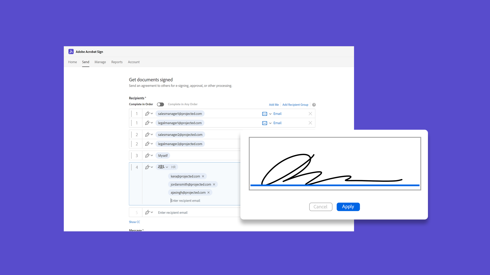

# 시작 개요

이 간단한 단계별 튜토리얼을 통해 문서를 전송, 서명 및 추적하는 방법을 최대한 빠르게 살펴보세요. Acrobat Sign을 빠르게 둘러본 다음 한 명 이상의 사람에게 문서를 전송합니다. 이 콘텐츠는 전자 서명 워크플로우를 쉽게 사용할 수 있도록 설계되었습니다.

## 새로운 기능

>[!BEGINTABS]

>[!TAB 한 서명자에게 문서 보내기]

[서명을 위해 문서를 손쉽게 전송](send-to-single-recipient.md)하는 방법을 살펴봅니다.

>[!TAB Acrobat Sign 시작하기]

Acrobat Sign을 처음 사용하십니까? 이 [튜토리얼](new-sender.md)은(는) 시작하기에 좋은 장소입니다.

>[!ENDTABS]

## 전송

<table style="table-layout:fixed">
<tr>
  <td>
    
    

    <a href="new-sender.md"><strong>Acrobat Sign 시작하기</strong></a>
    

    이 튜토리얼은 Acrobat Sign의 새로운 사용자를 위해 좋은 출발점입니다.
     
  </td>
 <td>
    
    

    <a href="quick-tour.md"><strong>작업 영역 기본 사항</strong></a>
    

    Acrobat Sign 작업 영역을 간단히 둘러보고 작업을 시작하고 실행합니다
     
  </td>
  <td>
    
    

    <a href="send-to-single-recipient.md"><strong>한 서명자에게 문서 보내기</strong></a>
    

    바로 로그인하여 서명을 받기 위해 문서를 보내는 것이 얼마나 쉬운지 알아보세요.
     
  </td>
  <td>
    
    

    <a href="send-to-multiple-recipients.md"><strong>여러 수신자에게 보내기</strong></a>
    

    전자 서명을 위해 문서를 두 명 이상의 사용자에게 원하는 순서대로 보내기
     
  </td>
</tr>
<tr>
  <td>
    
    

    <a href="sending-options.md"><strong>전송 옵션 구성</strong></a>
    

    서명을 위해 문서를 전송할 때 다양한 옵션을 구성하는 방법에 대해 알아보십시오
     
  </td>
  <td>
    
    

    <a href="adding-fields.md"><strong>문서에 필드 추가</strong></a>
    

    문서에 다양한 유형의 필드를 추가하는 방법에 대해 알아봅니다.
     
  </td>
  <td>
    
    

    <a href="modify-in-flight.md"><strong>전송 후 문서 수정</strong></a>
    

    이미 진행 중인 문서 수정
     
  </td>
  <td>
    
    

    <a href="replace-signer.md"><strong>서명자 바꾸기</strong></a>
    

    이미 진행 중인 문서의 서명자를 변경하는 방법에 대해 알아보십시오
      
  </td>
</tr>
<tr>
  <td>
      
      

      <a href="set-deadlines-reminders.md"><strong>기한 및 미리 알림 설정</strong></a>
      

      문서에 빠르게 서명할 수 있도록 일반 전자 메일 알림 메시지 및 기한을 보내는 방법을 알아봅니다
       
    </td> 
  <td>
      
      

       
    </td>
    <td>
      
      

       
    </td>
    <td>
      
      

       
    </td>
</tr>
</table>

## 서명

<table style="table-layout:fixed">
<tr>
  <td>
    
    

    <a href="electronically-sign-a-document.md"><strong>문서에 전자 서명</strong></a>
    

    Acrobat Sign으로 전송된 문서에 서명하는 방법을 살펴봅니다.
     
  </td>
  <td>
    
    

    <a href="fill-and-sign.md"><strong>문서 작성 및 서명</strong></a>
    

    양식을 작성하고 문서에 전자 서명을 추가합니다.
     
  </td>
  <td>
    
    

    <a href="sign-in-person.md"><strong>직접 서명 받기</strong></a>
    

    Acrobat Sign 모바일 앱을 사용하여 직접 다른 사람의 서명 받기
     
  </td>
  <td>
    
    

    <a href="delegate-signing.md"><strong>다른 사람에게 서명을 위임</strong></a>
    

    문서 서명을 다른 사람에게 위임하는 방법을 알아보십시오
     
  </td>
</tr>
<tr>
  <td>
    
    

    <a href="sign-with-a-digital-signature.md"><strong>디지털 서명이란 무엇입니까</strong></a>
    

    인증서 기반 디지털 서명에 대해 알아보기
     
  </td>
  <td>
    
    

    <a href="sign-with-a-stamp.md"><strong>스탬프를 사용하여 서명</strong></a>
    

    스탬프를 사용하여 승인됨 또는 완료된 문서 표시
      
  </td> 
 <td>
    
    

     
  </td>
  <td>
    
    

     
  </td>
</tr>  
</table>

## 관리

<table style="table-layout:fixed">
<tr>
  <td>
    
    

    <a href="manage-and-track.md"><strong>계약 관리 및 추적</strong></a>
    

    서명을 위해 전송된 계약을 관리하고 추적하는 방법을 알아봅니다.
     
  </td>
  <td>
    
    

    <a href="../sign-advanced-users/create-a-template.md"><strong>문서 템플릿 만들기</strong></a>
    

    재사용 가능한 문서 템플릿을 만들어 조직의 속도와 일관성을 제공합니다
     
  </td>
  <td>
    
    

     
  </td>
  <td>
    
    

     
  </td>
</tr>
</table>
