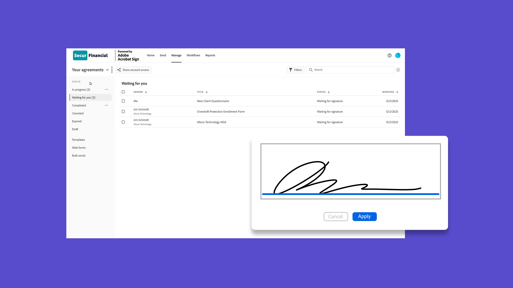

# 시작 개요

이 간단한 단계별 튜토리얼을 통해 문서를 전송, 서명 및 추적하는 방법을 최대한 빠르게 살펴보세요. Acrobat Sign을 빠르게 둘러본 다음 한 명 이상의 사람에게 문서를 전송합니다. 이 콘텐츠는 전자 서명 워크플로우를 쉽게 사용할 수 있도록 설계되었습니다.

## 새로운 기능

>[!BEGINTABS]

>[!TAB 전송 후 문서 수정]

서명을 위해 이미 전송된 [문서를 수정](../sign-beginner-tutorials/manage-and-track.md)하는 방법에 대해 알아보십시오.

>[!TAB 계약 관리 및 추적]

서명을 위해 보낸 [계약을 관리 및 추적](../sign-beginner-tutorials/manage-and-track.md)하는 방법에 대해 알아봅니다.

>[!TAB 문서에 전자 서명]

Acrobat Sign으로 전송된 문서에 [서명](../sign-beginner-tutorials/electronically-sign-a-document.md)하는 방법을 알아봅니다.

>[!TAB 재사용 가능한 템플릿 만들기]

[재사용 가능한 문서 템플릿](../sign-advanced-users/create-a-template.md)을 만드는 방법에 대해 알아봅니다.

>[!ENDTABS]

## 전송

<table style="table-layout:fixed">
<tr>
  <td>
    
    

    <a href="new-sender.md"><strong>Acrobat Sign 시작하기</strong></a>
    

    이 튜토리얼은 Acrobat Sign 신규 사용자를 위한 좋은 시작점입니다.
     
  </td>
 <td>
    
    

    <a href="quick-tour.md"><strong>작업 영역 기본 사항</strong></a>
    

    Acrobat Sign 작업 영역을 간단히 둘러보고 작업을 시작하고 실행합니다
     
  </td>
  <td>
    
    

    <a href="send-to-single-recipient.md"><strong>한 서명자에게 문서 보내기</strong></a>
    

    바로 시작하여 서명을 받기 위해 문서를 전송하기가 얼마나 쉬운지 알아보세요.
     
  </td>
  <td>
    
    

    <a href="send-to-multiple-recipients.md"><strong>여러 서명자에게 보내기</strong></a>
    

    원하는 순서대로 여러 사람에게 전자 서명을 위한 문서 보내기
     
  </td>
</tr>
<tr>
  <td>
    
    

    <a href="sending-options.md"><strong>전송 옵션 구성</strong></a>
    

    서명을 위해 문서를 보낼 때 다양한 옵션을 구성하는 방법을 알아보세요.
     
  </td>
  <td>
    
    

    <a href="adding-fields.md"><strong>문서에 필드 추가</strong></a>
    

    문서에 다양한 유형의 필드를 추가하는 방법에 대해 알아봅니다.
     
  </td>
  <td>
    
    

    <a href="modify-in-flight.md"><strong>전송 후 문서 수정</strong></a>
    

    이미 진행 중인 문서를 수정하는 방법 알아보기
     
  </td>
  <td>
    
    

    <a href="replace-signer.md"><strong>서명자 바꾸기</strong></a>
    

    이미 진행 중인 문서의 서명자를 변경하는 방법에 대해 알아보십시오
      
  </td>
</tr>
<tr>
  <td>
      
      

      <a href="set-deadlines-reminders.md"><strong>기한 및 미리 알림 설정</strong></a>
      

      문서에 빠르게 서명할 수 있도록 일반 전자 메일 알림 메시지 및 기한을 보내는 방법을 알아봅니다
       
    </td> 
  <td>
    
    

    <a href="../sign-advanced-users/create-a-template.md"><strong>재사용 가능한 템플릿 만들기</strong></a>
    

    재사용 가능한 문서 템플릿을 만들어 조직에 속도와 일관성 제공
     
  </td>
    <td>
     
    

    <a href="checkbox-groups.md"><strong>확인란 그룹이 있는 필수 선택 항목 안내</strong></a>
    

    확인란 그룹을 사용하여 서명자가 양식에서 선택할 수 있는 옵션 수를 제어하는 방법에 대해 알아봅니다.
     
    </td>
    <td>
      
      

       
    </td>
</tr>
</table>

## 서명

<table style="table-layout:fixed">
<tr>
  <td>
    
    

    <a href="electronically-sign-a-document.md"><strong>문서에 전자 서명</strong></a>
    

    Acrobat Sign으로 받은 문서에 서명하기가 얼마나 쉬운지 알아보세요.
     
  </td>
  <td>
    
    

    <a href="fill-and-sign.md"><strong>문서 작성 및 서명</strong></a>
    

    양식을 작성하고 문서에 전자 서명을 추가합니다.
     
  </td>
  <td>
    
    

    <a href="sign-in-person.md"><strong>직접 서명 받기</strong></a>
    

    Acrobat Sign 모바일 앱을 사용하여 직접 다른 사람의 서명 받기
     
  </td>
  <td>
    
    

    <a href="delegate-signing.md"><strong>다른 사람에게 서명을 위임</strong></a>
    

    문서 서명을 다른 사람에게 위임하는 방법을 알아보십시오
     
  </td>
</tr>
<tr>
  <td>
    
    

    <a href="sign-with-a-digital-signature.md"><strong>디지털 서명이란 무엇입니까</strong></a>
    

    인증서 기반 디지털 서명에 대해 알아보기
     
  </td>
  <td>
    
    

    <a href="sign-with-a-stamp.md"><strong>스탬프를 사용하여 서명</strong></a>
    

    스탬프를 사용하여 승인됨 또는 완료된 문서 표시
      
  </td> 
 <td>
    
    

     
  </td>
  <td>
    
    

     
  </td>
</tr>  
</table>

## 관리

<table style="table-layout:fixed">
<tr>
  <td>
    
    

    <a href="manage-and-track.md"><strong>계약 관리 및 추적</strong></a>
    

    서명을 위해 보낸 계약을 관리하고 추적하는 방법을 알아보세요.
     
  </td>
  <td>
    
    

     
  </td>
  <td>
    
    

     
  </td>
  <td>
    
    

     
  </td>
</tr>
</table>
