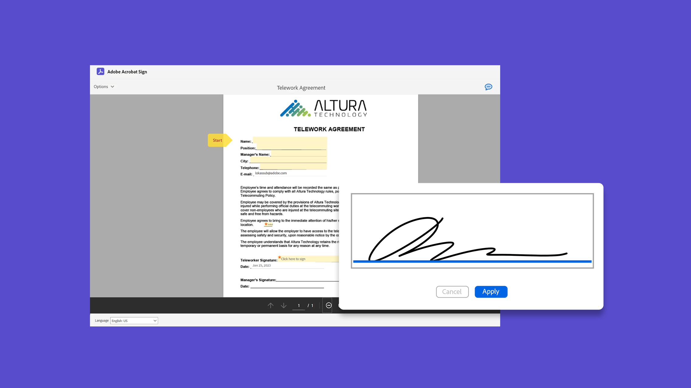

# 시작 개요

간단한 단계별 튜토리얼을 통해 문서를 전송, 서명 및 추적하는 방법을 빠르게 알아볼 수 있습니다. Acrobat Sign을 빠르게 살펴본 다음 한 명 이상의 사람에게 문서를 전송합니다. 이 콘텐츠는 전자 서명 워크플로우를 간소화하기 위해 고안되었습니다.

## 새로운 기능

* [Acrobat Sign 시작하기](new-sender.md)
Acrobat Sign을 처음 사용하십니까? 이 튜토리얼은 시작하기 좋은 곳입니다.
* [기한 및 미리 알림 설정](set-deadlines-reminders.md)
문서에 빠르게 서명을 받기 위해 일반 이메일 알림 메시지 및 최종 기한을 보내는 방법을 알아봅니다

## 전송

<table style="table-layout:fixed">
<tr>
 <td>
    
    

    <a href="quick-tour.md"><strong>작업 영역 기본 사항</strong></a>
    

    <em>Acrobat Sign 작업 영역을 빠르게 살펴보고 바로 시작할 수 있습니다</em>
     
  </td>
  <td>
    
    

    <a href="new-sender.md"><strong>Acrobat Sign 시작하기</strong></a>
    

    <em>이 종합적인 튜토리얼은 Acrobat Sign에서 처음 보낸 사람을 위한 좋은 출발점입니다</em>
     
  </td>
  <td>
    
    

    <a href="send-to-single-recipient.md"><strong>단일 수신자에게 보내기</strong></a>
    

    <em>서명이 필요한 문서를 손쉽게 전송하는 방법을 살펴보세요</em>
     
  </td>
  <td>
    
    

    <a href="send-to-multiple-recipients.md"><strong>여러 수신자에게 보내기</strong></a>
    

    <em>전자 서명이 필요한 문서를 원하는 순서대로 두 명 이상의 사람에게 전송</em>
     
  </td>
</tr>
<tr>
  <td>
    
    

    <a href="sending-options.md"><strong>보내기 옵션 구성</strong></a>
    

    <em>서명을 위해 문서를 보낼 때 다양한 옵션을 구성하는 방법 알아보기</em>
     
  </td>
  <td>
    
    

    <a href="adding-fields.md"><strong>문서에 필드 추가</strong></a>
    

    <em>문서에 다른 유형의 필드를 추가하는 방법에 대해 알아봅니다.</em>
     
  </td>
  <td>
    
    

    <a href="modify-in-flight.md"><strong>전송 후 문서 수정</strong></a>
    

    <em>이미 진행 중인 문서 수정</em>
     
  </td>
  <td>
    
    

    <a href="replace-signer.md"><strong>서명자 바꾸기</strong></a>
    

    <em>이미 진행 중인 문서의 서명자를 변경하는 방법 알아보기</em>
      
  </td>
</tr>
<tr>
  <td>
      
      

      <a href="set-deadlines-reminders.md"><strong>기한 및 미리 알림 설정</strong></a>
      

      <em>문서에 빠르게 서명을 받기 위해 일반 이메일 알림 메시지 및 최종 기한을 보내는 방법을 알아봅니다</em>
       
    </td> 
  <td>
      
      

       
    </td>
    <td>
      
      

       
    </td>
    <td>
      
      

       
    </td>
</tr>
</table>

## Signing

<table style="table-layout:fixed">
<tr>
  <td>
    
    

    <a href="electronically-sign-a-document.md"><strong>문서에 전자 서명</strong></a>
    

    <em>Acrobat Sign을 사용하여 전송된 문서에 손쉽게 서명하는 방법에 대해 알아봅니다</em>
     
  </td>
  <td>
    
    

    <a href="fill-and-sign.md"><strong>문서 채우기 및 서명</strong></a>
    

    <em>양식 채우기 및 문서에 전자 서명 추가</em>
     
  </td>
  <td>
    
    

    <a href="sign-in-person.md"><strong>직접 서명 받기</strong></a>
    

    <em>Acrobat Sign 모바일 앱을 사용하여 직접 다른 사람의 서명 받기</em>
     
  </td>
  <td>
    
    

    <a href="delegate-signing.md"><strong>다른 사용자에게 서명 위임</strong></a>
    

    <em>다른 사용자에게 문서 서명을 위임하는 방법 알아보기</em>
     
  </td>
</tr>
<tr>
  <td>
    
    

    <a href="sign-with-a-digital-signature.md"><strong>디지털 서명 소개</strong></a>
    

    <em>인증서 기반의 디지털 서명에 대한 자세한 내용</em>
     
  </td>
  <td>
    
    

    <a href="sign-with-a-stamp.md"><strong>스탬프를 사용하여 서명</strong></a>
    

    <em>스탬프를 사용하여 승인 또는 완료된 문서를 표시합니다.</em>
      
  </td> 
 <td>
    
    

     
  </td>
  <td>
    
    

     
  </td>
</tr>  
</table>

## 관리

<table style="table-layout:fixed">
<tr>
  <td>
    
    

    <a href="manage-and-track.md"><strong>계약 관리 및 추적</strong></a>
    

    <em>서명을 위해 전송된 계약을 관리 및 추적하는 방법 알아보기</em>
     
  </td>
  <td>
    
    

    <a href="../sign-advanced-users/create-a-template.md"><strong>문서 템플릿 만들기</strong></a>
    

    <em>재사용 가능한 문서 템플릿을 만들어 조직의 속도와 일관성 유지</em>
     
  </td>
  <td>
    
    

     
  </td>
  <td>
    
    

     
  </td>
</tr>
</table>
