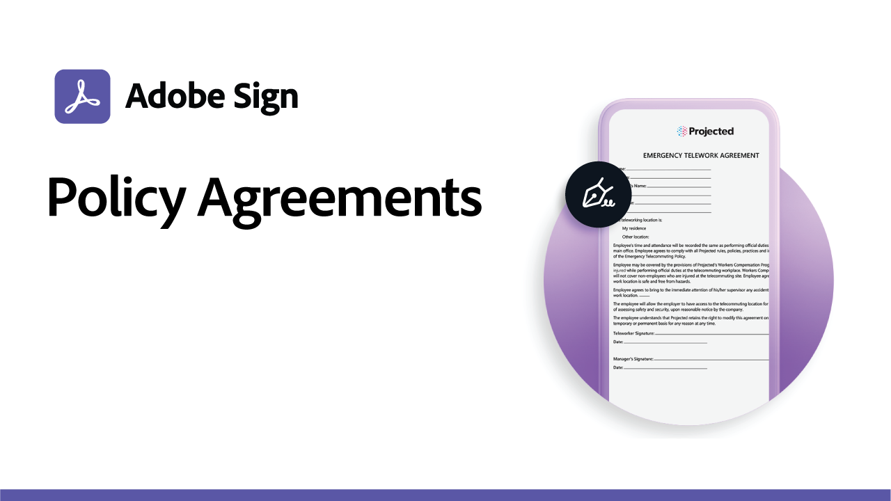

# 케이스 레시피 사용

공공 기관 및 상업용 전자 서명 예시를 통해 기업의 디지털 워크플로우를 가속화할 수 있습니다. 특정 전자 서명 사용 사례를 설정하는 방법에 대한 리소스 및 세부 정보가 포함된 PDF을 보려면 클릭하십시오.

## 새로운 기능

* [교육 웹 양식 인턴십 신청](usecase-edu-intern.md)
웹 양식을 사용하여 학생들이 필수 양식에 액세스하는 방법을 알아봅니다.
* [교육 웹 양식 인턴십 응용 프로그램 만들기](usecase-edu-intern-create.md)
인턴십 웹 양식을 만드는 방법 알아보기
* [여러 명의 서명자를 알 수 없는 공공 기관 대출 신청](webform-multiple-signers.md)
웹 양식이 여러 명의 알 수 없는 참가자를 포함하는 복잡한 정부 대출 신청 워크플로우에 사용되는 방법을 알아봅니다.

## 공공 기관 활용 사례

<table style="table-layout:fixed">
<tr>
  <td>
    
    

    <a href="webform-multiple-signers.md"><strong>여러 명의 서명자를 알 수 없는 공공 기관 대출 신청</strong></a>
    

    <em>웹 양식이 여러 명의 알 수 없는 참가자를 포함하는 복잡한 정부 대출 신청 워크플로우에 사용되는 방법을 알아봅니다.</em>
     
  </td> 
  <td>
    
    

    <a href="usecasegovgrants.md"><strong>사업 보조금 및 융자금</strong></a>
    

    <em>부여, 대출 및 세금 유예 신청 양식에 대한 셀프 서비스 이용 권한을 제공하여 비즈니스에 신속한 지원을 제공할 수 있습니다</em>
     
  </td> 
  <td>
    
    

    <a href="usecasegovtelework.md"><strong>원격 근무 협정</strong></a>
    

    <em>원격 근무 계약, 정책 업데이트 등으로 모든 직원의 서명을 효율적으로 수집할 수 있습니다</em>
     
  </td>
  <td>
    
    

    <a href="usecasegovcontracts.md"><strong>계약서 및 구매요청 양식</strong></a>
    

    <em>종이 문서를 감사 보고서가 포함된 완벽한 디지털 워크플로우로 신속하게 대체</em>
     
  </td>
</tr>
<tr>
 <td>
    
    

    <a href="usecasegovreemployment.md"><strong>재취업 지원</strong></a>
    

    <em>일상적으로 사용할 수 있는 디지털 신청 양식에 맞추지 않고 시민이 필요한 도움을 받을 수 있도록 지원</em>
     
  </td>
  <td>
    
    

    <a href="usecasegovpaycheck.md"><strong>급여 보호</strong></a>
    

    <em>Acrobat Sign을 사용하여 결제 보호 프로그램 양식을 온라인 대화형 양식으로 변환하는 방법에 대해 살펴보십시오</em>
     
  </td>
  <td>
    
    

    <a href="usecasegovremote.md"><strong>원격 영장 청구</strong></a>
    

    <em>전자 서명과 웹 회의를 함께 사용하여 법관의 영장을 청구하고 확보하는 데 걸리는 시간을 줄일 수 있습니다</em>
     
  </td>
  <td>
    
    

     
  </td>
</tr>
</table>

## 상업적 사용 사례

<table style="table-layout:fixed">
<tr>
  <td>
    
    

    <a href="usecasecomcontracts.md"><strong>계약서 및 구매요청 양식</strong></a>
    

    <em>종이 문서를 감사 보고서가 포함된 완벽한 디지털 워크플로우로 신속하게 대체</em>
     
  </td> 
  <td>
    
    

    <a href="usecasecompolicy.md"><strong>정책 계약</strong></a>
    

    <em>정책 계약 및 업데이트로 모든 직원의 서명을 효율적으로 수집</em>
     
  </td>
  <td>
    
    

    <a href="usecasecomtelework.md"><strong>원격 근무 협정</strong></a>
    

    <em>원격 근무 계약을 통해 모든 직원의 서명을 효율적으로 수집할 수 있습니다</em>
     
  </td>
  <td>
    
    

     
  </td>
</tr>
</table>

## 교육 활용 사례

<table style="table-layout:fixed">
<tr>
  <td>
    
    

    <a href="usecase-edu-intern.md"><strong>교육 웹 양식 인턴십 신청</strong></a>
    

    <em>웹 양식을 사용하여 학생들이 필수 양식에 액세스하는 방법을 알아봅니다.</em>
     
  </td> 
  <td>
    
    

    <a href="usecase-edu-intern-create.md"><strong>교육 웹 양식 인턴십 응용 프로그램 만들기</strong></a>
    

    <em>인턴십 웹 양식을 만드는 방법 알아보기</em>
     
  </td> 
  <td>
    
    

     
  </td>
  <td>
    
    

     
  </td>
</tr>
</table>

