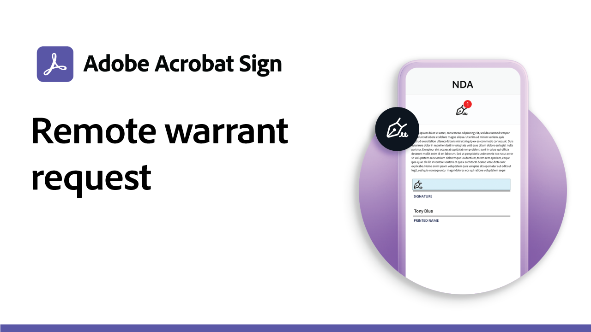

# 사용 사례

다양한 조직이 Acrobat Sign을 사용하여 이러한 실제 사용 사례를 통해 조직의 디지털 워크플로우를 어떻게 변화시키고 있는지 살펴보십시오.

## 새로운 기능

>[!BEGINTABS]

>[!TAB 교육기관 IEP 프로세스에 대한 사용자 지정 워크플로]

[사용자 지정 워크플로 Designer](usecase-edu-iep.md)을 사용하여 IEP(Individualized Education Program) 프로세스를 디지털화하는 방법을 알아봅니다.

>[!TAB 교육 웹 양식 인턴십 응용 프로그램]

[웹 양식](usecase-edu-intern.md)을 사용하여 필요한 양식에 대한 학생들의 액세스 권한을 향상시키는 방법에 대해 알아봅니다.

>[!TAB 교육 웹 양식 인턴십 응용 프로그램 만들기]

[웹 양식](usecase-edu-intern-create.md) 인턴십을 만드는 방법에 대해 알아봅니다.

>[!TAB 여러 서명자가 있는 정부 대출 신청]

[웹 양식](webform-multiple-signers.md)이(가) 여러 명의 알 수 없는 참가자를 포함하는 복잡한 정부 대출 응용 프로그램 워크플로에 사용되는 방법을 알아봅니다.

>[!ENDTABS]

## 정부 사용 사례

<table style="table-layout:fixed">
<tr>
  <td>
    
    

    <a href="webform-multiple-signers.md"><strong>여러 서명자가 있는 정부 대출 신청</strong></a>
    

    <em>웹 양식이 여러 명의 알 수 없는 참가자를 포함하는 복잡한 정부 대출 응용 프로그램 워크플로에 사용되는 방법을 알아봅니다.</em>
     
  </td> 
  <td>
    
    

    <a href="usecasegovgrants.md"><strong>사업 보조금 및 대출</strong></a>
    

    <em>보조금, 대출 및 세금 이연 요청 양식에 셀프 서비스 액세스 권한을 제공하여 기업에 빠른 지원을 제공합니다</em>
     
  </td> 
  <td>
    
    

    <a href="usecasegovtelework.md"><strong>텔레워크 계약</strong></a>
    

    <em>텔레워크 계약, 정책 업데이트 등에 대한 모든 직원의 서명을 효율적으로 수집</em>
     
  </td>
  <td>
    
    

    <a href="usecasegovcontracts.md"><strong>계약 및 구매요청 양식</strong></a>
    

    <em>문서 처리를 규격 디지털 작업 과정으로 빠르게 대체하고 감사 보고서를 완성합니다</em>
     
  </td>
</tr>
<tr>
 <td>
    
    

    <a href="usecasegovreemployment.md"><strong>재취업 지원</strong></a>
    

    <em>며칠 동안 사용할 수 있는 모든 디지털 응용 프로그램 양식에 줄을 서지 않고 시민들이 필요한 도움을 받을 수 있도록 지원</em>
     
  </td>
  <td>
    
    

    <a href="usecasegovpaycheck.md"><strong>급여 확인 보호</strong></a>
    

    <em>Acrobat Sign을 사용하여 결제 보호 프로그램 양식을 온라인 대화형 양식으로 변환하는 방법을 확인하십시오</em>
     
  </td>
  <td>
    
    

    <a href="usecasegovremote.md"><strong>원격 영장 요청</strong></a>
    

    <em>전자 서명과 웹 회의를 함께 사용하여 판사로부터 영장을 요청하고 보호하는 데 걸리는 시간을 단축하세요.</em>
     
  </td>
  <td>
    
    

     
  </td>
</tr>
</table>

## 상업적 사용 사례

<table style="table-layout:fixed">
<tr>
  <td>
    
    

    <a href="usecasecomcontracts.md"><strong>계약 및 구매요청 양식</strong></a>
    

    <em>문서 처리를 규격 디지털 작업 과정으로 빠르게 대체하고 감사 보고서를 완성합니다</em>
     
  </td> 
  <td>
    
    

    <a href="usecasecompolicy.md"><strong>정책 계약</strong></a>
    

    <em>정책 계약 및 업데이트에 대한 모든 직원의 서명을 효율적으로 수집</em>
     
  </td>
  <td>
    
    

    <a href="usecasecomtelework.md"><strong>텔레워크 계약</strong></a>
    

    <em>원격 근무 계약에 대한 모든 직원의 서명을 효율적으로 수집</em>
     
  </td>
  <td>
    
    

     
  </td>
</tr>
</table>

## 교육기관 사용 사례

<table style="table-layout:fixed">
<tr>
  <td>
    
    

    <a href="usecase-edu-intern.md"><strong>교육 웹 양식 인턴십 응용 프로그램</strong></a>
    

    <em>웹 양식을 사용하여 필요한 양식에 대한 학생들의 액세스를 개선하는 방법에 대해 알아보십시오</em>
     
  </td> 
  <td>
    
    

    <a href="usecase-edu-intern-create.md"><strong>교육 웹 양식 인턴십 응용 프로그램 만들기</strong></a>
    

    <em>인턴십 웹 양식을 만드는 방법 알아보기</em>
     
  </td> 
  <td>
    
    

    <a href="usecase-edu-iep.md"><strong>교육기관 IEP 프로세스에 대한 사용자 지정 워크플로</strong></a>
    

    <em>사용자 지정 워크플로 Designer을 사용하여 IEP(Individualized Education Program) 프로세스를 디지털화하는 방법을 알아보십시오</em>
     
  </td>
  <td>
    
    

     
  </td>
</tr>
</table>

